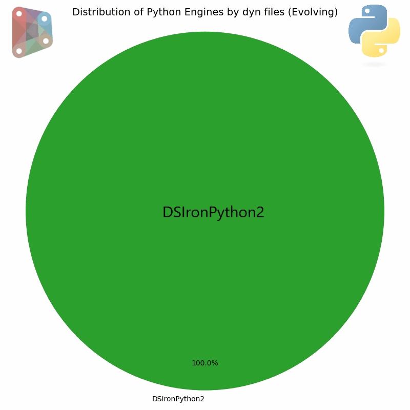

# Working with Python3

### Introduction 

With the [release of Dynamo 4.0](https://dynamobim.org/dynamo-core-4-0-release/), the Dynamo team shared that Dynamo_PythonNet3 is the new Python engine for Dynamo, based on CPython 3.11 and the Python.NET v3 library. This change is a significant moment in the ongoing evolution of Python scripting in Dynamo. The introduction of PythonNet3 marks a milestone compared to the previous CPython3 implementation (based on PythonNet 2.5). While the latter could be frustrating due to its lack of flexibility within the .NET ecosystem, PythonNet3 effectively bridges these gaps.

This new engine succeeds in the difficult task of reconciling two worlds: It offers interoperability comparable to IronPython, while finally unlocking access to the modern Python ecosystem and its powerful C-based libraries (NumPy, Pandas, etc.).

For developers still relying on IronPython 2.7, it is time to migrate. Beyond the technical advantages of PythonNet3, continuing to use the old engine poses real risks:

* Technical obsolescence: Python 2.7 has reached its end of life and is no longer maintained.
* Security: The presence of known vulnerabilities (e.g., urllib2) that will never be patched.
* Limitations: A total inability to use modern PyPI packages.
* Future uncertainty: Increasingly uncertain compatibility with future versions of .NET (9+).

Detailed below are the major changes, the benefits of adopting PythonNet3, and solutions to common migration obstacles.

Further recommended reading is this [previous blog post](https://dynamobim.org/pythonnet3-a-new-dynamo-python-to-fix-everything/) by Trygve Wastvedt.

The following migration was therefore carried out as follows:

IronPython2 -> IronPython3 -> PythonNet3

| **Features**   | **IronPython 2.7**             | **IronPython 3**       |       **Python.NET 2.5.x (alias CPthyon3)**  | **Python.NET 3.x**|
| -------------- | -------------------------------|----------------------- | --------------                               | ------------------ |
| Principal Concept | Implementing Python on .NET (with DLR)|Implementing Python on .NET (with DLR)| Gateway to CPython | Gateway to CPython  |
| Python Version| Python 2.7 | Python 3.4 (currently)  | Python 2.7, Python 3.5 - 3.9  | Python 3.7+ (modern) |
| .NET Support|  .NET Framework & .Net Core/.NET 6/7/8 Uncertain compatibility with future versions of .NET | .NET Framework & .NET Core/.NET 5+ |.NET Framework (mainly)  | .NET Framework & .NET Core/.NET 5+  |
| Library Compatibility     |**Weak**. Incompatible with Python libraries that use C extensions|**Weak**. Same fundamental limitation as v2.7.| **Excellent**. Access to the entire CPython ecosystem.| **Excellent**. Access to the entire modern PyPI ecosystem (NumPy, Pandas, etc.) 
| Performance     | Good for pure .NET interoperability |Good for pure .NET interoperability   | Depends on CPython. Slight overhead for calls. |Depends on CPython. Slight overhead for calls, but highly optimised |
| Status of Python Project     |**Obsolete**. No longer actively maintained. |**Active**. The modern and recommended version if you choose IronPython |**Obsolete**. Replaced by version 3.x. | **Active**. The industry standard for Python/.NET interoperability.|

### Observations on the previous CPython3 engine
The previous CPython3 engine was based on PythonNet 2.5 and had several limitations and drawbacks, including:

1. **Expensive conversion of .NET collections:** The engine performed an automatic and implicit conversion of .NET collections to native Python lists. This approach was costly in performance due to a deep copy of the data. Additionally, changes to the Python list were not reflected in the original .NET object.
2. **Difficulty of implementing .NET Class Interfaces:** In CPython3 (PythonNet 2.5), it was impossible to easily use .NET class interfaces.
3. **Problems with method overloading**
4. **Binary and unary arithmetic operators** not taken into account for C# operator methods
5. **Iteration bug**: A bug caused all instances of .NET classes to be considered Iterable, resolved in the newer version.
