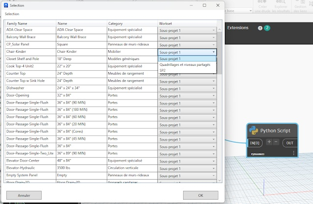

# Migrating from IronPython2 to PythonNet3
### Explicitly calling the base class constructor

Now, in Python classes that inherit from a .NET type (like _Winform_, _WPF_, _DataTable_, or an _Interface_), if you overload the method \__init__, you must explicitly call the base class constructor using _super()_.\__init__(...).

**Example (WinForms):**

```python
class TestForm(Form):
    def __init__(self):
        super().__init__() # add this line
        self.Font  = System.Drawing.SystemFonts.DefaultFont
        self.InitializeComponent()
   
    def InitializeComponent(self):
        self._buttonCancel = System.Windows.Forms.Button()
        self._buttonOK = System.Windows.Forms.Button()
        self.SuspendLayout()
```
# Specific Syntax of .NET Class Interface Implementation
Implementing .NET Class Interfaces, which was difficult under CPython3 (PythonNet 2.5), is now fixed and made easier with Dynamo_PythonNet3.

A Python class deriving from a .NET class must have the attribute __namespace__.

**Example (Implementation of _ISelectionFilter_):**

```python
class Custom_SelectionElem(ISelectionFilter):
    __namespace__ = "SelectionNameSpace_tEfYX0DHE"
    #
    def __init__(self, bic):
        super().__init__() # necessary  if you override the __init__ method
        self.bic = bic
       
    def AllowElement(self, e):
        if e.Category.Id == ElementId(self.bic):
            return True
        else:
            return False
    def AllowReference(self, ref, point):
        return True
     
class Custom_FamilyOption(IFamilyLoadOptions) :
    __namespace__ = "FamilyOptionNameSpace_tEfYX0DHE"

    def __init__(self):
        super().__init__() # necessary  if you override the __init__ method
       
    def OnFamilyFound(self, familyInUse, _overwriteParameterValues):
        overwriteParameterValues = True
        return (True, overwriteParameterValues)

    def OnSharedFamilyFound(self, sharedFamily, familyInUse, source, _overwriteParameterValues):
        overwriteParameterValues = True     
        return (True, overwriteParameterValues)

```
### The UI with WPF
IronPython allows the direct use of WPF thanks to a specific library (_wpf_).

There is no similar library with PythonNet3. However, with some concessions on Binding, it is still possible to use WPF (even with the MVVM pattern) via _XamlReader.Load(StringReader(xaml))_

Here is an example of assigning a sub-project by Element type using the MVVM pattern:



```python
import clr
import sys
import System
from System.Collections.ObjectModel import ObservableCollection

# Import Revit API
clr.AddReference('RevitAPI')
import Autodesk
from Autodesk.Revit.DB import *
import Autodesk.Revit.DB as DB

clr.AddReference('RevitServices')
import RevitServices
from RevitServices.Persistence import DocumentManager
from RevitServices.Transactions import TransactionManager

# Get Important vars
doc = DocumentManager.Instance.CurrentDBDocument
uidoc = DocumentManager.Instance.CurrentUIApplication.ActiveUIDocument
uiapp = DocumentManager.Instance.CurrentUIApplication
app = uiapp.Application
sdkNumber = int(app.VersionNumber)

clr.AddReference('System.Data')
from System.Data import *

clr.AddReference("System.Xml")
clr.AddReference("PresentationFramework")
clr.AddReference("System.Xml")
clr.AddReference("PresentationCore")
clr.AddReference("System.Windows")
import System.Windows.Controls
from System.Windows.Controls import *
from System.IO import StringReader
from System.Xml import XmlReader
from System.Windows import LogicalTreeHelper
from System.Windows.Markup import XamlReader, XamlWriter
from System.Windows import Window, Application
from System.ComponentModel import INotifyPropertyChanged, PropertyChangedEventArgs

import time
import traceback
import itertools


class ViewModel(INotifyPropertyChanged): # INotifyPropertyChanged
    __namespace__ = "ViewModel_jhggsbUbwQpY" # rename it each edition class
    def __init__(self, elem_type, lst_Workset):
        super().__init__()
        self._elem_type = elem_type
        self._SelectValue = lst_Workset[0] # set default workset
        self._lst_Workset = ObservableCollection[DB.Workset](lst_Workset)
        #
        self._property_changed_handlers = []
        self.PropertyChanged = None
       
    @clr.clrproperty(DB.Element)
    def ElementType(self):
        return self._elem_type
   
    @clr.clrproperty(System.String)
    def Name(self):
        return self._elem_type.get_Name()
       
    @clr.clrproperty(System.String)
    def FamilyName(self):
        return self._elem_type.FamilyName
       
    def get_SelectValue(self):
        return self._SelectValue
    def set_SelectValue(self, value):
        if self._SelectValue != value:
            self._SelectValue = value
            self.OnPropertyChanged("SelectValue")

    # Add SelectValue as a clr property
    SelectValue = clr.clrproperty(DB.Workset, get_SelectValue, set_SelectValue)
      
    @clr.clrproperty(ObservableCollection[DB.Workset])
    def LstWorkset(self):
        return self._lst_Workset
       
    def OnPropertyChanged(self, property_name):
        event_args = PropertyChangedEventArgs(property_name)
        for handler in self._property_changed_handlers:
            handler(self, event_args)

    # Implementation of add/remove_PropertyChanged
    def add_PropertyChanged(self, handler):
        if handler not in self._property_changed_handlers:
            self._property_changed_handlers.append(handler)

    def remove_PropertyChanged(self, handler):
        if handler in self._property_changed_handlers:
            self._property_changed_handlers.remove(handler)
   

class MainWindow(Window):
    string_xaml = '''
<Window
        xmlns="http://schemas.microsoft.com/winfx/2006/xaml/presentation"
        xmlns:x="http://schemas.microsoft.com/winfx/2006/xaml"
        xmlns:d="http://schemas.microsoft.com/expression/blend/2008"
        xmlns:mc="http://schemas.openxmlformats.org/markup-compatibility/2006"
        Title="Selection"
        Height="700" MinHeight="700"
        Width="700" MinWidth="780"
        x:Name="MainWindow">
        <Window.Resources>
        </Window.Resources>
        <Grid Width="auto" Height="auto">
            <Grid.RowDefinitions>
                <RowDefinition Height="30" />
                <RowDefinition />
                <RowDefinition Height="60" />
            </Grid.RowDefinitions>
            <Label
                x:Name="label1"
                Content="Selection"
                Grid.Column="0" Grid.Row="0"
                HorizontalAlignment="Left" VerticalAlignment="Bottom"
                Margin="8,0,366.6,5"
                Width="415" Height="25" />
            <DataGrid
                x:Name="dataGrid"
                AutoGenerateColumns="False"
                ItemsSource="{Binding}"
                Grid.Column="0" Grid.Row="1"
                HorizontalAlignment="Stretch" VerticalAlignment="Stretch"
                Margin="8,3,8,7"
                SelectionUnit="Cell"
                CanUserAddRows="False">
                <DataGrid.Columns>
                    <DataGridTextColumn Header="Family Name" Binding="{Binding FamilyName}" Width="*" />
                    <DataGridTextColumn Header="Name" Binding="{Binding Name}" Width="*" />
                    <DataGridTextColumn Header="Category" Binding="{Binding ElementType.Category.Name}" Width="*" />
                    <DataGridTemplateColumn Header="Workset">
                        <DataGridTemplateColumn.CellTemplate>
                            <DataTemplate>
                                <ComboBox x:Name="Combobox"
                                    ItemsSource="{Binding LstWorkset}"
                                    DisplayMemberPath="Name"
                                    SelectedItem="{Binding SelectValue, Mode=TwoWay, UpdateSourceTrigger=PropertyChanged}"
                                    Width="200"/>
                            </DataTemplate>
                        </DataGridTemplateColumn.CellTemplate>
                    </DataGridTemplateColumn>
                </DataGrid.Columns>
            </DataGrid>
            <Button
                x:Name="buttonCancel"
                Content="Cancel"
                Grid.Column="0" Grid.Row="2"
                HorizontalAlignment="Left" VerticalAlignment="Bottom"
                Margin="18,13,0,10"
                Height="30" Width="120">
            </Button>
            <Button
                x:Name="buttonOK"
                Content="OK"               
                Grid.Column="0" Grid.Row="2"
                HorizontalAlignment="Right" VerticalAlignment="Bottom"
                Margin="0,12,22,10"
                Height="30" Width="120">
            </Button>
        </Grid>
</Window>'''
 
    def __init__(self, lst_wkset, lst_elems):
        super().__init__()
        self._lst_wkset = lst_wkset
        self._lst_elems = lst_elems
        self._set_elemTypeId = set(x.GetTypeId() for x in lst_elems if isinstance(x, FamilyInstance))
        self._lst_elemType = [doc.GetElement(xId) for xId in self._set_elemTypeId if xId != ElementId.InvalidElementId]
        

        # Sort _lst_elemType by Name   
        self._lst_elemType= sorted(self._lst_elemType, key = lambda x : x.FamilyName)
        

        # Create an ObservableCollection of MyDataViewModel objects
        self.data = ObservableCollection[System.Object]()
        for elem in self._lst_elemType:
            self.data.Add(ViewModel(elem, self._lst_wkset))
                
        self.pairLst = []
        
        xr = XmlReader.Create(StringReader(MainWindow.string_xaml))
        self.winLoad = XamlReader.Load(xr)
        self.InitializeComponent()
       
    def InitializeComponent(self):
        try:
            self.Content = self.winLoad.Content
            
            self.dataGrid = LogicalTreeHelper.FindLogicalNode(self.winLoad, "dataGrid")
            
            self.buttonCancel = LogicalTreeHelper.FindLogicalNode(self.winLoad, "buttonCancel")
            self.buttonCancel.Click += self.ButtonCancelClick
            
            self.buttonOK = LogicalTreeHelper.FindLogicalNode(self.winLoad, "buttonOK")
            self.buttonOK.Click += self.ButtonOKClick
            
            self.winLoad.Loaded += self.OncLoad
            
            # Set DataContext
            self.dataGrid.DataContext = self.data               
            self.winLoad.DataContext = self.data

        except Exception as ex:
            print(traceback.format_exc())

    def OncLoad(self, sender, e):
        print("UI loaded")

    def ButtonCancelClick(self, sender, e):
        self.outSelection = []
        self.winLoad.Close()

    def ButtonOKClick(self, sender, e):
        try:
            # Get result from input Data (Binding)
            self.pairLst = [[x.ElementType, x.SelectValue] for x  in self.data]
            self.winLoad.Close()
        except Exception as ex:
            print(traceback.format_exc())

lst_Elements = UnwrapElement(IN[0])
lst_Wkset = FilteredWorksetCollector(doc).OfKind(WorksetKind.UserWorkset).ToWorksets()
objWindow = MainWindow(lst_Wkset, lst_Elements)
objWindow.winLoad.ShowDialog()

OUT = objWindow.pairLst 
```

# Respect method signatures
IronPython is more permissive. With PythonNet, you must strictly adhere to the signature of a .NET method, which means that:

- The method name is correct.
- The method is called on the correct type of object (instance method vs static method).
- The types of objects passed as arguments are correct.

If you pass a native Python list to a .NET method that expects a .NET collection, you must explicitly cast/convert the Python list. 

**Example: Casting a Python list to** _List<\ElementId>_ :

```py
from System.Collections.Generic import List

# Some imports
selelemz=List([ElementId][ElementId(124291), ElementId(124292), ElementId(124293)])
elements=FilteredElementCollector(doc,selelemz).WhereElementIsNotElementType().ToElements()
```

### Specific syntax for _out_ and _ref_ parameters
With PythonNet3, the parameters _out_ or _ref_ appear as normal arguments in Python, but the return value of the method is modified: The method returns the modified value(s) of these parameters as a tuple.

**Example (Using _ComputeClosestPoints_ with a parameter _out_):**

**IronPython (old syntax):**

```py
curvA = cableTray1.Location.Curve
curvB = cableTray2.Location.Curve
outrefClosest = clr.Reference[IList[ClosestPointsPairBetweenTwoCurves]](List[ClosestPointsPairBetweenTwoCurves]())
curvA.ComputeClosestPoints(curvB, True, True, True, outrefClosest)
listOfPoint = [[x.XYZPointOnFirstCurve.ToPoint(), x.XYZPointOnSecondCurve.ToPoint()] for x in outrefClosest.Value]
```

_Please note that there is a difference with the old version “PythonNet2.5” when the method returns nothing (Void)_

### Access to CPython libraries coded in C
PythonNet3 provides excellent access to the entire modern PyPI ecosystem, including libraries that use C extensions (such as _numpy, pandas, scipy, openpyxl_). IronPython has an incompatibility with these libraries.

### LINQ
Just as IronPython PythonNet3 supports LINQ method extensions, it will nevertheless be necessary to specify the Types of the objects passed as arguments. **See examples in the next section.**

### No direct access to COM objects
PythonNet does not implement DLR, unlike IronPython. As a result, dynamic access directly to COM object properties is not possible.

Two workarounds:

- Use .NET Reflection
- Cast objects to the correct interface
Example of using .NET Reflection:

```py
import sys
import clr
import System
from System import Environment
from System.Runtime.InteropServices import Marshal

try:
    from System.Reflection import BindingFlags
except:
    clr.AddReference("System.Reflection")
    from System.Reflection import BindingFlags

xls_filePath = IN[0]
wsNames = []

systemType = System.Type.GetTypeFromProgID("Excel.Application", True)
try:
    ex = System.Activator.CreateInstance(systemType)
except:
    methodCreate = next((m for m in clr.GetClrType(System.Activator)\
                    .GetMethods()if "CreateInstance(System.Type)" in m.ToString()), None)
    ex = methodCreate.Invoke(None, (systemType, ))
   
ex.Visible = False
workbooks = ex.GetType()\
            .InvokeMember("Workbooks", BindingFlags.GetProperty ,None, ex, None)

workbook = workbooks.GetType()\
            .InvokeMember("Open", BindingFlags.InvokeMethod , None, workbooks, (xls_filePath, ))

worksheets = workbook.GetType()\
            .InvokeMember("Worksheets", BindingFlags.GetProperty ,None, workbook, None)

enumerator_sheets = worksheets.GetType()\
            .InvokeMember("GetEnumerator", BindingFlags.InvokeMethod , None, worksheets, None)

while enumerator_sheets.MoveNext():
    sheet = enumerator_sheets.Current
    sheet_name = sheet.GetType().InvokeMember("Name", BindingFlags.GetProperty,None, sheet, None)
    wsNames.append(sheet_name)

workbooks.GetType().InvokeMember("Close", BindingFlags.InvokeMethod, None, workbooks, None)
ex.GetType().InvokeMember("Quit", BindingFlags.InvokeMethod, None, ex, None)

if workbooks is not None:
    Marshal.ReleaseComObject(workbooks)
if ex is not None:
    Marshal.ReleaseComObject(ex)

workbooks = None
ex = None

OUT = wsNames
```