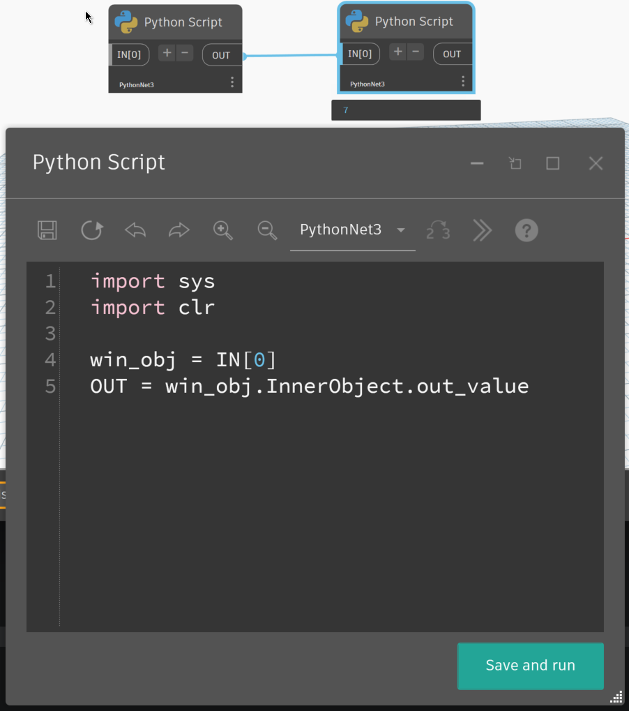
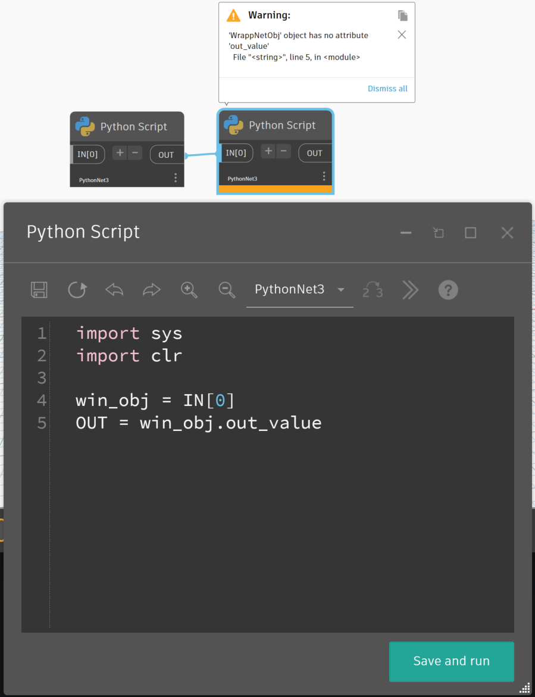

# Obstacles encountered with PythonNet3 and workarounds

### Properties of type “Indexer”

Properties of type “Indexer” (like access to _Space_ in the Revit API) are no longer handled directly with the bracket syntax. The indexer must be replaced by the corresponding _get__  method.

**Example:**

**Old code:**

```py 
space = elem.Space[phase]
```
**New code:**
```py
space = elem.get_Space(phase)
```
### Error in Python set collection
The Python Collection _ste()_ does not accept objects of type _ElementId.InvalidId_.

**Workarounds:**
- Filter invalid IDs when building the _set()_
- Use the .NET class _HashSet\<T>

**Example(Filtering):**
```py
setViewsIds = set([w.OwnerViewId for In in allWires if w.OwnerViewId != ElementId.InvalidElementId])
```
### "with" statement on .NET objects

The use of the keyword _with_ on .NET objects (which implement the interface _IDisposable_) currently throws an error with PythonNet3, unlike IronPython.

**Workaround:** Build a custom context manager to explicitly handle the method _Dispose()_.

**Example (Custom Context Manager CManager):**

```py
import sys
import clr
import System

# Add Assemblies for AutoCAD and Civil3D
clr.AddReference('AcMgd')
clr.AddReference('AcCoreMgd')
clr.AddReference('AcDbMgd')
clr.AddReference('AecBaseMgd')
clr.AddReference('AecPropDataMgd')
clr.AddReference('AeccDbMgd')

# Import references from AutoCAD
from Autodesk.AutoCAD.Runtime import *
from Autodesk.AutoCAD.ApplicationServices import *
from Autodesk.AutoCAD.EditorInput import *
from Autodesk.AutoCAD.DatabaseServices import *
from Autodesk.AutoCAD.Geometry import *

# Import references from Civil3D
from Autodesk.Civil.ApplicationServices import *
from Autodesk.Civil.DatabaseServices import *

# The inputs to this node will be stored as a list in the IN variables.
dataEnteringNode = IN

adoc = Application.DocumentManager.MdiActiveDocument
editor = adoc.Editor

class CManager:
    """
    a custom context manager for Disposable Object
    """
    def __init__(self, obj):
        self.obj = obj
       
    def __enter__(self):
        return self.obj
       
    def __exit__(self, exc_type, exc_value, exc_tb):
        self.obj.Dispose()
        if exc_type:
            error = f"{exc_value} at line {exc_tb.tb_lineno}"
            raise ValueError( error)
        return self
             
        
dynCADObjects = IN[0]
with adoc.LockDocument():
    with CManager(adoc.Database) as db:
        print(db)
        with CManager(db.TransactionManager.StartTransaction()) as t:
            print(t)
            for dynObj in dynCADObjects:
                ent = t.GetObject(dynObj.AcadObjectId, OpenMode.ForWrite)
                ent.Layer = "Layer1"
                #a = 10 /0
            t.Commit()

print(f"{db.IsDisposed=}")
print(f"{t.IsDisposed=}")
```
### .NET Objects that Inherit from an Interface
In the case of objects that inherit from a .NET Interface, it may be necessary to cast (convert) the object to that interface to use the inherited methods.

**Example (Call _BeginInit()_ on a _PictureBox_):**

In the example below, you will find the PythonNet syntax to perform an explicit cast to a .NET interface.

```py
class Form8(Form):
    def __init__(self):
        super().__init__() # necessary  if you override the __init__ method
        self.InitializeComponent()
   
    def InitializeComponent(self):
        self._pictureBox1 = System.Windows.Forms.PictureBox()
        System.ComponentModel.ISupportInitialize(self._pictureBox1).BeginInit()
        self.SuspendLayout()
```

The line _System.ComponentModel.ISupportInitialize(self._pictureBox1).BeginInit()_ is therefore a method call on an explicit interface:

- It “casts” (or rather, it accesses) the object _self._pictureBox1_ via its implementation of the interface _ISupportInitialize_.
- It then calls the method _BeginInit()_ of this interface

### Attributes lost on .NET Class Instances when assigning to _OUT_

Python class instances deriving from a .NET class may have their attributes removed by the Dynamo Wrapper when assigning to the variable _OUT_.

**Workaround**:

Wrap the .NET object in a simple Python class before assigning it to _OUT_.

**Example**:

```py
# Load the Python Standard and DesignScript Libraries
import sys
import clr

clr.AddReference('System.Drawing')
clr.AddReference('System.Windows.Forms')
import System.Drawing
import System.Windows.Forms

from System.Drawing import *
from System.Windows.Forms import *

class WrappNetObj:
     def __init__(self, obj):
         self.InnerObject = obj
     def __repr__(self):
         return "WrappNetObj_" + self.InnerObject.GetType().ToString()

class Form8(Form):
    def __init__(self):
        super().__init__()
        self.out_value = 7
        self.InitializeComponent()
   
    def InitializeComponent(self):
        self.SuspendLayout()
        #
        #Form8
        #
        self.ClientSize = System.Drawing.Size(284, 261)
        self.Name = "Form8"
        self.Text = "Form8"
        self.ResumeLayout(False)

win_obj = Form8()
OUT = WrappNetObj(win_obj)
```





### Missing error line

In rare cases, the error line number in the Python node error message may be missing.

Here are some solutions while waiting for a fix:

Implement a try-except block with the _traceback_ library and print the error.
Implement a try-except block with a _logger_ and write the error.
Implement a debugger, for example, using _sys.settrace()_.

**Conclusion**
PythonNet3 establishes itself not only as the current standard but as the only sustainable path forward for development in Dynamo. 
