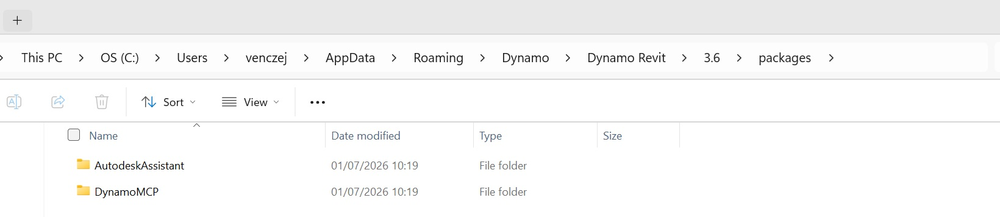
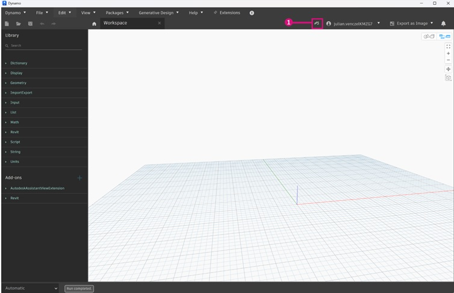
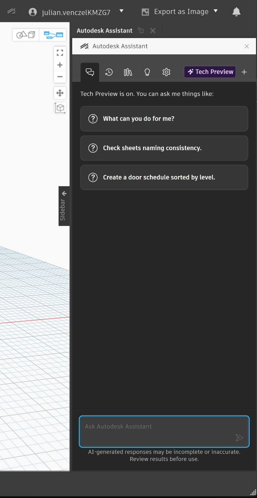

# What is Autodesk Assistant for Dynamo

Autodesk Assistant is a built-in AI tool that will ship standard with Revit 2027. Revit 2027 will also ship with the built-in version 4.2 of Dynamo which will have it's own access to Autodesk Assistant.

> 1. Autodesk Assistant is available as a view extension and will not add any additional nodes to the library
> 2. It is available as an extension in version 4.2 of Dynamo onwards
> 3. It functions in much the same way as other chat based AI tools and will directly alter the nodes on the canvas

### How do you install it?

> 1. Currently the Autodesk Assistant for Dynamo is only available by being part of the alpha testing group. This is available by signing up here: https://feedback.autodesk.com/key/DynamoAgenticAlpha.
> 2. Once downloaded, the Autodesk Assistant for Dynamo and MCP server should be unzipped and then copied into the desired dynamo version at this file locaton: _C:\Users\\[Username]\AppData\Roaming\Dynamo\Dynamo Revit\\[dynamo version]\packages_

### Using the Autodesk Assistant?

> 1. Once installed, an icon should appear above the canvas space towards the right-hand side. Clicking this icon will open the Autodesk Assistant window.

> 2. Once opened, a chatbar will appear on the right-hand side of the window which will allow you to interact and make requests of Autodesk Assistant for Dynamo. 

> 3. 

