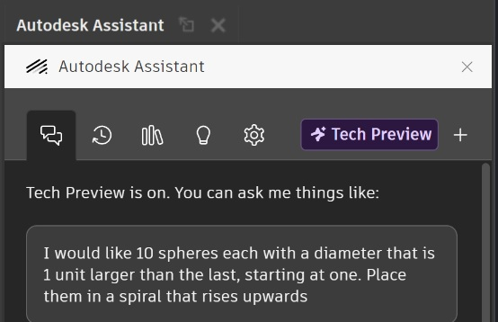
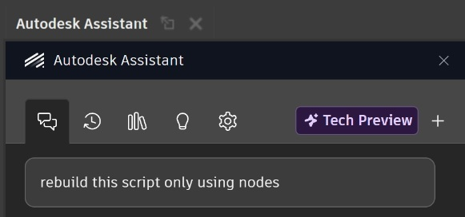
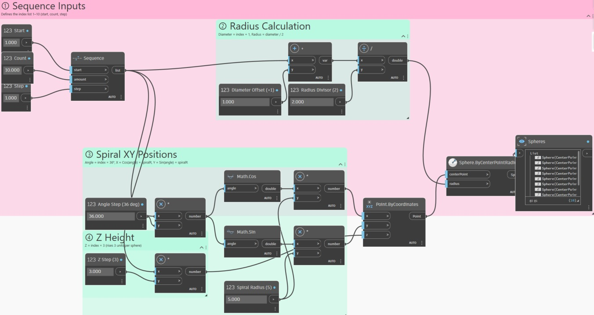
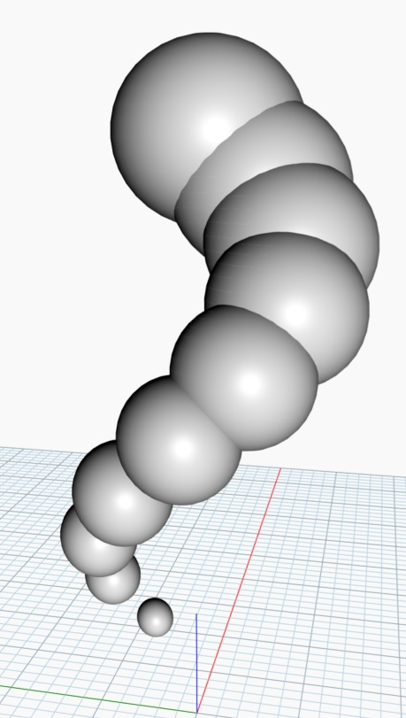
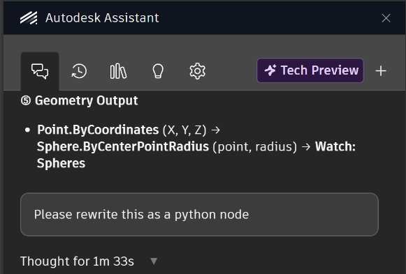
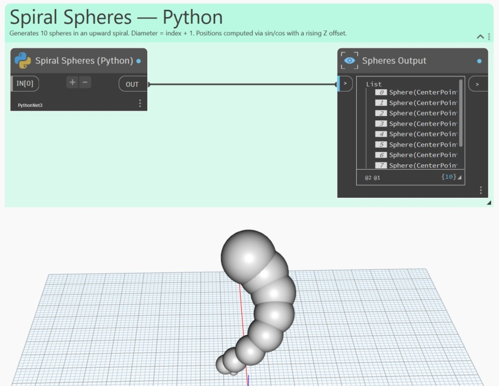
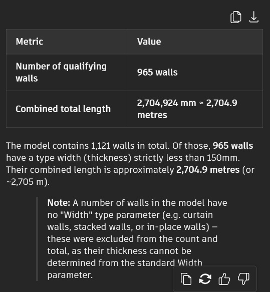
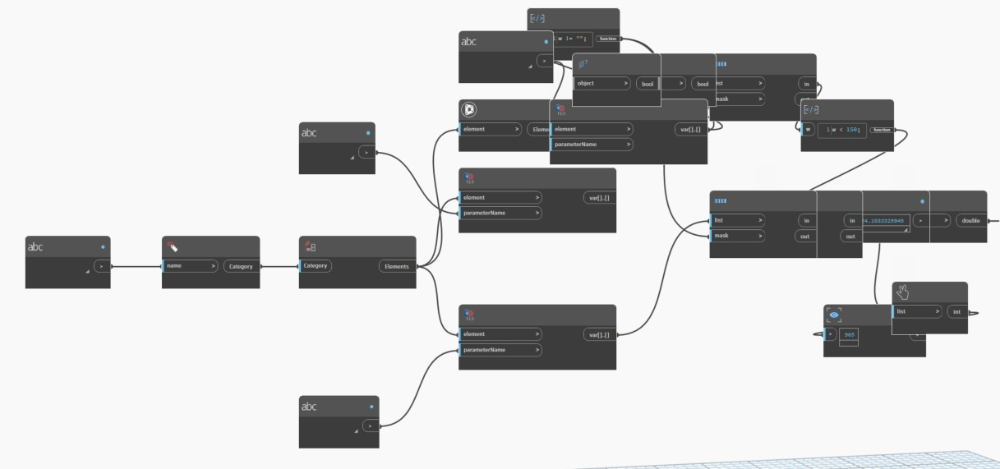

# What can autodesk assistant do?

Autodesk Assistant is capable of many operations and will utilise library nodes, code blocks containing designscript and custom python nodes. Autodesk Assistant is also capable of organising and annotating dynamo scripts using coloured regions and text.

### Geometry 
Autodesk Assistant can create complex geometry and will try as best as possible to match a given query. Concise instructions are key to getting the desired results. In this example, Autodesk Assistant is being asked to create 10 spheres that increase in diameter by 1 unit each time, starting with a diameter of 1. The spheres are to be placed in a spiral that trends upwards. The exact prompt reads: _I would like 10 spheres each with a diameter that is 1 unit larger than the lat, starting at one. Place them in a spiral that rises upwards._

Autodesk Assistant best tries to match this request as can be seen by the geometry created here. 

The Autodesk Assistant is able to generate nodes, custom code blocks and python nodes but if not specified will tend towards code blocks.

If requested, the Autodesk Assistant can rewrite a script to prioritise using a particular method if that is what is wanted.

The script will be re-written as desired.

However the results may be slightly different, especially if certain variables were not given in the first place.

As mentioned Autodesk Assistant can also create python nodes if that is what is desired.

The Autodesk Assistant will again rewrite the script in the requested format, with some minor changes in the results being possible once again.

### Data manipulation
> 1. Autodesk Assistant can use revit nodes to search through the Revit document attached to the dynamo file in order to extract information about the Revit model. In this particular example, a sample revit project has been loaded into the program and Autodesk Assistant will be used to make queries about the model. 

AA_Data_Results

### Search functions 
> 1. Autodesk Assistant can use the web to search for scripts that may already exist elsewhere and recreate or copy them into the canvas 