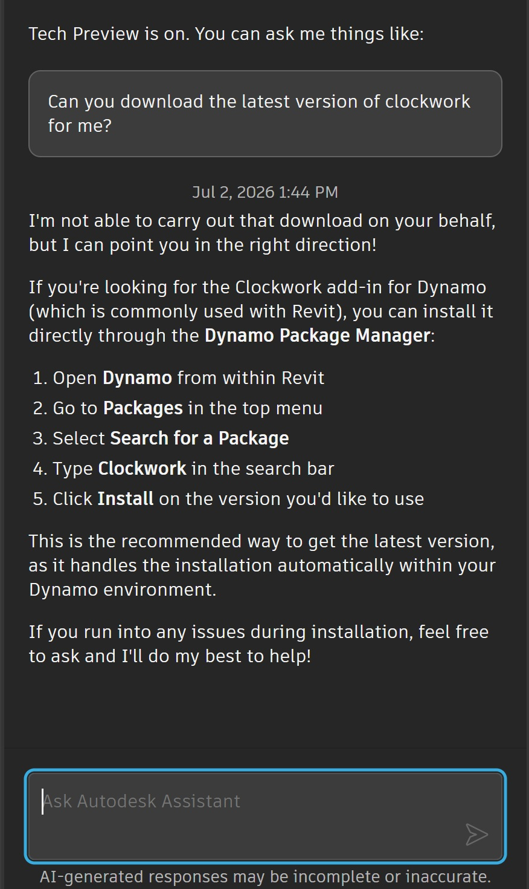
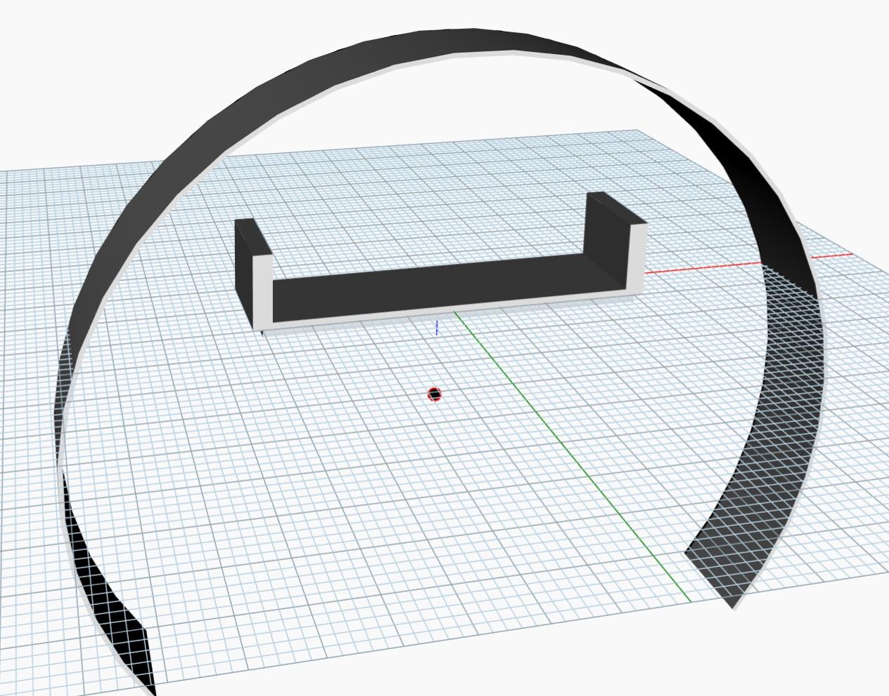
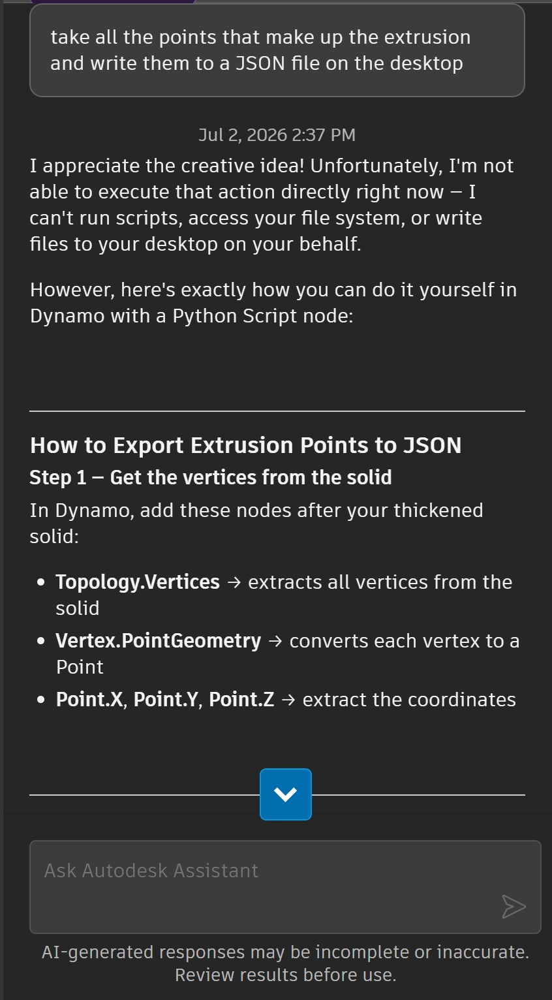

# What is Autodesk Assistant not yet capable of

### Updating packages

Autodesk Assistant can not yet download and install packages into Dynamo

As can be seen in the image above, Autodesk Assistant is not able to modify, install or uninstall external packages associated with Dynamo. It is able to provide instructions so that you may install them yourself.

### Accessing the hard disk

Autodesk Assistant is currently not able to access file systems on the general hard disk. 
In the example below there is some geometry created on the canvas. Autodesk Assistant is asked to take the points that make up the geometry and export them as a JSON. Whilst the Autodesk Assistant is not able to generate this JSON directly, it does suggest that a dynamo script could be made that does this.

### Directly changing the Revit document

