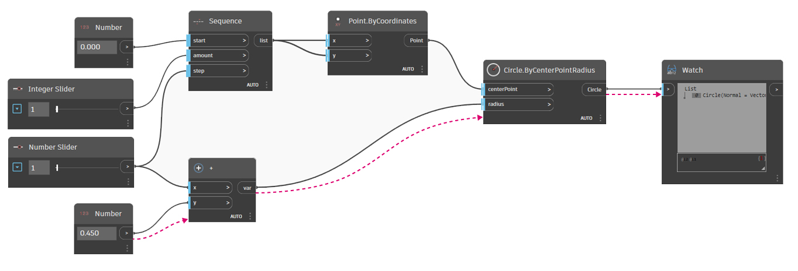

# 什么是 Dynamo 以及它是如何工作的？

Dynamo 是一款[可视化编程](https://primer2.dynamobim.org/a_appendix/a-1_visual-programming-and-dynamo)应用程序，可以下载并在单独的“沙盒”模式下运行，也可以下载并作为 Revit、FormIt 或 Civil 3D 等其他软件的插件运行。

详细了解 [**Dynamo 核心**/**Revit**/**沙盒**之间的差异。](https://dynamobim.org/a-new-way-to-get-dynamo-sandbox/)

### 过程

Dynamo 将使我们能够在可视化编程过程中工作，从而将各元素连接在一起以定义关系和构成自定义算法的操作序列。我们可以使用算法来处理各种应用程序（从处理数据到生成几何图形），所有操作均可实时完成，无需编写任何 `code`。

### 连接节点和导线

节点和导线是 Dynamo 中支持[可视化编程](../a\_appendix/a-1\_visual-programming-and-dynamo.md)过程的关键组件。它有助于在设计的各个部分之间建立强大的视觉和系统关系。在开发和优化设计工作流时，使用简单的鼠标单击即可轻松连接节点。

## Dynamo 有哪些用途？

从对项目工作流使用可视化编程到开发自定义工具，Dynamo 是各种令人兴奋的应用程序不可或缺的一部分。

[关注 Pinterest 上的“Dynamo 操作”讨论板。](http://www.pinterest.com/modelabnyc/dynamo-in-action/)
