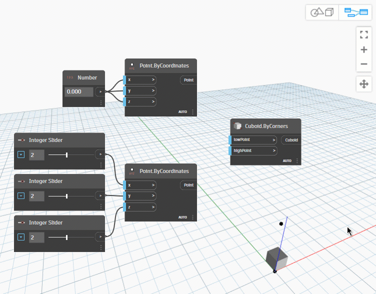

# Qu’est-ce que Dynamo et comment fonctionne-t-il ?

Dynamo est une application de [programmation visuelle](https://primer2.dynamobim.org/a_appendix/a-1_visual-programming-and-dynamo) qui peut être téléchargée et exécutée en mode « Sandbox » autonome ou en tant que plug-in pour d’autres logiciels tels que Revit, FormIt ou Civil 3D.

 
En savoir plus sur la [différence entre **Dynamo Core**/**Revit**/**Sandbox**. ](https://dynamobim.org/a-new-way-to-get-dynamo-sandbox/) 


### Processus

Dynamo vous permet de travailler au sein d’un processus de programmation visuelle dans lequel vous connectez des éléments pour définir les relations et les séquences d’actions qui composent les algorithmes personnalisés. Vous pouvez utiliser vos algorithmes pour un large éventail d’applications, du traitement de données à la génération de géométries, le tout en temps réel et sans avoir à écrire une ligne de `code`.

### Connexion de nœuds et des fils

Les nœuds et les fils sont les composants clés de Dynamo qui prennent en charge un processus de [programmation visuelle](../a\_appendix/a-1\_visual-programming-and-dynamo.md). Ils permettent d’établir des relations visuelles et systémiques solides entre les parties d’une conception. Utilisez la souris pour connecter les nœuds en toute simplicité lorsque vous développez et optimisez votre workflow de conception.

## Quels sont les avantages de Dynamo ?

De l’utilisation de la programmation visuelle pour des workflows de projet au développement d’outils personnalisés, Dynamo est l’aspect essentiel d’une large gamme d’applications passionnantes.

[Suivez le tableau Dynamo en action sur Pinterest.](http://www.pinterest.com/modelabnyc/dynamo-in-action/)
