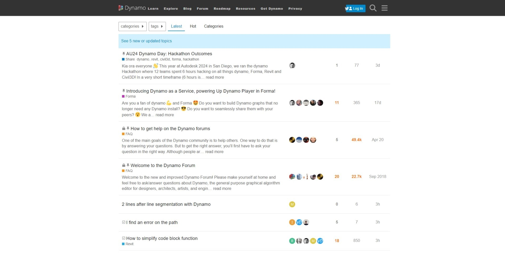
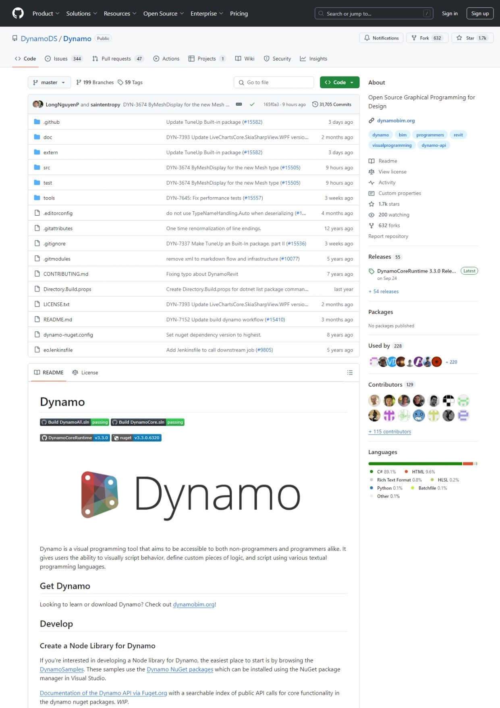

# Primer 사용자 안내서, Dynamo Community 및 플랫폼

Dynamo Primer에는 Mode Lab과 함께 작성한 장의 내용이 포함되어 있습니다. 이러한 장에서는 Dynamo를 사용하여 자체 시각적 프로그램을 개발하고 실행하는 데 필요한 필수 요건과, Dynamo를 더욱 활용하는 방법에 대한 핵심적인 통찰력에 대해 집중적으로 설명합니다.&#x20;

### Primer 사용자 안내서

이 안내서는 다양한 배경과 기술 수준의 독자들을 대상으로 합니다. Dynamo 설정, 사용자 인터페이스 및 주요 개념에 대한 일반적인 소개는 다음 섹션에서 확인할 수 있습니다. 새 사용자는 다음 항목을 참조하는 것이 좋습니다.

* [Dynamo의 정의 및 작동 방식](1-what-is-dynamo.md)
* [Dynamo 설정](../2\_setup\_for\_dynamo/)
* [사용자 인터페이스](../3\_user\_interface/)
* [노드 및 와이어](../4\_nodes\_and\_wires/)

특정 노드 및 기본 개념과 같은 각 요소에 대한 보다 심도 있는 이해를 원하는 사용자를 위해 해당 장의 기본 사항에 대해 알아봅니다.

* [필수 노드 및 개념](../5\_essential\_nodes\_and\_concepts/)

Dynamo 워크플로우의 데모를 보고 싶다면 샘플 워크플로우 섹션에 포함된 그래프를 참조하십시오. 첨부된 지침에 따라 고유한 Dynamo 그래프를 작성합니다.

* [파라메트릭 꽃병](../10\_sample\_workflow/10-1\_getting-started-workflows/1-parametric-vase.md)

* [어트랙터 점](../10\_sample\_workflow/10-1\_getting-started-workflows/2-attractor-points.md)


Dynamo에 대한 여러 항목을 다루므로 이후 장에서 더 많은 주제별 연습을 확인할 수 있습니다. **연습**은 일반적으로 각 페이지의 마지막 섹션에서 찾을 수 있습니다.


### 커뮤니티

의욕적인 사용자 그룹과 활동적인 참가자가 없다면 Dynamo는 지금의 모습을 갖추지 못했을 것입니다. [블로그](http://dynamobim.org/blog/)를 팔로우하거나, 갤러리에 작업을 추가하거나, [포럼](https://forum.dynamobim.com)에서 Dynamo에 대해 토론하여 커뮤니티에 참여해 보십시오.

### 플랫폼

Dynamo는 설계자를 위한 시각적 프로그래밍 도구로 통용되며, 외부 라이브러리 또는 API가 있는 모든 Autodesk 제품을 활용할 수 있게 해 줍니다. Dynamo Sandbox를 사용하여 "샌드박스" 스타일 응용프로그램에서 프로그램을 개발할 수도 있지만, Dynamo 에코시스템은 계속해서 성장하고 있습니다.

프로젝트의 소스 코드는 오픈 소스이므로 해당 기능을 핵심 컨텐츠로 확장할 수 있습니다. GitHub에서 프로젝트를 확인하고 Dynamo를 사용자화하고 있는 사용자의 진행 중 작업을 찾아보십시오.

> 필요에 따라 찾아보기, 분기, Dynamo 확장
