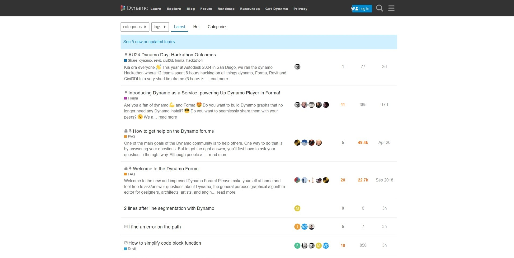
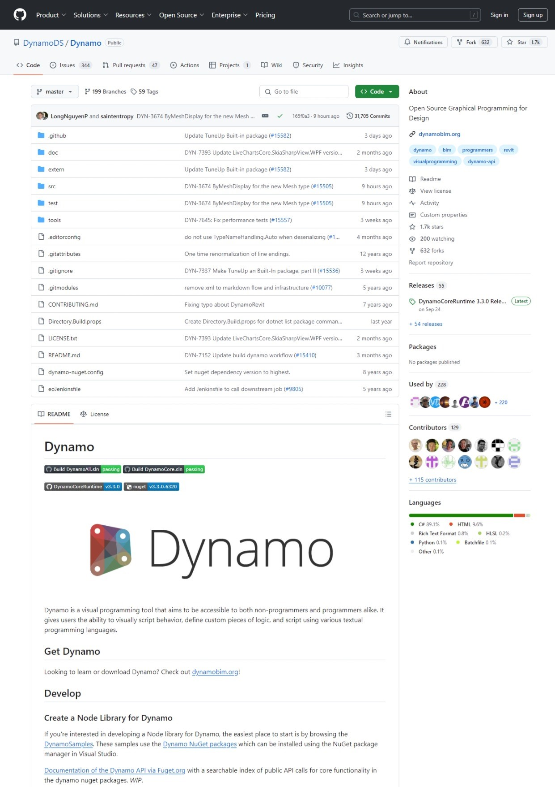

# Primer-Leitfaden, Dynamo-Community und -Plattform

Dieser Leitfaden enthält Kapitel, die mit Mode Lab entwickelt wurden. In diesen Kapiteln liegt der Schwerpunkt auf den Grundlagen, die Sie zum Entwickeln Ihrer eigenen visuellen Programme mit Dynamo benötigen, und auf wichtigen Einblicken in die weiteren Schritte mit Dynamo.

### Primer-Leitfaden

Dieser Leitfaden richtet sich an Leser mit unterschiedlichen Hintergründen und Kenntnisstufen. Eine allgemeine Einführung in die Einrichtung von Dynamo, die Benutzeroberfläche und die wichtigsten Konzepte finden Sie in den folgenden Abschnitten. Wir empfehlen neuen Benutzern, die folgenden Themen zu behandeln:

* [Was ist Dynamo und wie funktioniert die Anwendung?](1-what-is-dynamo.md)
* [Setup für Dynamo](../2_setup_for_dynamo/)
* [Benutzeroberfläche](../3_user_interface/)
* [Blöcke und Drähte](../4_nodes_and_wires/)

Für Benutzer, die ein tieferes Verständnis der einzelnen Elemente, z. B. bestimmter Blöcke und des Konzepts dahinter entwickeln möchten, werden die Grundlagen in einem eigenen Kapitel behandelt.

* [Wichtige Blöcke und Konzepte](../5_essential_nodes_and_concepts/)

Wenn Sie eine Demonstration der Dynamo-Arbeitsabläufe sehen möchten, finden Sie einige Diagramme im Abschnitt Beispielarbeitsabläufe. Befolgen Sie die angehängten Anweisungen, um Ihre eigenen Dynamo-Diagramme zu erstellen.

* [Parametrische Vase](../10_sample_workflow/10-1_getting-started-workflows/1-parametric-vase.md)

* [Attraktorpunkte](../10_sample_workflow/10-1_getting-started-workflows/2-attractor-points.md)

\.gif>)

 In den folgenden Kapiteln finden Sie themenspezifische Übungen, die sich mit unterschiedlichen Themen zu Dynamo befassen. **Übungen** finden Sie normalerweise im letzten Abschnitt jeder Seite. 

### Community

Ohne seine starke Community engagierter Benutzer und aktiver Beitragender hätte sich Dynamo nie so weit entwickelt. Engagieren auch Sie sich in der Community, indem Sie den [Blog](http://dynamobim.org/blog/) lesen, Ihre Arbeiten zur Galerie hinzufügen oder an [Forumsdiskussionen](https://forum.dynamobim.com) zu Dynamo teilnehmen.

### Die Plattform

Dynamo ist als visuelles Programmierwerkzeug für Designer konzipiert. Dies ermöglicht es, Tools zu entwickeln, die externe Bibliotheken oder beliebige Autodesk-Produkte nutzen, in denen eine API zur Verfügung steht. In Dynamo Sandbox können Sie Programme in einer Sandbox-ähnlichen Anwendung entwickeln. Das Dynamo-Ökosystem wächst jedoch nach wie vor weiter.

Da der Quellcode für dieses Projekt als Open Source zur Verfügung steht, können Sie seine Funktionen ganz nach Ihren Vorstellungen erweitern. Besuchen Sie das Projekt auf GitHub und sehen Sie sich die laufenden Beiträge der Benutzer an, die Dynamo anpassen.

> Durchsuchen, Verzweigen und Erweitern von Dynamo für Ihre Anforderungen
