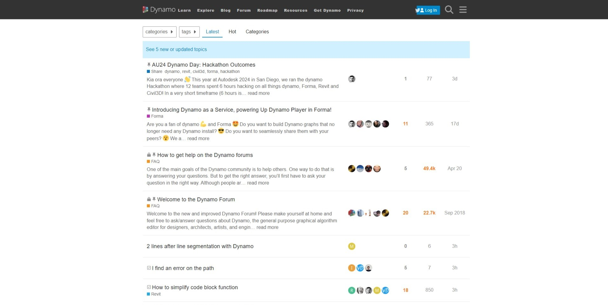
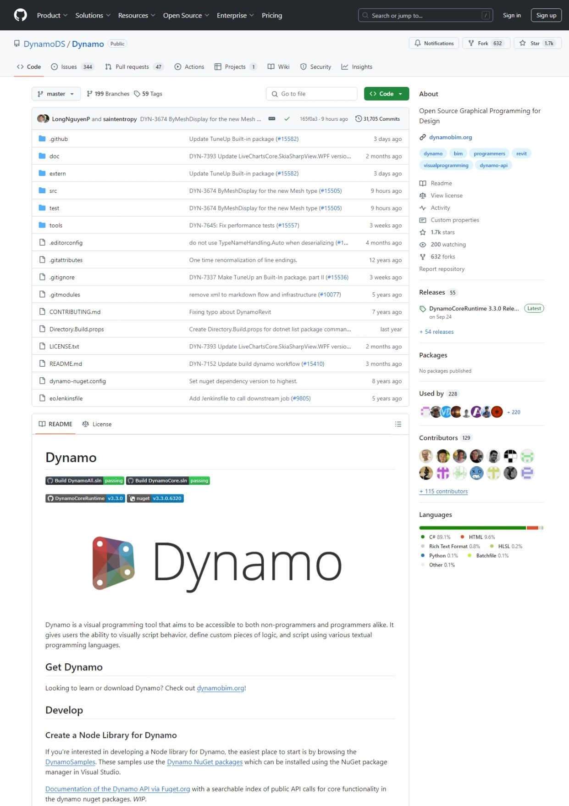

# Primer User Guide, Dynamo Community & Platform

### Primer User Guide

This guide is designed to cater to readers from different backgrounds and skill levels. General introduction about Dynamo setup, user interface and essential concepts can be found in the following sections, we recommend new users to cover these essential topics.

* [1-2\_what\_is\_dynamo.md](1-2\_what\_is\_dynamo.md "mention")
* [2\_setup\_for\_dynamo](../2\_setup\_for\_dynamo/ "mention")
* [2-2\_the\_dynamo\_ui](../2-2\_the\_dynamo\_ui/ "mention")
* [3-1\_dynamo\_nodes](../3-1\_dynamo\_nodes/ "mention")

For users who would like to develop a more in-depth understanding of each element such as a specific Nodes and the concept behind it, we cover the fundamentals in its own chapter.

#### Under Essential Nodes and Concepts

* [5\_geometry-for-computational-design](../essential-nodes-and-concepts/5\_geometry-for-computational-design/ "mention")
* [4\_the-building-blocks-of-programs](../essential-nodes-and-concepts/4\_the-building-blocks-of-programs/ "mention")
* [6\_designing-with-lists](../essential-nodes-and-concepts/6\_designing-with-lists/ "mention")
* [9\_dictionaries-in-dynamo](../essential-nodes-and-concepts/9\_dictionaries-in-dynamo/ "mention")

If you would like to see the demonstration of Dynamo workflows, we have included some graphs in the Sample Workflows section. Follow the attached instructions to create your own Dynamo graphs.

* [creating-a-vase.md](../sample-workflow/your-first-dynamo-graph/creating-a-vase.md "mention") (GIF)
* [2-6\_the\_quick\_start\_guide.md](../sample-workflow/your-first-dynamo-graph/2-6\_the\_quick\_start\_guide.md "mention") (GIF)
* [attractor.md](../sample-workflow/your-first-dynamo-graph/attractor.md "mention")(GIF)

### The Community

Dynamo wouldn't be what it is without a strong group of avid users and active contributors. Engage the community by following the [Blog](http://dynamobim.org/blog/), adding your work to the Gallery, or discussing Dynamo in the [Forum](https://forum.dynamobim.com).

### The Platform

Dynamo is envisioned as a visual programming tool for designers, allowing us to make tools that make use of external libraries or any Autodesk product that has an API. With Dynamo Sandbox we can develop programs in a "Sandbox" style application - but the Dynamo ecosystem continues to grow.

The source code for the project is open-source, enabling us to extend its functionality to our hearts content. Check out the project on GitHub and browse the Works in Progress of users customizing Dynamo.

> Browse, Fork, and start extending Dynamo for your needs
