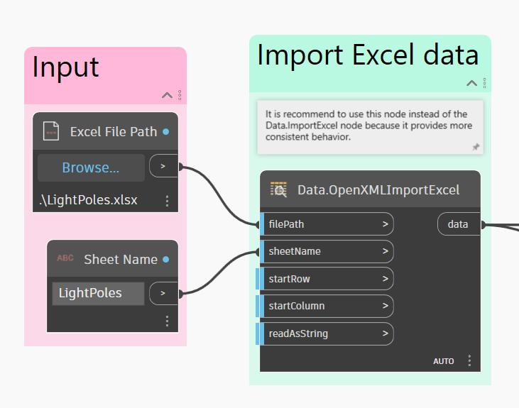

# User Interface

### UI Overview

The User Interface (UI) for Dynamo is organized into five main regions. We will briefly cover the overview here and further explain the Workspace and Library in following sections.

.jpg>)

> 1. Menus
> 2. Toolbar
> 3. Library
> 4. Workspace
> 5. Execution bar

### Menus

_<mark style="color:red;">(Update screenshot when new Dynamo version available in Revit)</mark>_

Here are Menus for basic functionality of the Dynamo application. Like most Windows software, the first two menus related to managing files, operations for selection and content editing. The remaining menus are more specific to Dynamo.

#### Settings

From geometric to user settings, these options can be found in the **Settings** menu. Here you can opt in or out for sharing your user data to improve Dynamo as well as define the application's decimal point precision and geometry render quality.

_<mark style="color:red;">(Update screenshot when new Dynamo version available in Revit)</mark>_

> 1. Enabling Reporting - Options for sharing user data to improve Dynamo.
> 2. Show Run Preview - Preview the execution state of your graph. Nodes scheduled for execution will be highlighted in your graph.
> 3. Number Format Options - Change the document settings for decimals.
> 4. Render Precision - Raise or lower the document render quality.
> 5. Geometry Scaling - Select range of geometry you are working on.
> 6. Isolate Selected Geometry - Isolated background geometry based on your node selection.
> 7. Show/Hide Geometry Edges - Toggle 3D geometry edges.
> 8. Show/Hide Preview Bubbles - Toggle data preview bubbles below nodes.
> 9. Manage Node and Package Paths - Manage file paths to make nodes and packages show up in the Library.
> 10. Enabling Experimental Features - Use beta features new in Dynamo.

#### Help

If you're stuck, check out the **Help** Menu. You may access one of the Dynamo reference websites through your internet browser.

Check the version of Dynamo installed and whether it is up to date through the **About** option.

_<mark style="color:red;">(Check latest Revit Dynamo version, About probably moved to First item on menu)</mark>_

Here are the list of options available through the Help menu.

> 1. Getting Started - A brief introduction to using Dynamo.
> 2. Samples - Reference example files.
> 3. Open Dynamo Dictionary - Resource with documentation on all nodes.
> 4. Report A Bug - Open an Issue on GitHub.
> 5. Go To Project Website - View the Dynamo Project on GitHub.
> 6. Go To Project Wiki - Visit the wiki for learning about development using the Dynamo API, supporting libraries and tools.
> 7. Display Start Page - Return to the Dynamo start page when within a document.
> 8. About - Dynamo Version data

_<mark style="color:red;">(Update screenshot when new Dynamo version available in Revit)</mark>_

### Toolbar

Dynamo's Toolbar contains a series of buttons for quick access to working with files as well as Undo \[Ctrl + Z] and Redo \[Ctrl + Y] commands. On the far right is another button that will export a snapshot of the workspace, which is extremely useful for documentation and sharing.

*  New - Create a new .dyn file
* .jpg>) Open - Open an existing .dyn (workspace) or .dyf (custom node) file
*  Save/Save As - Save your active .dyn or .dyf file
*  Undo - Undo your last action
*  Redo - Redo the next action
*  Export Workspace as Image - Export the visible workspace as a PNG file

### Library

The Dynamo Library is a collection of functional libraries, each Library containing Nodes grouped by Category. It consists basic libraries which are added during default installation of Dynamo, as we continue to introduce its usage, we will demonstrate how to extend the base functionality with Custom Nodes and additional Packages. The [3-3\_dynamo\_libraries.md](3-3\_dynamo\_libraries.md "mention") section will cover a more detailed guidance on using it.

### Workspace

The Workspace is where we compose our visual programs, you may also change its Preview setting to view the 3D geometries from here. Refer [workspace.md](workspace.md "mention") for more details.

.gif>)

### Execution Bar

Run your Dynamo script from here. Click the dropdown icon on the Execution button to change between the different modes.

* Automatic: Runs your script automatically. Changes is updated in realtime.
* Manual: Script only runs when the 'Run' button is clicked. Useful for when making changes to complicated and 'heavy script'
* Periodic: This option is grayed out by default. Only available when the DateTime.Now Node is used.

