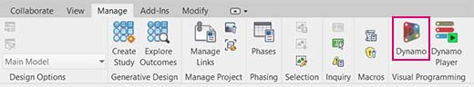

# Dynamo 설정

### Dynamo 확장 및 Dynamo Sandbox

Dynamo는 활성 오픈 소스 개발 프로젝트입니다. [Dynamo를 지원하는 소프트웨어 리스트](http://dynamobim.org/download/)를 확인해 보십시오.

\ \ \ \ \ \ \

### Dynamo 확장 시작

Dynamo는 **Revit3D**, **FormIt**, **Civil3D** 등의 소프트웨어와 함께 사전 설치됩니다.

사용하려면 도구막대 패널에서 시작합니다. 사용 중인 소프트웨어에 따라 일반적으로 시작 아이콘은 메뉴 > **관리** 탭에서 사용할 수 있습니다. Dynamo 아이콘 을 클릭하여 실행합니다.

특정 소프트웨어에서 Dynamo를 사용하는 방법에 대한 자세한 지침은 다음 섹션을 참고하십시오.

* [Revit용 Dynamo](../7_dynamo_for_revit/)
* [Dynamo for Civil 3D](../dynamo-for-civil-3d/)

Dynamo를 독립 실행형 응용프로그램으로 사용하려는 경우, Sandbox 다운로드에 대한 지침을 계속 읽습니다.

### Dynamo Sandbox 가져오기

#### 다운로드

공식 버전, 이전 버전 및 사전 출시 버전은 모두 다운로드 페이지에서 이용할 수 있습니다. 공식 출시 버전을 사용하려면 [Dynamo 다운로드](http://dynamobim.org/download/) 페이지를 방문하고 **다운로드**를 클릭합니다.

\.png>)

이전 또는 '최신' 개발 버전을 찾으려는 경우 모든 버전을 동일한 페이지의 아래쪽 섹션에서 찾을 수 있습니다.

\


'최신' 개발 버전에는 아직 충분히 테스트되지 않은 새로운 실험적 기능이 포함될 수 있어 불안정할 수 있습니다. 이 기능을 사용하여 버그 또는 문제를 발견하고, Autodesk 팀에 문제를 보고하여 응용프로그램을 개선할 수 있습니다.

초보자는 안정적인 공식 버전을 다운로드하는 것이 좋습니다.


#### 압축 해제

다운로드한 버전을 시작하기 전에 선택한 폴더에 컨텐츠의 압축을 풀어야 합니다.

이 단계를 수행하려면 컴퓨터에 [7zip](https://www.7-zip.org/download.html)을 다운로드하여 설치합니다.

zip 파일을 마우스 오른쪽 버튼으로 클릭하고 **모두 압축 풀기**를 선택합니다.

\

모든 파일의 압축을 풀 대상을 선택합니다.

\

#### 실행

대상 폴더에서 **DynamoSandbox.exe**를 두 번 클릭하여 실행합니다.

\

DynamoSandbox 시작 화면이 다음과 같이 표시됩니다.

\

축하합니다. DynamoSandbox 사용을 위한 설정이 완료되었습니다.


**형상**은 Dynamo Sandbox의 추가 기능으로, Autodesk 소프트웨어인 Revit, Robot Structural Analysis, FormIt 및 Civil 3D의 유효한 서브스크립션 또는 라이센스를 보유한 사용자만 사용할 수 있습니다. **형상**을 를 사용하면 Dynamo Sandbox에서 형상을 가져오고, 작성하고, 편집하고, 내보낼 수 있습니다.

