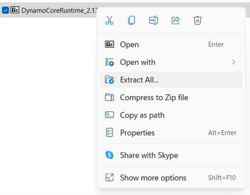
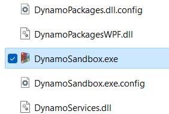

# 安裝 Dynamo

### 以延伸模組形式使用 Dynamo 與使用 Dynamo Sandbox 的差異

Dynamo 是進行中的開放原始碼開發專案。瞭解[支援 Dynamo 的軟體清單](http://dynamobim.org/download/)。

    .png>) 

### 以延伸模組形式啟動 Dynamo

Dynamo 隨附於如 **Revit3D**、**FormIt**、**Civil3D** 等軟體而預先安裝。

若要開始使用，請從工具列面板啟動。視您使用的軟體而定，通常可從「功能表」> **「管理」** 頁籤找到啟動圖示。按一下 Dynamo 圖示  即可啟動。

.jpg>)

如需更多 Dynamo 搭配特定軟體的使用說明，建議參閱以下各節：

* [適用於 Revit 的 Dynamo](../7_dynamo_for_revit/)
* [Dynamo for Civil 3D](../dynamo-for-civil-3d/)

如果想要以獨立應用程式的形式使用 Dynamo，請繼續閱讀 Sandbox 的下載說明。

### 取得 Dynamo Sandbox

#### 下載

您可以從 [Dynamo 網站](http://dynamobim.com)取得 Dynamo 應用程式。從下載頁面可取得正式版、舊版或預先發行版。請造訪 [Get Dynamo](http://dynamobim.org/download/) 頁面，然後按一下 **「下載」** 以取得官方發行的版本。

.png)

如果您要尋找舊版或「最尖端」的開發版本，在同一頁面的下半部分可以找到所有版本。

 
「最尖端」的開發內容可能包含一些尚未完全測試的新功能和實驗性功能，因此或許不太穩定。使用這類版本，您可能會發現錯誤或問題，請向我們的團隊回報問題，協助我們改善應用程式。

建議初學者下載官方發行的穩定版本。  


#### 解壓縮

啟動已下載的任何版本之前，您必須先將內容解壓縮到您選擇的資料夾。

在此步驟，請下載並安裝 [7zip](https://www.7-zip.org/download.html) 到您的電腦。

在壓縮檔案上按一下右鍵，然後選取 **「解壓縮全部...」**

選擇要解壓縮所有檔案的目的地。

#### 啟動

在目的地資料夾中，按兩下 **DynamoSandbox.exe** 即可啟動

您會看到下面的 DynamoSandbox 啟動畫面。

恭喜您，您現在已經完成使用 DynamoSandbox 的設定！

 
**Geometry** 是 Dynamo Sandbox 中的一個額外功能，僅提供給目前擁有下列 Autodesk 軟體固定期限使用授權或授權的使用者：Revit、Robot Structural Analysis、FormIt 和 Civil 3D。**Geometry** 可讓使用者從 Dynamo Sandbox 匯入、建立、編輯和匯出幾何圖形。

