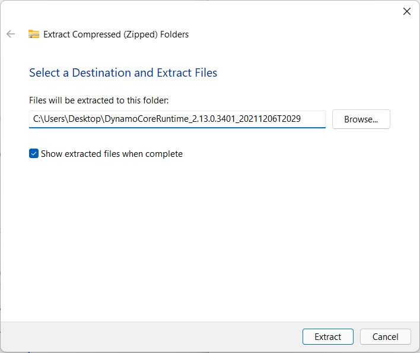
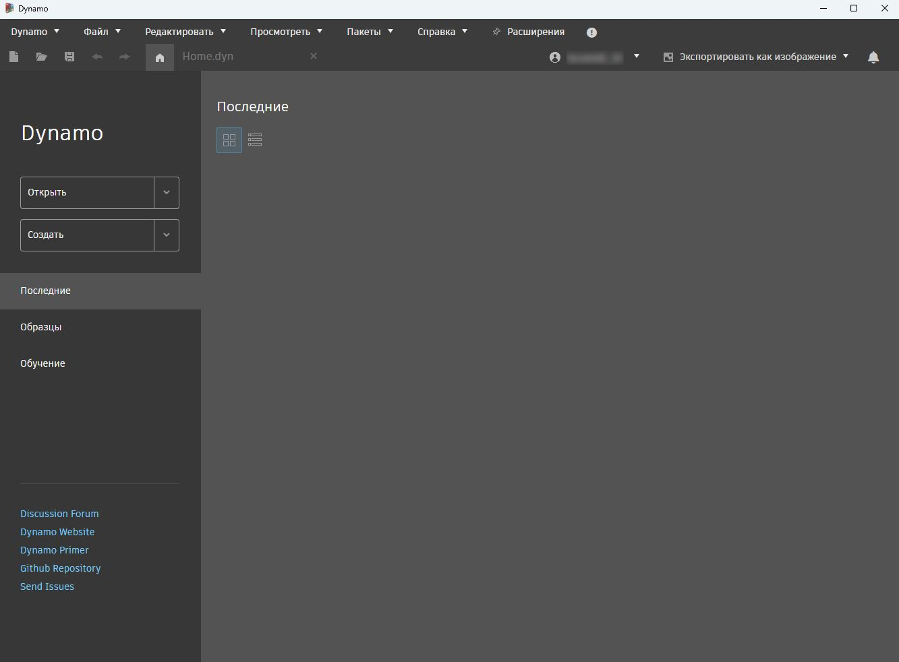

# Настройка для Dynamo

### Расширение Dynamo и Dynamo Sandbox

Dynamo — это активный проект разработки с открытым исходным кодом. Ознакомьтесь со [списком программ, поддерживающих Dynamo](http://dynamobim.org/download/)

    .png>) 

### Запуск Dynamo как расширения

Dynamo поставляется в комплекте с таким программным обеспечением, как **Revit 3D**, **FormIt**, **Civil 3D** и т. д.

Чтобы начать работу, запустите данную программу на панели инструментов. В зависимости от используемого программного обеспечения, значок запуска обычно находится на вкладке «Меню» > **Управление**. Щелкните значок Dynamo , чтобы запустить программу.

.jpg>)

Дополнительные сведения об использовании Dynamo с конкретным программным обеспечением см. в следующих разделах.

* [Dynamo for Revit](../7\_dynamo\_for\_revit/)

Чтобы использовать Dynamo как автономное приложение, продолжите чтение статьи для ознакомления с инструкциями по скачиванию Dynamo Sandbox.

### Доступ к Dynamo Sandbox

#### Загрузка

Приложение Dynamo доступно на [веб-сайте Dynamo](http://dynamobim.com). Официальные, предыдущие и предварительные версии доступны на странице загрузки. Перейдите на страницу [скачивания Dynamo](http://dynamobim.org/download/) и нажмите кнопку **Загрузить**, чтобы получить официальную версию.

.png)

Чтобы получить предшествующую или последнюю версию, перейдите в нижний раздел на той же странице.

 Новейшие разработки включают в себя новые экспериментальные возможности, которые еще не прошли полную проверку, поэтому могут функционировать нестабильно. С помощью этой версии можно обнаружить ошибки или проблемы, помочь нам улучшить приложение, сообщив о проблемах нашей команде.

Для начинающих пользователей рекомендуется официальная стабильная версия. 

#### Распаковка

Перед запуском любой скачанной версии необходимо распаковать содержимое в выбранную папку.

Скачайте и установите на компьютер программу [7zip](https://www.7-zip.org/download.html) для выполнения этого шага.

Щелкните правой кнопкой мыши файл ZIP и выберите **Извлечь все**.

Выберите папку для распаковки всех файлов.

#### Запуск

В выбранной папке дважды щелкните файл **DynamoSandbox.exe**, чтобы запустить его.

Отображается следующий экран запуска DynamoSandbox.

Поздравляем! Настройка DynamoSandbox завершена.


**Геометрия** — это дополнительная функция в Dynamo Sandbox, доступная только пользователям с действующей подпиской или лицензией на следующие программные продукты Autodesk: Revit, Robot Structural Analysis, FormIt и Civil 3D. **Геометрия** позволяет импортировать, создавать, редактировать и экспортировать геометрию из Dynamo Sandbox. 

