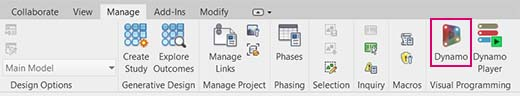

# Installazione per Dynamo

### Dynamo come estensione rispetto a Dynamo Sandbox

Dynamo è un progetto di sviluppo open source attivo. Scoprire l'[elenco di software che supporta Dynamo](http://dynamobim.org/download/).

     

### Avvio di Dynamo come estensione

Dynamo viene preinstallato con software come **Revit3D**, **FormIt**, **Civil3D** e così via.

Per iniziare ad utilizzarlo, avviarlo dal gruppo della barra degli strumenti. A seconda del software utilizzato, l'icona di avvio è in genere disponibile in Menu > scheda **Gestisci**. Fare clic sull'icona di Dynamo  per avviarlo.

Per ulteriori informazioni sull'utilizzo di Dynamo con un software specifico, si consiglia di consultare le seguenti sezioni:

* [Dynamo for Revit](../7\_dynamo\_for\_revit/)

Se si desidera utilizzare Dynamo come applicazione indipendente, continuare la lettura per ottenere consigli sul download di Sandbox.

### Download di Dynamo Sandbox

#### Download

L'applicazione Dynamo è disponibile nel [sito Web di Dynamo](http://dynamobim.com). Le versioni ufficiali, passate o pre-rilasciate sono disponibili nella pagina di download. Visitare la pagina [Get Dynamo](http://dynamobim.org/download/) e fare clic su **Download** per la versione ufficiale rilasciata.

\ (1).png>)

Se si cercano release di sviluppo precedenti o "bleeding edge", tutte le versioni sono disponibili nella sezione inferiore della stessa pagina.

 La release di sviluppo "bleeding edge" potrebbe includere alcune funzionalità nuove e sperimentali che non sono ancora state testate completamente, quindi potrebbe essere instabile. Utilizzando questo strumento, si potrebbero scoprire bug o problemi; per aiutarci a migliorare l'applicazione segnalare i problemi al nostro team.

Ai principianti viene consigliato di scaricare la release ufficiale stabile. 

#### Decompressione

Prima di avviare qualsiasi versione scaricata, è necessario decomprimere il contenuto nella cartella scelta.

Scaricare e installare [7zip](https://www.7-zip.org/download.html) nel computer per questo passaggio.

Fare clic con il pulsante destro del mouse sul file .zip e selezionare **Estrai tutto**.

Scegliere una destinazione per decomprimere tutti i file.

#### Avvio

Nella cartella di destinazione, fare doppio clic su **DynamoSandbox.exe** per avviarlo.

Verrà visualizzata la schermata di avvio di Dynamo Sandbox come indicato di seguito.

Congratulazioni, è stata completata l'installazione per l'utilizzo di Dynamo Sandbox.

 **Geometry** è una funzionalità aggiuntiva in Dynamo Sandbox che è disponibile solo per gli utenti che dispongono di una licenza o di un abbonamento corrente per il seguente software Autodesk: Revit, Robot Structural Analysis, FormIt e Civil 3D. **Geometry** consente agli utenti di importare, creare, modificare ed esportare la geometria da Dynamo Sandbox.
