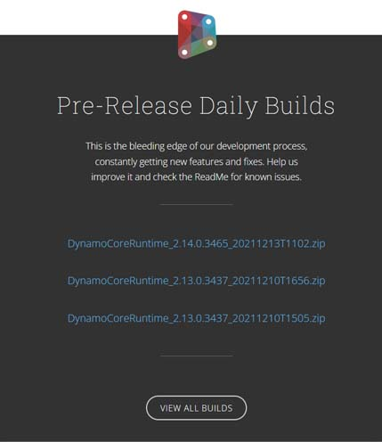

# Dynamo のセットアップ

### 拡張機能としての Dynamo と Dynamo Sandbox

Dynamo は、アクティブなオープンソース開発プロジェクトです。[Dynamo を利用できるソフトウェアの一覧](http://dynamobim.org/download/)をご確認いただけます。

   .png>) 

### 拡張機能としての Dynamo を起動する

Dynamo は、**Revit3D**、**FormIt**、**Civil3D** などのソフトウェアに事前にインストールされています。

使用を開始するには、ツールバー パネルから起動します。使用しているソフトウェアによって異なりますが、起動アイコンは通常、[メニュー] > [**管理**]タブにあります。Dynamo アイコン  をクリックして起動します。

.jpg>)

特定のソフトウェアで Dynamo を使用する方法の詳細については、次のセクションを参照してください。

* [Dynamo for Revit](../7\_dynamo\_for\_revit/)
* [Dynamo for Civil 3D](../dynamo-for-civil-3d/)

スタンドアロン アプリケーションとしての Dynamo をご希望の場合は、Sandbox のダウンロードに関するガイダンスについて、引き続きお読みください。

### Dynamo Sandbox を取得する

#### ダウンロード

Dynamo アプリケーションは、[Dynamo の Web サイト](http://dynamobim.com)から入手できます。公式の過去またはプレリリース版のバージョンは、両方ともダウンロード ページから入手できます。「[Dynamo を取得](http://dynamobim.org/download/)」ページにアクセスし、[**ダウンロード**]をクリックして公式リリース バージョンをダウンロードしてください。

.png)

過去のリリースまたは「ブリーディング エッジ」開発リリースをお探しの場合は、同じページの下部セクションにすべてのバージョンがあります。

 「ブリーディング エッジ」開発には、まだ完全にテストされていない新機能および実験的機能が含まれている可能性があるため、不安定になる可能性があります。これを使用して、バグや問題を発見したら、問題をチームに報告してアプリケーションの改善にご協力ください。

初心者ユーザーは安定した公式リリース版をダウンロードすることをお勧めします。

#### 解凍

ダウンロードしたバージョンを起動する前に、選択したフォルダにコンテンツを解凍する必要があります。

この手順のために、ご使用のコンピュータに [7zip](https://www.7-zip.org/download.html) をダウンロードしてインストールします。

ZIP ファイルを右クリックして、[**すべて展開**]を選択します。

すべてのファイルを解凍する場所を選択します。

#### 起動する

宛先フォルダで、**DynamoSandbox.exe** をダブルクリックして起動します。

次のように、DynamoSandbox の起動画面が表示されます。

これで、DynamoSandbox を使用するための設定が完了しました。

 **Geometry** は、Dynamo Sandbox の追加機能です。この機能は、現在 Revit、Robot Structural Analysis、FormIt、Civil 3D の Autodesk ソフトウェアのサブスクリプションまたはライセンスを所有しているユーザのみが使用できます。**Geometry** を使用すると、Dynamo Sandbox からジオメトリを読み込み、作成、編集、書き出すことができます。
