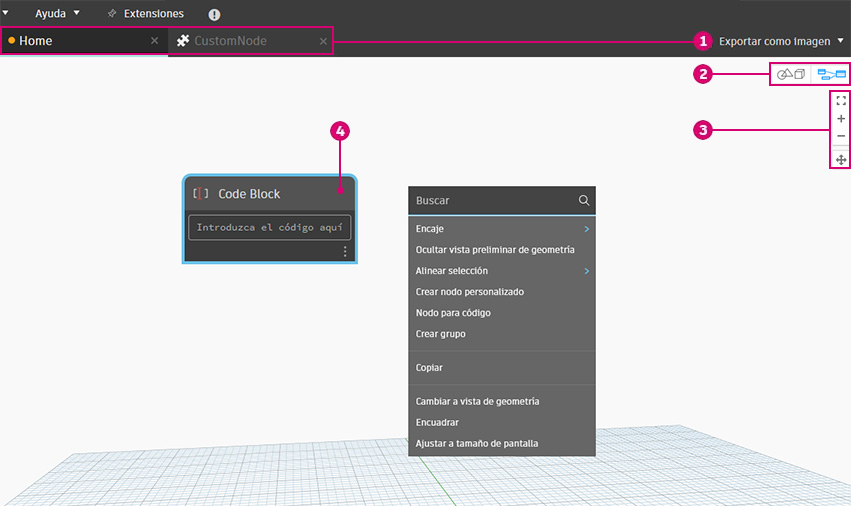
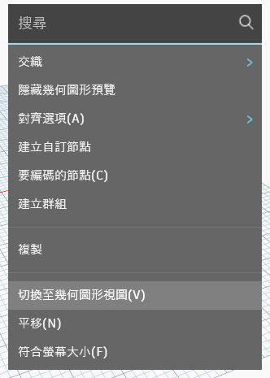
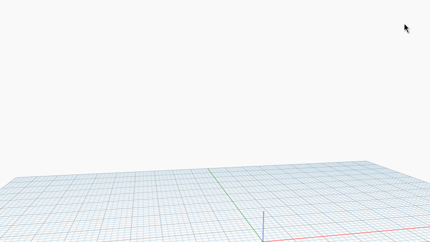

# 工作空间

### 主工作空间

Dynamo 工作空间由四个主要元素组成。

> 1. 所有活动选项卡。
> 2. 预览模式
> 3. 缩放/平移控件
> 4. 工作空间中的节点

### 所有活动选项卡

打开新文件时，将默认打开新的主工作空间。

可以创建一个自定义节点，然后在自定义节点工作空间中将其打开。

每个 Dynamo 窗口中仅允许有一个主工作空间，但可能在选项卡中打开多个自定义节点工作空间。

### 预览模式

有 3 种方法可在不同预览之间切换：

a.使用右上角图标

* 图形预览
* 三维预览

b.在工作空间中单击鼠标右键

* 从三维预览切换到图形预览

* 从图形预览切换到三维预览

c.使用键盘快捷键 (Ctrl+B)

### 缩放/平移控件

可以使用图标或鼠标在任一工作空间中导航。

a.在 **“图形预览”** 模式下

* 使用图标：
  * 缩放匹配
  * 放大
  * 缩小
  * 平移
* 使用鼠标：
  * 单击鼠标左键 - 选择
  * 单击鼠标左键并拖动 - 选择框用于选择多个节点
  * 鼠标中键向上/向下滚动 - 放大/缩小
  * 单击鼠标中键并拖动 - 平移
  * 在画布上的任意位置单击鼠标右键 - 打开画布内搜索

b.在 **“三维预览”** 模式下

* 使用图标：
  * 缩放匹配
  * 放大
  * 缩小
  * 平移
  * 动态观察
* 使用鼠标：
  * 鼠标中键向上/向下滚动 - 放大/缩小
  * 单击鼠标中键并拖动 - 平移
  * 单击鼠标右键并拖动 - 动态观察

### 工作空间中的节点

单击鼠标左键以选择任意节点。

要选择多个节点，请单击并拖动以创建选择框。

