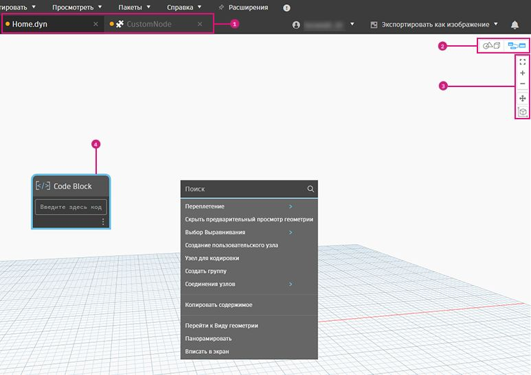

# 작업공간

### 주 작업공간

Dynamo 작업공간은 네 가지 기본 요소로 구성되어 있습니다.

> 1. 모든 활성 탭
> 2. 미리보기 모드
> 3. 줌/초점이동 컨트롤
> 4. 작업공간의 노드

### 모든 활성 탭

새 파일을 열면 기본적으로 새 홈 작업공간이 열립니다.

사용자 노드를 작성하여 사용자 노드 작업공간에서 열 수 있습니다.

 각 Dynamo 창에는 하나의 홈 작업공간만 허용되지만 탭에는 여러 개의 사용자 노드 작업공간이 열려 있을 수 있습니다. 

### 미리보기 모드

다음과 같은 세 가지 방법으로 서로 다른 미리보기 간을 전환할 수 있습니다.

a. 오른쪽 상단 아이콘 사용

* 그래프 미리보기
* 3D 미리보기

b. 작업공간을 마우스 오른쪽 버튼으로 클릭

* 3D 미리보기에서 그래프 미리보기로 전환

* 그래프 미리보기에서 3D 미리보기로 전환

c. 키보드 단축키(Ctrl+B) 사용

### 줌/초점이동 컨트롤

아이콘 또는 마우스를 사용하여 두 작업공간 중 하나를 탐색할 수 있습니다.

a. **그래프 미리보기** 모드에서

* 아이콘 사용:
  * 윈도우 줌
  * 줌 확대
  * 줌 축소
  * 초점이동
* 마우스 사용:
  * 마우스 왼쪽 버튼 클릭 - 선택
  * 마우스 왼쪽 버튼을 클릭하고 끌기 - 여러 노드를 선택하려면 선택 상자 사용
  * 마우스 가운데 버튼을 클릭하고 위/아래로 스크롤 - 줌 확대/축소
  * 마우스 가운데 버튼을 클릭하고 끌기 - 초점이동
  * 캔버스의 아무 곳이나 마우스 오른쪽 버튼으로 클릭 - 캔버스 내 검색 열기

b. **3D 미리보기** 모드에서

* 아이콘 사용:
  * 윈도우 줌
  * 줌 확대
  * 줌 축소
  * 초점이동
  * 궤도
* 마우스 사용:
  * 마우스 가운데 버튼을 클릭하고 위/아래로 스크롤 - 줌 확대/축소
  * 마우스 가운데 버튼을 클릭하고 끌기 - 초점이동
  * 마우스 오른쪽 버튼을 클릭하고 끌기 - 궤도

### 작업공간의 노드

마우스 왼쪽 버튼을 클릭하여 노드를 선택합니다.

여러 노드를 선택하려면 클릭하고 끌어 선택 상자를 작성합니다.

