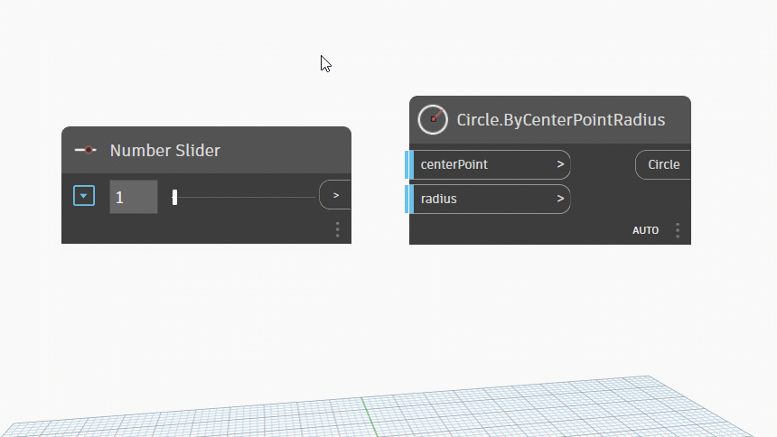

# Pracovní prostor

### Hlavní pracovní prostor

Pracovní prostor aplikace Dynamo se skládá ze čtyř hlavních prvků.

> 1. Všechny aktivní karty
> 2. Režim náhledu
> 3. Ovládací prvky pro přiblížení / posun pohledu
> 4. Uzel v pracovním prostoru

### Všechny aktivní karty

Při otevření nového souboru se ve výchozím nastavení otevře nový domovský pracovní prostor.

Můžete vytvořit vlastní uzel a otevřít jej v pracovním prostoru vlastního uzlu.

 V každém okně aplikace Dynamo je povolen pouze jeden domovský pracovní prostor, ale na kartách můžete mít otevřeno více pracovních prostorů vlastních uzlů. 

### Režim náhledu

Existují 3 metody přepínání mezi různými náhledy:

a. Pomocí ikon v pravém horním rohu

* Náhled grafu
* 3D náhled

b. Kliknutím pravým tlačítkem myši na pracovní prostor

* Přepnutí z 3D náhledu na náhled grafu

* Přepnutí z náhledu grafu na 3D náhled

c. Pomocí klávesové zkratky (Ctrl+B)

### Ovládací prvky pro přiblížení / posun pohledu

K navigaci v obou pracovních prostorech můžete využívat ikony nebo myš.

a. V režimu **náhledu grafu**

* Pomocí ikon:
  * Přizpůsobit oknu
  * Přiblížit
  * Oddálit
  * Posun pohledu
* Pomocí myši:
  * Kliknutí levým tlačítkem – Výběr
  * Kliknutí levým tlačítkem a přetažení – Pole výběru umožňující výběr více uzlů
  * Otáčení prostředním kolečkem nahoru/dolů – Přiblížení/oddálení
  * Kliknutí prostředním kolečkem a přetažení – Posun pohledu
  * Kliknutí pravým tlačítkem kdekoli na kreslicí ploše – Otevření hledání na kreslicí ploše

b. V režimu **3D náhledu**

* Pomocí ikon:
  * Přizpůsobit oknu
  * Přiblížit
  * Oddálit
  * Posun pohledu
  * Orbit
* Pomocí myši:
  * Otáčení prostředním kolečkem nahoru/dolů – Přiblížení/oddálení
  * Kliknutí prostředním kolečkem a přetažení – Posun pohledu
  * Kliknutí pravým tlačítkem a přetažení – Orbit

### Uzel v pracovním prostoru

Kliknutím levým tlačítkem myši vyberte libovolný uzel.

Chcete-li vybrat více uzlů, kliknutím a přetažením vytvořte pole výběru.

