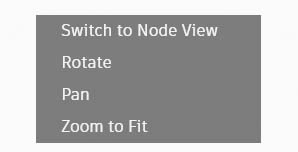

# Рабочее пространство

### Основное рабочее пространство

Рабочее пространство Dynamo состоит из четырех основных элементов.

> 1. Все активные вкладки
> 2. Режим предварительного просмотра
> 3. Элементы управления масштабированием/панорамированием
> 4. Узел в рабочем пространстве

### Все активные вкладки

При открытии нового файла по умолчанию открывается новое исходное рабочее пространство.

Можно создать пользовательский узел и открыть его в рабочем пространстве пользовательского узла.

 В каждом окне Dynamo можно использовать только одно исходное рабочее пространство, однако на вкладках можно открыть несколько рабочих пространств пользовательского узла. 

### Режим предварительного просмотра

Существует три способа переключения между режимами предварительного просмотра.

a. Использование значков в верхней части экрана справа

* Предварительный просмотр графика
* Предварительный 3D-просмотр

b. Щелчком правой кнопкой мыши в рабочем пространстве

* Переключение из режима 3D-просмотра в режим предварительного просмотра графика

* Переключение из режима предварительного просмотра графика в режим 3D-просмотра

c. С помощью горячей клавиши (CTRL + B)

### Элементы управления масштабированием/панорамированием

Для навигации в любом рабочем пространстве можно использовать значки или мышь.

a. В режиме **Предварительный просмотр графика**

* Использование значков:
  * Вписать
  * Увеличить
  * Уменьшить
  * Панорамирование
* Использование мыши:
  * Щелчок левой кнопкой мыши — выбор
  * Щелчок левой кнопкой мыши и перетаскивание — выбор нескольких точек
  * Прокрутка колесика вперед/назад — увеличение/уменьшение
  * Перетаскивание с удерживаемой средней кнопкой мыши — панорамирование
  * Щелчок правой кнопкой мыши в любом месте активного окна — открытие окна поиска в активном окне

b. В режиме **3D-просмотра**

* Использование значков:
  * Вписать
  * Увеличить
  * Уменьшить
  * Панорамирование
  * Орбита
* Использование мыши:
  * Прокрутка колесика вперед/назад — увеличение/уменьшение
  * Перетаскивание с удерживаемой средней кнопкой мыши — панорамирование
  * Щелчок правой кнопкой мыши и перетаскивание — вращение

### Узел в рабочем пространстве

Щелкните левой кнопкой мыши, чтобы выбрать какой-либо узел.

Чтобы выбрать несколько узлов, щелкните и перетащите указатель для создания рамки выбора.

