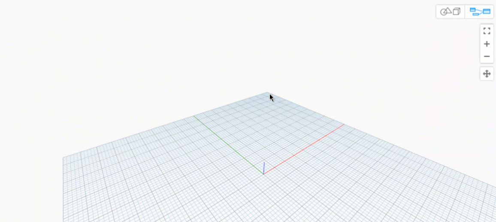

# Bibliothek

Die Bibliothek enthält alle geladenen Blöcke, einschließlich der zehn vorgabemäßigen Kategorieblöcke, die zum Lieferumfang gehören, sowie der zusätzlich geladenen benutzerdefinierten Blöcke und Pakete. Die Blöcke in der Bibliothek sind hierarchisch in Bibliotheken, Kategorien und gegebenenfalls Unterkategorien angeordnet.

\

* Basisblöcke: Im Lieferumfang der Vorgabeinstallation enthalten.
* Benutzerdefinierte Blöcke: Speichern Sie häufig verwendete Routinen oder spezielle Diagramme als benutzerdefinierte Blöcke. Sie können Ihre benutzerdefinierten Blöcke auch für die Community freigeben.
* Blöcke aus Package Manager: Sammlung von veröffentlichten benutzerdefinierten Blöcken.

Wir sehen uns die Kategorien für die [Hierarchie der Blöcke](2-library.md#library-hierarchy-for-categories) an und zeigen, wie Sie [schnell in der Bibliothek suchen](2-library.md#search-by-hierarchy) können. Außerdem werden einige der [häufig verwendeten Blöcke](2-library.md#frequently-used-nodes) vorgestellt.

### Bibliothekshierarchie für Kategorien

Das Durchsuchen dieser Kategorien stellt die schnellste Möglichkeit dar, um die Hierarchie dessen zu verstehen, was Sie zu Ihrem Arbeitsbereich hinzufügen können, und um neue Blöcke zu entdecken, die Sie niemals zuvor verwendet haben.

Durchsuchen Sie die Bibliothek, indem Sie durch die Menüs klicken, um die einzelnen Kategorien und ihre Unterkategorien zu erweitern.

 Am besten untersuchen Sie zunächst die Menüs unter Geometry, da sie die größte Anzahl an Blöcken enthalten. 

\

> 1. Bibliothek
> 2. Kategorie
> 3. Unterkategorie
> 4. Block

Mit diesen werden die Blöcke weiter in derselben Unterkategorie kategorisiert, je nachdem, ob die Blöcke Daten **erstellen**, eine **Aktion** ausführen oder Daten **abfragen**.

* \ **Erstellen**: Erstellt oder konstruiert eine Geometrie von Grund auf neu. Beispiel: Kreis.
* \ **Aktion**: Führt eine Aktion für ein Objekt aus. Beispiel: Skalieren eines Kreises.
* \ **Abfrage**: Ruft eine Eigenschaft eines bereits vorhandenen Objekts ab. Beispiel: Abrufen des Radius eines Kreises.

Bewegen Sie den Mauszeiger über einen Block, um weitere Informationen über seinen Namen und sein Symbol hinaus anzuzeigen. Dadurch können Sie schnell nachvollziehen, welche Aktion der Block ausführt, welche Eingaben erforderlich sind und was von dem Block ausgegeben wird.

\

> 1. Beschreibung: Kurze Beschreibung des Blocks
> 2. Symbol: Größere Version des Symbols im Menü Bibliothek
> 3. Eingabe(n): Name, Datentyp und Datenstruktur
> 4. Ausgabe(n): Datentyp und Struktur

### Schnellsuche in der Bibliothek

Wenn Sie relativ genau wissen, welchen Block Sie zu Ihrem Arbeitsbereich hinzufügen möchten, geben Sie etwas in das Feld **Suchen** ein, um alle passenden Blöcke zu suchen.

Treffen Sie Ihre Auswahl, indem Sie auf den hinzuzufügenden Block klicken, oder drücken Sie die EINGABETASTE, um die markierten Blöcke in der Mitte des Arbeitsbereichs hinzuzufügen.

\

#### Suchen nach Hierarchie

Neben der Verwendung von Schlüsselwörtern zum Suchen von Blöcken können Sie auch die Hierarchie getrennt durch einen Punkt im Suchfeld oder mithilfe von Codeblöcken (in denen die _Textsprache von Dynamo_ verwendet wird) eingeben.

Die Hierarchie der einzelnen Bibliotheken spiegelt sich im Namen der Blöcke wider, die dem Arbeitsbereich hinzugefügt wurden.

Durch die Eingabe verschiedener Teile der Position des Blocks in der Bibliothekshierarchie im Format `library.category.nodeName` werden unterschiedliche Ergebnisse zurückgegeben.

* `library.category.nodeName`

\

* `category.nodeName`

\

* `nodeName` oder `keyword`

\

In der Regel wird der Name eines Blocks im Arbeitsbereich im Format `category.nodeName` gerendert, wobei einige Ausnahme insbesondere bei der Eingabe- und Ansichtskategorie bestehen.

Beachten Sie bei ähnlich benannten Blöcken den Kategorieunterschied:

* Blöcke aus den meisten Bibliotheken schließen das Kategorieformat ein.

\

* `Point.ByCoordinates` und `UV.ByCoordinates` weisen denselben Namen auf, stammen jedoch aus unterschiedlichen Kategorien.

\

* Zu den wichtigsten Ausnahmen gehören Built-in Functions, Core.Input, Core.View und Operators.

\

### Häufig verwendete Blöcke

Welche der zahlreichen Blöcke, die zum Lieferumfang der Basisinstallation von Dynamo gehören, sind für die Entwicklung visueller Programme von grundlegender Bedeutung? Konzentrieren Sie sich zunächst auf jene, mit denen Sie die Parameter Ihres Programms definieren (**Input**), die Ergebnisse der Aktion eines Blocks anzeigen (**Watch**) und die Eingaben oder Funktionen mithilfe einer Verknüpfung definieren (**Code Block**).

#### Eingabeblöcke

Eingabeblöcke stellen das primäre Mittel für die Benutzer eines visuellen Programms – sowohl für Sie selbst als auch für andere Benutzer – zur Verwendung der Schlüsselparameter dar. Hier sehen Sie einige, die in der Core-Bibliothek verfügbar sind:

| Block           |                                                        | Block           |                                                        |
| -------------- | ------------------------------------------------------ | -------------- | ------------------------------------------------------ |
| Boolesch        | \        | Nummer         | \         |
| Zeichenfolge         | \         | Number Slider  | \  |
| Directory Path | \ | Integer Slider | \ |
| File Path      | \      |                |                                                        |

#### Watch und Watch3D

Die Beobachtungsblöcke sind für die Verwaltung der Daten, die ein visuelles Programm durchlaufen, von grundlegender Bedeutung. Sie können das Ergebnis eines Blocks in der **Datenvorschau des Blocks** anzeigen, indem Sie den Mauszeiger über den Block bewegen.

\

Es ist hilfreich, sie in einem **Watch**-Block offen zu halten.

\

Sie können die Geometrieergebnisse auch über einen **Watch3D**-Block anzeigen.

\

Beide Blöcke sind in der Kategorie View der Core-Bibliothek enthalten.

 Tipp: Die 3D-Vorschau kann bisweilen unübersichtlich sein, wenn Ihr visuelles Programm viele Blöcke enthält. Ziehen Sie in diesem Fall in Betracht, im Einstellungsmenü die Option zum Anzeigen der Hintergrundvorschau zu deaktivieren und einen Watch3D-Block zu verwenden, um eine Vorschau der Geometrie anzuzeigen. 

#### Code Block

Code Block-Blöcke können verwendet werden, um einen Codeblock mit Linien durch Semikolons getrennt zu definieren. Dies kann ganz einfach sein: `X/Y`.

Wir können auch Codeblöcke als Abkürzung verwenden, um einen Number Input-Block zu definieren oder eine andere Funktion des Blocks aufzurufen. Die Syntax hierfür entspricht der Namenskonvention der textuellen Sprache von Dynamo, [DesignScript](../8_coding_in_dynamo/8-1_code-blocks-and-design-script/2-design-script-syntax.md).

Hier sehen Sie eine einfache Demonstration (mit Anweisungen) zur Verwendung von Codeblöcken in Ihrem Skript.

1. Doppelklicken Sie, um einen Code Block-Block zu erstellen.
2. Geben Sie `Circle.ByCenterPointRadius(x,y);` ein.
3. Klicken Sie auf den Arbeitsbereich, um die Auswahl aufzuheben und automatisch `x`- und `y`-Eingaben hinzuzufügen.
4. Erstellen Sie einen Point.ByCoordinates-Block und einen Number Slider und verbinden Sie sie anschließend mit den Eingaben des Codeblocks.
5. Das Ergebnis der Ausführung des visuellen Programms wird in der 3D-Vorschau als Kreis dargestellt.
