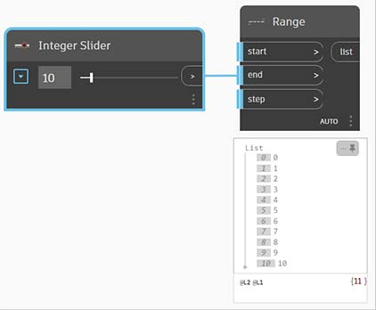

# Knihovna

Knihovna obsahuje všechny načtené uzly, včetně výchozích kategorií uzlů, které jsou dodávány s instalací, a všech dalších načtených vlastních uzlů nebo balíčků. Uzly v knihovně jsou hierarchicky uspořádány v rámci knihoven, kategorií a případně podkategorií.

* Základní uzly: Dodávány s výchozí instalací.
* Vlastní uzly: Často používané postupy nebo speciální graf si můžete uložit jako vlastní uzly. Vlastní uzly můžete také sdílet s komunitou.
* Uzly z nástroje Package Manager: Kolekce publikovaných vlastních uzlů.

V tomto tématu si vysvětlíme [hierarchii kategorií uzlů](2-library.md#library-hierarchy-for-categories), ukážeme si, jak lze [rychle vyhledávat v knihovně](2-library.md#search-by-hierarchy) a seznámíme se s některými [často používanými uzly](2-library.md#frequently-used-nodes).

### Hierarchie knihovny pro kategorie

Procházení těchto kategorií je nejrychlejší způsob, jak pochopit hierarchii toho, co můžeme přidat do našeho pracovního prostoru, a nejlepší způsob, jak objevit nové uzly, které jste předtím nepoužili.

Procházejte knihovnu kliknutím na nabídky a rozbalte jednotlivé kategorie a jejich podkategorie.

\r\n K počátečnímu zkoumání je vhodná nabídka Geometry, protože obsahuje největší množství uzlů. \r\n

> 1. Knihovna
> 2. Kategorie
> 3. Dílčí kategorie
> 4. Uzel

Uzly jsou dále kategorizovány do stejné podkategorie na základě toho, zda uzly **vytvářejí** data, provádějí **akce** nebo **dotazují** data.

*  **Tvorba**: Vytvořte nebo sestavte geometrii od začátku. Vytvořte například kružnici.
*  **Akce**: Proveďte akci s objektem. Změňte například velikost kružnice.
*  **Dotaz**: Získejte vlastnost objektu, který již existuje. Zjistěte například poloměr kružnice.

Přesunutím ukazatele myši nad uzel zobrazíte podrobnější informace kromě jeho názvu a ikony. To nám umožňuje rychle pochopit, co uzel dělá, jaké bude vyžadovat vstupy a jaký bude poskytovat výstup.

> 1. Popis – prostý jazyk popisující uzel
> 2. Ikona – větší verze ikony v nabídce knihovny
> 3. Vstupy – název, datový typ a datová struktura
> 4. Výstupy – datový typ a struktura

### Rychlé vyhledávání v knihovně

Pokud přibližně víte, který uzel chcete přidat do pracovního prostoru, začněte zadávat jeho název do pole **Hledat**, čímž vyhledáte všechny odpovídající uzly.

Kliknutím na uzel, který chcete přidat, nebo stisknutím klávesy Enter přidáte zvýrazněné uzly do středu pracovního prostoru.

#### Hledání podle hierarchie

Kromě použití klíčových slov při hledání uzlů můžete zadat hierarchii oddělenou tečkou do vyhledávacího pole nebo pomocí bloků kódu (které používají _textový jazyk aplikace Dynamo_).

Hierarchie jednotlivých knihoven se odráží v názvu uzlů přidaných do pracovního prostoru.

Zadáním různých částí místa uzlu v hierarchii knihovny ve formátu `library.category.nodeName` získáte různé výsledky:

* `library.category.nodeName`

.jpg)

* `category.nodeName`

* `nodeName` nebo `keyword`

Název uzlu v pracovním prostoru se obvykle vykresluje ve formátu `category.nodeName`, s důležitými výjimkami zejména v kategoriích Input a View.

Dávejte pozor na podobně pojmenované uzly a všimněte si rozdílu kategorií:

* Uzly z většiny knihoven budou obsahovat formát kategorie

* Uzly `Point.ByCoordinates` a `UV.ByCoordinates` mají stejný název, ale pocházejí z různých kategorií

* Mezi povinné výjimky patří funkce Built-in, Core.Input, Core.View a Operators

### Často používané uzly

Základní instalace aplikace Dynamo zahrnuje stovky uzlů. Které z nich jsou nezbytné pro vývoj našich vizuálních programů? Zaměřme se na ty, které nám umožňují definovat parametry programu (**Input**), zobrazit výsledky akce uzlu (**Watch**) a definovat vstupy nebo funkce pomocí zástupce (**Code Block**).

#### Vstupní uzly

Vstupní uzly jsou primárním prostředkem pro uživatele našeho vizuálního programu – ať jste to vy nebo někdo jiný – pro propojení s klíčovými parametry. Níže jsou uvedeny některé uzly dostupné v základní knihovně:

| Uzel           |                                           | Uzel           |                                           |
| -------------- | ----------------------------------------- | -------------- | ----------------------------------------- |
| Logická hodnota        |        | Number         |         |
| String         |         | Number Slider  |   |
| Directory Path |  | Integer Slider |  |
| File Path      |       |                |                                           |

#### Uzly Watch a Watch3D

Uzly Watch jsou nezbytné ke správě dat, která prochází vaším vizuálním programem. Výsledek uzlu si můžete zobrazit prostřednictvím **náhledu dat uzlu**, když nad uzel umístíte ukazatel myši.

V uzlu **Watch** je vhodné zachovat náhled zobrazený.

Pomocí uzlu **Watch3D** si můžete zobrazit výsledky geometrie.

Oba tyto uzly jsou dostupné v základní knihovně v kategorii View.

\r\n Tip: Pokud vizuální program obsahuje mnoho uzlů, může být někdy 3D náhled rozptylující. Zvažte zrušení zaškrtnutí možnosti Zobrazovat náhled pozadí v nabídce Nastavení a použití uzlu Watch3D k zobrazení náhledu geometrie. \r\n

#### Code Block

Uzly Code Block lze použít k definování bloku kódu pomocí řádků oddělených středníky. Může to být jednoduchý kód, například `X/Y`.

Bloky kódu také můžete použít jako zkratku k definování položky Number Input nebo k volání funkce jiného uzlu. Syntaxe se řídí konvencí pojmenování textového jazyka aplikace Dynamo, [DesignScript](../8\_coding\_in\_dynamo/8-1\_code-blocks-and-design-script/2-design-script-syntax.md).

Níže je uvedena jednoduchá ukázka (s pokyny) použití bloku kódu ve skriptu.

1. Dvojitým kliknutím vytvořte uzel Code Block.
2. Zadejte `Circle.ByCenterPointRadius(x,y);`.
3. Kliknutím na pracovní prostor pro zrušení výběru by se měly automaticky přidat vstupy `x` a `y`.
4. Vytvořte uzly Point.ByCoordinates a Number Slider a připojte je ke vstupům uzlu Code Block.
5. Výsledek spuštění vizuálního programu je zobrazen jako kružnice v 3D náhledu.
