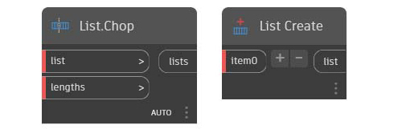
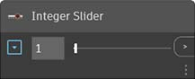

# Biblioteca

A biblioteca contém todos os nós carregados, incluindo os dez nós de categorias padrão que vêm com a instalação, bem como quaisquer nós ou pacotes personalizados carregados adicionalmente. Os nós na biblioteca são organizados hierarquicamente dentro de bibliotecas, categorias e, quando apropriado, subcategorias.

* Nós básicos: vêm com a instalação padrão.
* Nós personalizados: armazene as rotinas ou gráficos especiais usados com frequência como nós personalizados. Também é possível compartilhar os nós personalizados com a comunidade
* Nós do Gerenciador de pacotes: conjunto de nós personalizados publicados.

Vamos abordar as categorias da [hierarquia de nós](2-library.md#library-hierarchy-for-categories), mostrar como é possível [pesquisar rapidamente na biblioteca](2-library.md#search-by-hierarchy) e saber mais sobre alguns dos [nós usados com frequência](2-library.md#frequently-used-nodes).

### Hierarquia da biblioteca para categorias

Navegar por essas categorias é a maneira mais rápida de entender a hierarquia do que podemos adicionar ao nosso espaço de trabalho e a melhor maneira de descobrir novos nós que você não usou antes.

Navegue na biblioteca clicando nos menus para expandir cada categoria e suas subcategorias

\r\n Geometria oferece ótimos menus para começar a explorar, pois contêm a maior quantidade de nós. \r\n

> 1. Biblioteca
> 2. Categoria
> 3. Subcategoria
> 4. Nó

Essas opções categorizam os nós na mesma subcategoria com base na capacidade dos nós **criar** dados, executar uma **ação** ou **consultar** dados.

*  **Criar**: criar ou construir uma geometria do zero. Por exemplo, um círculo.
*  **Ação**: executar uma ação em um objeto. Por exemplo, dimensionar um círculo.
*  **Consulta**: obter uma propriedade de um objeto que já existe. Por exemplo, obter o raio de um círculo.

Passe o cursor do mouse sobre um nó para obter informações mais detalhadas além do nome e do ícone. Isso nos oferece uma maneira rápida de entender o que o nó faz, o que ele exigirá para as entradas e o que ele fornecerá como resultado.

> 1. Descrição: descrição de texto simples do nó
> 2. Ícone: versão maior do ícone no menu Biblioteca
> 3. Entrada(s): nome, tipo de dados e estrutura de dados
> 4. Saída(s): tipo de dados e estrutura

### Pesquisa rápida na biblioteca

Se você souber com algum grau de especificidade qual é o nó que deseja adicionar ao espaço de trabalho, digite no campo **Pesquisar** para procurar todos os nós correspondentes.

Clique no nó que deseja adicionar ou pressione Enter para adicionar nós realçados ao centro do espaço de trabalho.

#### Pesquisar por hierarquia

Além de usar palavras-chave para tentar localizar nós, podemos digitar a hierarquia separada por um ponto no campo de pesquisa ou com blocos de código (que usam o _idioma textual do Dynamo_).

A hierarquia de cada biblioteca é refletida no nome dos nós adicionados ao espaço de trabalho.

Se inserir diferentes partes do local do nó na hierarquia da biblioteca no formato `library.category.nodeName`, os resultados obtidos serão diferentes

* `library.category.nodeName`

.jpg)

* `category.nodeName`

* `nodeName` ou `keyword`

Normalmente, o nome do nó no espaço de trabalho será renderizado no formato `category.nodeName`, com algumas exceções notáveis, especialmente nas categorias de entrada e vista.

Tenha atenção aos nós de nome semelhante e observe a diferença de categoria:

* Os nós da maioria das bibliotecas incluirão o formato da categoria

* `Point.ByCoordinates` e `UV.ByCoordinates` têm o mesmo nome, mas são provenientes de diferentes categorias

* Exceções notáveis incluem funções incorporadas, Core.Input, Core.View e Operators

### Nós usados com frequência

Com centenas de nós incluídos na instalação básica do Dynamo, quais são essenciais para o desenvolvimento de nossos programas visuais? Vamos nos concentrar naqueles que nos permitem definir os parâmetros do programa (**Entrada**), ver os resultados de uma ação do nó (**Inspeção**) e definir entradas ou funcionalidades por meio de um atalho (**Bloco de código**).

#### Nós de entrada

Os nós de entrada são os principais meios para o usuário do nosso Programa visual, seja você mesmo ou outra pessoa, fazer a interface com os parâmetros mais importantes. Confira alguns exemplos disponíveis na biblioteca principal:

| Nó           |                                           | Nó           |                                           |
| -------------- | ----------------------------------------- | -------------- | ----------------------------------------- |
| Booleano        |        | Número         |         |
| Sequência de caracteres         |         | Controle deslizante de números  |   |
| Caminho do diretório |  | Controle deslizante de números inteiros |  |
| Caminho do arquivo      |       |                |                                           |

#### Inspeção e Watch3D

Os nós de inspeção são essenciais para gerenciar os dados que fluem através do Programa visual. É possível visualizar o resultado de um nó através da **visualização dos dados do nó** passando o cursor do mouse sobre o nó.

É útil manter a exibição dessas informações em um nó de **Inspeção**

Ou consultar os resultados da geometria através de um nó **Watch3D**.

Ambos são encontrados na categoria da vista na biblioteca principal.

\r\n Dica: Às vezes, a visualização 3D pode causar distrações, quando o Programa visual contém muitos nós. Considere desmarcar a opção Exibir visualização de plano de fundo no menu Configurações e usar um nó Watch3D para visualizar a geometria. \r\n

#### Bloco de código

Os nós Code Block podem ser utilizados para definir um Code Block com linhas separadas por ponto e vírgula. Isso pode ser tão simples quanto `X/Y`.

Também é possível usar os blocos de código como um atalho para definir uma entrada de número ou acionar outra funcionalidade do nó. A sintaxe para fazer isso segue a convenção de nomenclatura da linguagem textual do Dynamo, [DesignScript](../8\_coding\_in\_dynamo/8-1\_code-blocks-and-design-script/2-design-script-syntax.md).

Confira aqui uma demonstração simples (com instruções) para usar o Bloco de código no script.

1. Clique duas vezes para criar um nó de bloco de código
2. `Circle.ByCenterPointRadius(x,y);`Type
3. Clique no espaço de trabalho para limpar a seleção e adicionar as entradas `x` e `y` automaticamente.
4. Crie um nó Point.ByCoordinates e um controle deslizante de número e, em seguida, conecte-os às entradas do Bloco de código.
5. O resultado da execução do Programa visual é mostrado como o círculo na visualização 3D
