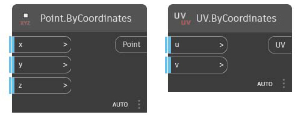
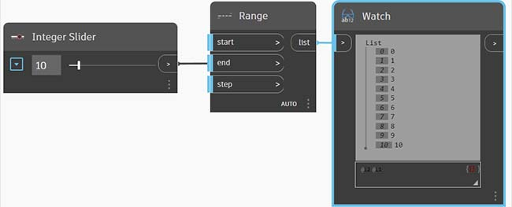

# Bibliothèque

La bibliothèque contient tous les nœuds chargés, y compris les nœuds de catégorie par défaut fournis avec l’installation, ainsi que tous les autres nœuds ou packages personnalisés chargés. Les nœuds de la bibliothèque sont organisés de manière hiérarchique dans les bibliothèques, les catégories et, le cas échéant, les sous-catégories.

* Nœuds de base : fournis avec l’installation par défaut.
* Nœuds personnalisés : stockez vos routines fréquemment utilisées ou votre graphique spécial en tant que nœuds personnalisés. Vous pouvez également partager vos nœuds personnalisés avec la communauté.
* Nœuds du gestionnaire de package : collection de nœuds personnalisés publiés.

Nous allons parcourir la catégorie [Hiérarchie des nœuds](3-3\_dynamo\_libraries.md#library-hierarchy-for-categories), apprendre comment [effectuer rapidement une recherche dans la bibliothèque](3-3\_dynamo\_libraries.md#quick-search-in-library) et découvrir certains des [nœuds fréquemment utilisés](3-3\_dynamo\_libraries.md#frequently-used-nodes).

### Hiérarchie de la bibliothèque pour les catégories

Parcourir ces catégories est la manière la plus rapide de comprendre la hiérarchie des éléments que vous pouvez ajouter à votre espace de travail et la meilleure façon de découvrir les nouveaux nœuds que vous n'avez pas utilisés auparavant.

Parcourez la bibliothèque en cliquant sur les menus pour développer chaque catégorie et sa sous-catégorie.

 Géométrie est un excellent menu à explorer en premier, car il contient la plus grande quantité de nœuds. 

> 1. Bibliothèque
> 2. Catégorie
> 3. Sous-catégorie
> 4. Nœud

Ces menus permettent de classer les nœuds dans la même sous-catégorie selon que les nœuds **créent** des données, exécutent une **action** ou **interrogent** des données.

*  **Créer** : permet de créer ou de construire une géométrie de toutes pièces. par exemple, un cercle.
*  **Action** : permet d’effectuer une action sur un objet. par exemple, mettre un cercle à l’échelle.
*  **Requête** : permet d’obtenir la propriété d’un objet qui existe déjà. par exemple, obtenir le rayon d’un cercle.

Placez le curseur de la souris sur un nœud pour afficher des informations plus détaillées que son nom et son icône. Ces informations permettent de comprendre ce que fait le nœud, ce qu’il requiert pour les entrées et ce qu’il va donner en sortie.

> 1. Description : description du nœud en langage simple
> 2. Icône : version plus grande de l'icône dans le menu de la bibliothèque
> 3. Entrée(s) : nom, type de données et structure de données
> 4. Sortie(s) : type de données et structure

### Recherche rapide dans la bibliothèque

Si vous avez une idée du nœud que vous souhaitez ajouter à votre espace de travail, faites une recherche dans le champ **Rechercher** pour rechercher tous les nœuds correspondants.

Cliquez sur le nœud que vous souhaitez ajouter ou appuyez sur la touche Entrée pour ajouter les nœuds mis en surbrillance au centre de l’espace de travail.

#### Recherche par hiérarchie

Outre l’utilisation de mots-clés pour rechercher des nœuds, vous pouvez saisir la hiérarchie en la séparant par un point dans le champ de recherche ou par des nœuds Code Block (qui utilisent le _langage textuel Dynamo_).

La hiérarchie de chaque bibliothèque est reflétée dans le nom des nœuds ajoutés à l’espace de travail.

La saisie de différentes parties de la position du nœud dans la hiérarchie de la bibliothèque au format `library.category.nodeName` renvoie différents résultats :

* `library.category.nodeName`

\ (1).jpg>)

* `category.nodeName`

* `nodeName` ou `keyword`

En règle générale, le nom du nœud dans l’espace de travail est rendu au format `category.nodeName`, à quelques exceptions près, notamment dans les catégories Input et View.

Attention aux nœuds ayant un nom similaire et notez la différence de catégorie :

* Les nœuds de la plupart des bibliothèques incluent le format de catégorie.

* Les nœuds `Point.ByCoordinates` et `UV.ByCoordinates` portent le même nom, mais proviennent de différentes catégories.

* Les exceptions notables incluent les fonctions intégrées : Core.Input, Core.View et Operators.

### Nœuds fréquemment utilisés

Compte tenu du fait que l’installation de base de Dynamo comprend des centaines de nœuds, quels nœuds sont essentiels au développement de programmes visuels ? Concentrez-vous sur ceux qui permettent de définir les paramètres de votre programme (**Input**), d’afficher les résultats de l’action d’un nœud (**Watch**) et de définir les entrées ou les fonctionnalités par le biais d’un raccourci (**Code Block**).

#### Nœuds d’entrée

Les nœuds Input sont les principaux moyens pour que l'utilisateur de votre programme visuel, que ce soit vous-même ou quelqu'un d'autre, interagisse avec les paramètres clés. En voici quelques-uns disponibles dans la bibliothèque principale :

| Noeud           |                                           | Nœud           |                                           |
| -------------- | ----------------------------------------- | -------------- | ----------------------------------------- |
| Opération booléenne        |        | Nombre         |         |
| Chaîne         |         | Number Slider  |   |
| Directory Path |  | Curseur d’entier |  |
| File Path      |       |                |                                           |

#### Watch et Watch3D

Les nœuds Watch sont essentiels pour la gestion des données qui circulent dans votre programme visuel. Vous pouvez afficher le résultat d’un nœud dans l’**aperçu des données de nœud** en plaçant le curseur de la souris sur le nœud.

Il sera utile de l’afficher dans un nœud **Watch**

Vous pouvez également afficher les résultats de la géométrie à l’aide d’un nœud **Watch3D**.

Ces deux nœuds sont disponibles dans la catégorie View de la bibliothèque Core.

 Conseil : il peut arriver que l’aperçu 3D soit gênant lorsque votre programme visuel contient un grand nombre de nœuds. Pensez à désactiver l’option Afficher l’aperçu en arrière-plan dans le menu Paramètres et à utiliser un nœud Watch3D pour afficher un aperçu de la géométrie. 

#### Code Block

Les nœuds Code Block servent à définir un bloc de code avec des lignes séparées par des points-virgules. Cela peut être aussi simple que `X/Y`.

Vous pouvez également utiliser les nœuds Code Block comme raccourci pour définir un nœud Number Input ou appeler la fonctionnalité d’un autre nœud. La syntaxe permettant de procéder à cette opération suit la convention d’attribution de noms du langage textuel Dynamo, [DesignScript](../coding-in-dynamo/7\_code-blocks-and-design-script/7-2\_design-script-syntax.md).

Voici une démonstration simple (avec des instructions) de l’utilisation du nœud Code Block dans votre script.

1. Double-cliquez pour créer un nœud Code Block.
2. `Circle.ByCenterPointRadius(x,y);`Type
3. Cliquez sur l’espace de travail pour effacer la sélection et ajouter automatiquement les entrées `x` et `y`.
4. Créez les nœuds Point.ByCoordinates et Number Slider, puis connectez-les aux entrées du nœud Code Block.
5. Le résultat de l’exécution du programme visuel est affiché sous forme de cercle dans l’aperçu 3D.
