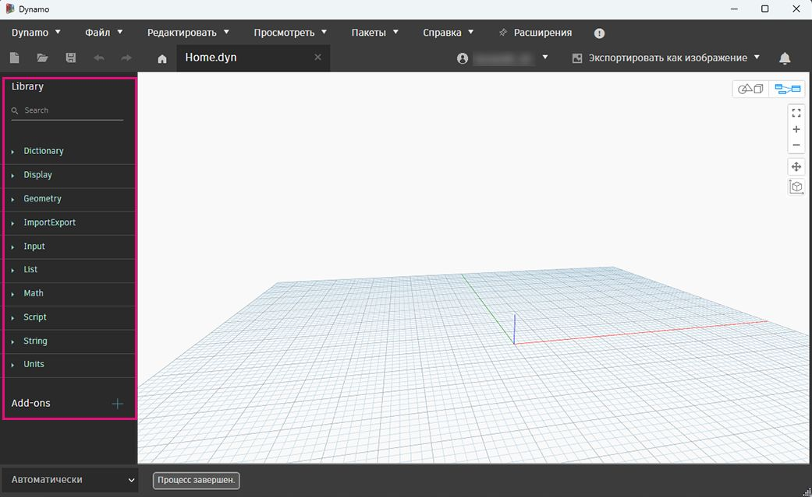
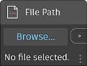

# Biblioteka

Biblioteka zawiera wszystkie wczytane węzły, w tym dziesięć domyślnych kategorii węzłów dołączonych do instalacji oraz dodatkowo wczytane węzły niestandardowe lub pakiety. Węzły w bibliotece są zorganizowane hierarchicznie w obrębie bibliotek, kategorii i, w razie potrzeby, podkategorii.

* Węzły podstawowe: dostarczane z instalacją domyślną.
* Węzły niestandardowe: zapisz często używane procedury lub wykres specjalny jako węzły niestandardowe. Węzły niestandardowe można również udostępniać społeczności
* Węzły z aplikacji Package Manager: kolekcja opublikowanych węzłów niestandardowych.

Przeanalizujemy kategorie [hierarchii węzłów](3-3\_dynamo\_libraries.md#library-hierarchy-for-categories), pokażemy, w jaki sposób można [szybko wyszukiwać w bibliotece](3-3\_dynamo\_libraries.md#quick-search-in-library), i zapoznamy się z niektórymi z [często używanych węzłów](3-3\_dynamo\_libraries.md#frequently-used-nodes), jakie się tam znajdują.

### Hierarchia biblioteki dla kategorii

Przeglądanie tych kategorii jest najszybszym sposobem zrozumienia hierarchii tego, co można dodać do obszaru roboczego, a także najlepszym sposobem odnajdowania nowych węzłów, których wcześniej nie używano.

Przeglądaj bibliotekę, klikając poszczególne menu, aby rozwijać kategorie i ich podkategorie

 Geometria to świetne menu, które doskonale nadają się do rozpoczęcia przeglądania, ponieważ zawierają największą liczbę węzłów. 

> 1. Biblioteka
> 2. Kategoria
> 3. Podkategoria
> 4. Węzeł

Zapewnia to dodatkowe skategoryzowanie węzłów należących do tej samej podkategorii w zależności od tego, czy węzły **tworzą** dane, wykonują **operacje**, czy wysyłają **zapytania** dotyczące danych.

*  **węzły tworzenia**: tworzą lub konstruują geometrię od podstaw. Np. okrąg.
*  **węzły operacji**: wykonują operacje na obiekcie. Np. skalowanie okręgu.
*  **węzły zapytań**: pobierają właściwość obiektu, który już istnieje. Np. pobieranie promienia okręgu.

Umieść wskaźnik myszy na węźle, aby wyświetlić informacje bardziej szczegółowe od jego nazwy i ikony. Dzięki temu można szybko zrozumieć, do czego służy węzeł, jakich wejść wymaga i jakie będą jego dane wyjściowe.

> 1. Opis — prosty opis węzła
> 2. Ikona — większa wersja ikony w menu Biblioteka
> 3. Wejścia — nazwa, typ danych i struktura danych
> 4. Wyjścia — typ danych i struktura

### Szybkie wyszukiwanie w bibliotece

Jeśli dosyć dobrze wiadomo, jaki węzeł ma zostać dodany do obszaru roboczego, wpisz w polu **Wyszukaj** nazwę węzła, aby wyszukać wszystkie pasujące węzły.

Wybierz, klikając węzeł, który chcesz dodać, lub naciśnij klawisz Enter, aby dodać wyróżnione węzły do środka obszaru roboczego.

#### Wyszukiwanie według hierarchii

Podczas wyszukiwania węzłów oprócz słów kluczowych można wpisywać hierarchię, oddzielając jej elementy kropkami w polu wyszukiwania. Można tak również robić w węzłach Code Block (w których jest używany _język tekstowy dodatku Dynamo_).

Hierarchia każdej biblioteki jest odzwierciedlona w nazwach węzłów dodawanych do obszaru roboczego.

Wpisanie różnych części miejsca węzła w hierarchii biblioteki w formacie `library.category.nodeName` zwraca różne wyniki:

* `library.category.nodeName`

.jpg)

* `category.nodeName`

* `nodeName` lub `keyword`

Zazwyczaj nazwa węzła w obszarze roboczym jest renderowana w formacie `category.nodeName`, z pewnymi ważnymi wyjątkami, szczególnie w przypadku kategorii widoków i wejść.

Należy zwrócić uwagę na podobnie nazwane węzły i na różnicę ich kategorii:

* Węzły z większości bibliotek mają format kategorii

* Węzły `Point.ByCoordinates` i `UV.ByCoordinates` mają tę samą nazwę, ale pochodzą z różnych kategorii

* Istotne wyjątki to funkcje wbudowane, Core.Input, Core.View i operatory

### Często używane węzły

Do podstawowej instalacji dodatku Dynamo dołączono setki węzłów — które są niezbędne do tworzenia programów wizualnych? Skupmy się na tych, które pozwalają zdefiniować parametry programu (**Input**), wyświetlić wyniki działania węzła (**Watch**) oraz zdefiniować wyjścia lub funkcjonalność za pomocą skrótu (**Code Block**).

#### Węzły Input

Węzły Input (wejścia) są podstawowym sposobem obsługi kluczowych parametrów programu wizualnego przez użytkownika — Ciebie lub kogoś innego. Oto kilka pozycji dostępnych w bibliotece podstawowej:

| Węzeł           |                                           | Węzeł           |                                           |
| -------------- | ----------------------------------------- | -------------- | ----------------------------------------- |
| Boolean        |        | Number         |         |
| String         |         | Number Slider  |   |
| Directory Path |  | Integer Slider |  |
| File Path      |       |                |                                           |

#### Watch oraz Watch3D

Węzły Watch (obserwacyjne) są niezbędne do zarządzania danymi, które przepływają przez program wizualny. Wynik węzła można wyświetlić w **podglądzie danych węzła**, umieszczając wskaźnik myszy na węźle.

Przydatne jest wyświetlenie informacji w węźle **Watch**

Można też wyświetlić wyniki geometrii za pomocą węzła **Watch3D**.

Oba te elementy znajdują się w kategorii widoku w bibliotece podstawowej.

 Wskazówka: czasami podgląd 3D może rozpraszać, gdy program wizualny zawiera wiele węzłów. Warto rozważyć wyczyszczenie zaznaczenia opcji Wyświetlanie podglądu tła w menu Ustawienia i użycie zamiast tego węzła Watch3D do wyświetlania podglądu geometrii. 

#### Code Block

Węzły Code Block (bloki kodu) umożliwiają definiowanie bloku kodu z wierszami oddzielonych średnikami. Może to być coś tak prostego, jak `X/Y`.

Bloków kodu można też używać jako skrótów do definiowania wejścia liczbowego lub wywoływania funkcji innego węzła. Składnia potrzebna do tego celu jest zgodna z konwencją nazewnictwa języka tekstowego Dynamo, [DesignScript](../coding-in-dynamo/7\_code-blocks-and-design-script/7-2\_design-script-syntax.md).

Oto prosty przykład (z instrukcjami) użycia węzła Code Block w skrypcie.

1. Kliknij dwukrotnie, aby utworzyć węzeł Code Block
2. `Circle.ByCenterPointRadius(x,y);`Typ
3. Kliknij obszar roboczy, aby wyczyścić zaznaczenie i automatycznie dodać wejścia `x` i `y`.
4. Utwórz węzły Point.ByCoordinates i Number Slider, a następnie połącz je z wejściami bloku kodu.
5. Wynik wykonania programu wizualnego jest pokazany jako okrąg w podglądzie 3D
