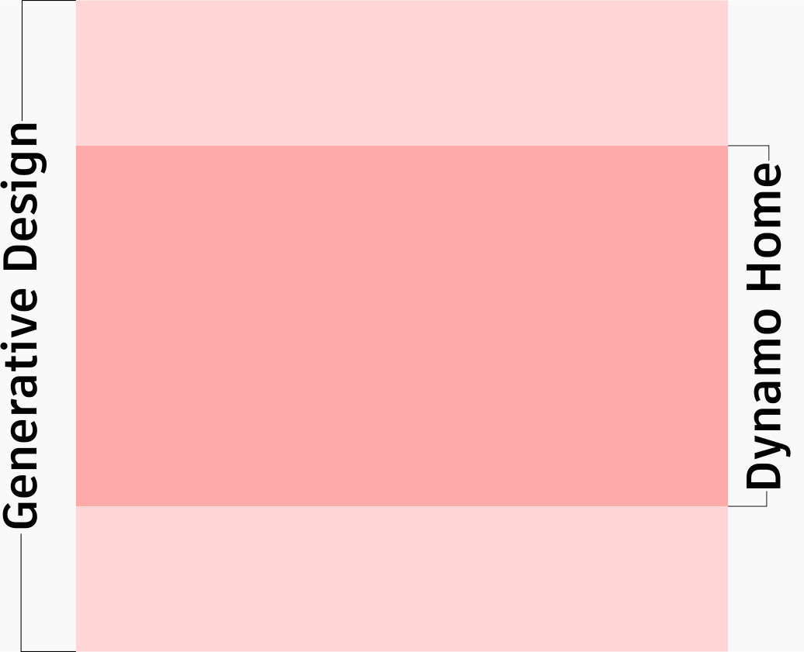

# Graph Thumbnails for Dynamo Home

Dynamo Home shows graph thumbnails on a wide card. The card is 16:9. Home centers the image and crops the top and bottom.

A square thumbnail can look complete in Generative Design, which shows the full square. The same image can lose titles or logos in Home.

This applies to any graph (`.dyn`), not only graphs inside a package. Set the image in Graph Properties. The image is stored in the graph file.


Keep titles, logos, and the main image in the center **safe area**. Use the top and bottom of a square thumbnail as background only.


## Thumbnail templates

Download a template and design on top of it. The darker center band is what Home shows. The lighter bands at the top and bottom are cropped in Home. Generative Design shows the full square.

> Download the SVG template to edit in a vector app, or the PNG template to place artwork in an image editor.





<figure><figcaption>
The darker center band is visible in Home. The lighter top and bottom bands are cropped.
</figcaption></figure>

## Compose the thumbnail

1. Open the SVG or PNG template in an image editor.
2. Place your artwork on the pink square in the template.
3. Keep the title, logo, and main image inside the darker center band.
4. Use the lighter top and bottom bands for background color or extra artwork only.
5. Hide or delete the pink guide, then export a **square** PNG.

Use a **square** image (1:1). Home always shows the darker center band as a 16:9 crop. Pixel size does not change the crop. If you start from a blank file instead of the template, make it square. The thumbnail template itself is 840 × 840 pixels.

## Add the thumbnail to a graph

Home reads the thumbnail from the graph file (`.dyn`), not from the Package Manager publish form.

1. Open the graph in Dynamo.
2. Go to **File > Show Graph Properties > General**.
3. Add your exported PNG in the image field.
4. Save the graph.

If the graph ships in a package, include that `.dyn` when you publish. See [Publishing a Package](../6_custom_nodes_and_packages/6-2_packages/4-publishing.md).

## Check the result in Home

1. Open Dynamo Home.
2. Under Recent, find the graph you just saved.
3. Confirm that the title and logo are fully visible on the card.

If text is cut off, move it toward the center, export the image again, and update Graph Properties. Do not rely on Generative Design alone. Generative Design shows the full square.
