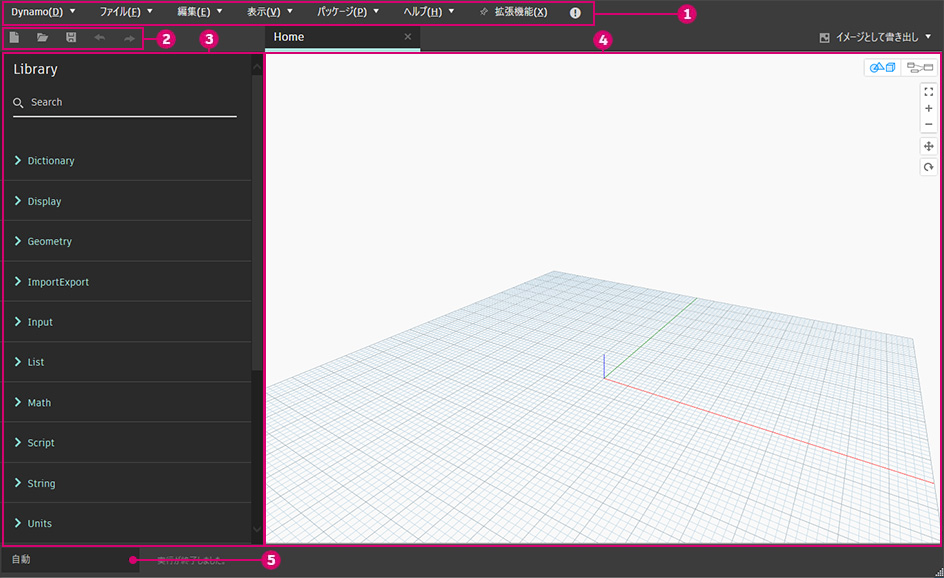
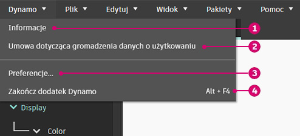
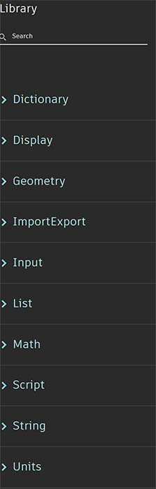
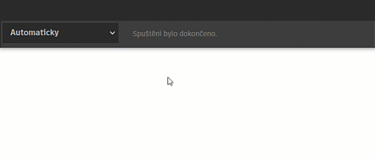
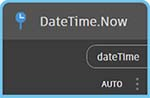

# ユーザ インタフェース

### ユーザ インタフェースの概要

Dynamo のユーザ インタフェース(UI)は、5 つの主要な領域に分かれています。ここでは、概要について簡単に説明し、次のセクションでワークスペースとライブラリについて詳しく説明します。

> 1. メニュー
> 2. ツールバー
> 3. ライブラリ
> 4. ワークスペース
> 5. 実行バー

### メニュー

.jpg)

これは Dynamo アプリケーションの基本機能を表示するメニューです。ほとんどの Windows ソフトウェアと同様に、最初の 2 つのメニューはファイルの管理、選択とコンテンツ編集の操作に関連しています。他のメニュー項目は、Dynamo 固有のメニュー項目です。

#### Dynamo メニュー

一般的な情報と設定は、**Dynamo** ドロップ ダウン メニューにあります。

> 1. [バージョン情報] - ご使用のコンピュータにインストールされている Dynamo のバージョンを確認できます。
> 2. [操作性データ収集の承諾] - これにより、Dynamo を改善するためのユーザ データの共有を開始または終了することができます。
> 3. [基本設定] - アプリケーションの小数点精度やジオメトリのレンダリング品質を定義するなどの設定が含まれます。
> 4. Dynamo を終了する

#### ヘルプ

不明な点については、**[ヘルプ]** メニューを確認します。Dynamo の参照 Web サイトの 1 つにインターネット ブラウザからアクセスすることができます。

> 1. [インタラクティブ ガイド]: Dynamo のさまざまな機能をステップごとに紹介するツアーです。
> 2. [サンプル] - 参照用のサンプル ファイルです。Revit や Civil 3D などのホスト プログラムでのみ使用できます。
> 3. [Dynamo ディクショナリ] - すべてのノードについての設計図書作成で参照するリソースです。
> 4. Dynamo の Web サイト: Dynamo に関する情報のほか、フォーラムやブログなどのリソースへのリンクを提供する Web サイトです。
> 5. Dynamo リポジトリ - GitHub で Dynamo プロジェクトを表示します。
> 6. [Dynamo プロジェクト Wiki] - Wiki にアクセスして、Dynamo API を使用する開発方法やライブラリとツールのサポートに関する情報を表示します。
> 7. [開始ページを表示] - ドキュメント内の Dynamo 開始ページに戻ります。
> 8. [バグをレポート] - GitHub 上に指摘事項を作成します。

### ツールバー

Dynamo ツールバーには、[元に戻す][Ctrl + Z]コマンドと[やり直し][Ctrl + Y]コマンドの他に、ファイルに関する作業に役立つ一連のクイック アクセス ボタンが用意されています。右端にあるボタンを使用すると、ワークスペースのスナップショットを書き出すことができます。このボタンは、ドキュメントの作成や共有を行う場合に特に便利です。

* [新規] - 新しい .dyn ファイルを作成する場合に使用します。
*  (1) (1).jpg>)[開く] - 既存の .dyn (ワークスペース)ファイルや .dyf (カスタム ノード)ファイルを開く場合に使用します。
* [保存]/[名前を付けて保存] - アクティブな .dyn ファイルや .dyf ファイルを保存する場合に使用します。
* [元に戻す] - 最後の操作を元に戻す場合に使用します。
* [やり直し] - 次の操作をやり直す場合に使用します。
* [ワークスペースをイメージとして書き出す] - 表示されているワークスペースを PNG ファイルに書き出す場合に使用します。

### ライブラリ

Dynamo ライブラリは、機能ライブラリのコレクションです。各ライブラリには、カテゴリ別にグループ化されたノードが含まれています。このライブラリは、Dynamo の既定のインストール時に追加される基本ライブラリで構成されています。引き続きこのライブラリの使用方法を紹介し、カスタム ノードと追加パッケージを使用して基本機能を拡張する方法について説明します。「[2-library.md](2-library.md "mention")」セクションでは、この使用方法を詳しく説明しています。

### ワークスペース

ワークスペースは、ビジュアル プログラムを構成する場所です。プレビューの設定を変更して、ここから 3D ジオメトリを表示することもできます。詳細については、「[1-workspace.md](1-workspace.md "mention")」を参照してください。

### 実行バー

ここから Dynamo スクリプトを実行します。実行ボタンのドロップダウン アイコンをクリックして、モードを切り替えます。

* [自動]: スクリプトを自動的に実行します。変更はリアルタイムで更新されます。
* [手動]: [実行]ボタンをクリックした場合のみスクリプトが実行されます。複雑で「重い」スクリプトに変更を加える場合に便利です。
* [周期]: このオプションは既定でグレー表示されます。_DateTime.Now_ ノードが使用されている場合にのみ使用できます。指定した間隔で自動的に実行されるようにグラフを設定できます。

