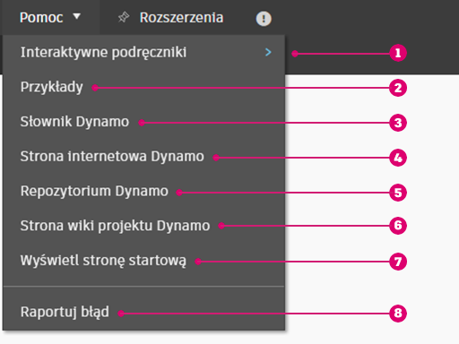

# Пользовательский интерфейс

### Обзор пользовательского интерфейса

Пользовательский интерфейс Dynamo разделен на пять основных областей. В следующих разделах подробно рассматривается рабочее пространство и библиотека.

\

> 1. Меню
> 2. Панель инструментов
> 3. Библиотека
> 4. Рабочее пространство
> 5. Панель выполнения

### Меню

.jpg)

Здесь указаны меню для основных функций приложения Dynamo. Как и в большинстве программ Windows, первые два меню связаны с управлением файлами, операциями выбора и редактированием содержимого. В остальных меню содержатся функции, присущие именно Dynamo.

#### Меню Dynamo

Общие сведения и настройки можно найти в раскрывающемся меню **Dynamo**.

\

> 1. О программе: данные о версии Dynamo, установленной на компьютере.
> 2. Соглашение о сборе данных об использовании: возможность принять участие в обмене пользовательскими данными для улучшения работы Dynamo или отказаться от него.
> 3. Настройки: параметры, такие как точность десятичных знаков в приложении и качество визуализации геометрии.
> 4. Выход из Dynamo

#### Справка

При возникновении вопросов по работе программы воспользуйтесь меню **Справка**. Для доступа к справочным веб-сайтам Dynamo можно использовать веб-браузер.

> 1. Интерактивные руководства: пошаговые обзоры различных функций Dynamo.
> 2. Образцы: файлы примеров для справки. Доступно только в основных программах, включая Revit и Civil 3D.
> 3. Словарь Dynamo: ресурс с документацией по всем узлам.
> 4. Веб-сайт Dynamo: веб-сайт с информацией о Dynamo и ссылками на форум, блог и другие ресурсы.
> 5. Репозиторий Dynamo: просмотр проекта Dynamo на сайте GitHub. 
> 6. Проект Dynamo Wiki: переход на страницу справки Wiki, посвященную методам разработки с помощью API Dynamo, вспомогательных библиотек и инструментов.
> 7. Показ начальной страницы: возврат на начальную страницу Dynamo при работе с документом.
> 8. Отчет об ошибке: создание инцидента на веб-сайте GitHub.

### Панель инструментов

Панель инструментов Dynamo содержит ряд кнопок для быстрого доступа к файлам, а также команды «Отменить» [CTRL+Z] и «Повторить [CTRL+Y]». Справа находится еще одна кнопка, с помощью которой можно экспортировать снимок рабочего пространства, что часто требуется при работе с документацией и совместном использовании данных.

* \ Создать: создание файла DYN.
* \.png>) Открыть: открытие существующего файла DYN (рабочего пространства) или DYF (пользовательского узла).
* \ Сохранить/Сохранить как: сохранение активного файла DYN или DYF.
* \ Отменить: отмена последней операции.
* \ Повторить: повтор последующей операции.
* \ Экспорт рабочего пространства в виде изображения: экспорт видимого рабочего пространства в файл PNG.

### Библиотека

Библиотека Dynamo — это набор функциональных библиотек, каждая из которых содержит узлы, сгруппированные по категориям. Она содержит базовые библиотеки, которые добавляются при установке Dynamo по умолчанию. В рамках этой процедуры мы продолжим знакомство с ее использованием. Мы рассмотрим, как расширить базовые функции с помощью пользовательских узлов и дополнительных пакетов. В разделе [2-library.md](2-library.md "mention") содержатся подробные инструкции по использованию.

\.gif>)

### Рабочее пространство

Рабочее пространство позволяет создавать визуальные программы и изменять настройки предварительного просмотра для отображения 3D-геометрии. Дополнительные сведения см. в разделе [1-workspace.md](1-workspace.md "mention").

\.gif>)

### Панель выполнения

Обеспечивает запуск сценария Dynamo. Щелкните значок раскрывающегося списка на кнопке «Выполнение», чтобы переключиться между различными режимами.

\

* «Автоматически»: сценарий запускается автоматически. Изменения применяются в реальном времени.
* «Вручную»: сценарий выполняется только при нажатии кнопки «Запуск». Используется при внесении изменений в сложный и крупный сценарий.
* «Периодически»: по умолчанию этот параметр неактивен. Он становится доступен только при использовании узла _DateTime.Now_. С его помощью можно настроить автоматическое выполнение сценария с заданным интервалом.

\
