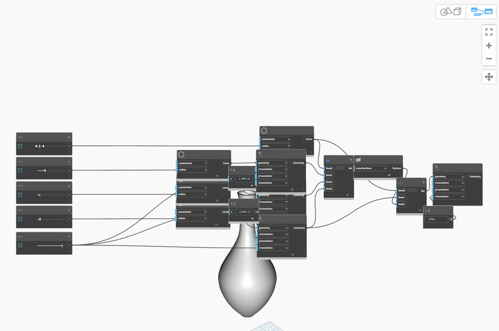
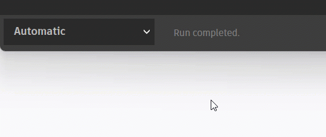

# 使用者介面

### 使用者介面概述

Dynamo 的使用者介面 (UI) 分為五個主要區域。我們在此將簡要概述，並在以下幾節進一步說明工作區和資源庫。

> 1. 功能表
> 2. 工具列
> 3. 資源庫
> 4. 工作區
> 5. 執行列

### 功能表

.jpg)

以下是 Dynamo 應用程式的基本功能功能表。與大多數 Windows 軟體一樣，前兩個功能表與管理檔案、選取作業和編輯內容相關。其餘的功能表包含 Dynamo 更具體的功能。

#### Dynamo 功能表

在 **Dynamo** 下拉式功能表上可以找到一般資訊和設定。

> 1. 關於 - 了解您電腦上安裝的 Dynamo 版本。
> 2. 收集使用狀況資料的合約 - 這可讓您選擇是否分享您的使用者資料來改善 Dynamo。
> 3. 偏好 - 包括各項設定，例如定義應用程式的小數點精確度和幾何圖形彩現品質。
> 4. 結束 Dynamo

#### 說明

如果您遇到問題，請查閱**「說明」**功能表。您可以透過網際網路瀏覽器存取其中一個 Dynamo 參考網站。

> 1. 開始使用 - 使用 Dynamo 的簡要介紹。
> 2. 互動式指南 -
> 3. 範例 - 參考範例檔案。
> 4. Dynamo 字典 - 所有節點上具備文件的資源。
> 5. Dynamo 網站 - 在 GitHub 上檢視 Dynamo 專案。
> 6. Dynamo 專案 Wiki - 造訪 Wiki，以學習使用 Dynamo API 進行開發，支援資源庫與工具。
> 7. 顯示開始頁面 - 返回至文件中的 Dynamo 開始頁面。
> 8. 報告錯誤 - 在 Github 開啟問題。

### 工具列

Dynamo 的工具列包含一系列按鈕，可快速存取以使用檔案及退回 [Ctrl + Z] 與重做 [Ctrl + Y] 指令。最右側是另一個按鈕，可以匯出工作區的快照，這對於製作文件及分享非常有用。

*  新建 - 建立新的 .dyn 檔案
*  開啟 - 開啟既有 .dyn (工作區) 或 .dyf (自訂節點) 檔案
*  儲存/另存新檔 - 儲存使用中的 .dyn 或 .dyf 檔案
*  退回 - 退回上一個動作
*  重做 - 重做下一個動作
*  匯出工作區做為影像 - 將可見工作區匯出為 PNG 檔案

### 資源庫

Dynamo 資源庫是一個功能資源庫的集合，每個資源庫都包含依品類分組的節點。它包含在 Dynamo 預設安裝期間加入的基本資源庫，隨著我們繼續介紹用法，我們將示範如何使用自訂節點和其他套件來延伸基本功能。[2-library.md](2-library.md "mention")一節將涵蓋使用資源庫更詳細的指導。

### 工作區

「工作區」是我們建構視覺程式的位置，您也可以變更其「預覽」設定，以從此處檢視 3D 幾何圖形。請參閱[1-workspace.md](1-workspace.md "mention")，以取得更多詳細資料。

### 執行列

從此處執行 Dynamo 指令碼。按一下「執行」按鈕上的下拉式圖示，可在不同模式之間進行變更。

* 自動：自動執行指令碼。變更會即時更新。
* 手動：只在按一下「執行」按鈕時才執行指令碼。在變更複雜和繁重的指令碼時，此功能非常有用
* 週期性：此選項預設會灰顯。只有在使用 DateTime.Now 節點時才能使用。您可以將圖表設定為以指定間隔自動執行。

