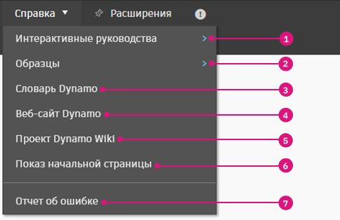

# Interfejs użytkownika

### Przegląd interfejsu użytkownika

Interfejs użytkownika (UI) aplikacji Dynamo jest podzielony na pięć głównych regionów. Krótko je tutaj omówimy i objaśnimy dokładniej obszar roboczy oraz bibliotekę w kolejnych sekcjach.

> 1. Menu
> 2. Pasek narzędzi
> 3. Biblioteka
> 4. Obszar roboczy
> 5. Pasek uruchamiania

### Menu

.jpg)

Tutaj znajdują się menu podstawowych funkcji aplikacji Dynamo. Podobnie jak w większości programów systemu Windows, operacje związane z zarządzaniem plikami i dotyczące wyboru oraz edycji elementów znajdują się w dwóch pierwszych menu. Pozostałe menu są bardziej specyficzne dla dodatku Dynamo.

#### Menu aplikacji Dynamo

Ogólne informacje i ustawienia można znaleźć w menu rozwijanym aplikacji **Dynamo**.

> 1. Informacje — dowiedz się, jaka wersja aplikacji Dynamo jest zainstalowana na komputerze.
> 2. Umowa dotycząca gromadzenia danych o użytkowaniu — umożliwia to zaakceptowanie lub odrzucenie opcji udostępniania danych użytkownika w celu ulepszenia aplikacji Dynamo.
> 3. Preferencje — zawiera ustawienia, takie jak dokładność dziesiętna i jakość renderingu geometrii w aplikacji.
> 4. Zakończ dodatek Dynamo

#### Pomoc

Jeśli nie wiesz, co zrobić dalej, skorzystaj z menu **Pomoc**. Możesz odwiedzić jedną z informacyjnych witryn internetowych dotyczących aplikacji Dynamo za pośrednictwem przeglądarki internetowej.

> 1. Pierwsze kroki — krótkie wprowadzenie do korzystania z dodatku Dynamo.
> 2. Interaktywne podręczniki —
> 3. Przykłady — informacyjne pliki przykładowe.
> 4. Słownik Dynamo — zasoby z dokumentacją dla wszystkich węzłów.
> 5. Witryna Dynamo — wyświetl projekt Dynamo w serwisie GitHub.
> 6. Witryna wiki Dynamo — odwiedź witrynę wiki, aby dowiedzieć się więcej na temat opracowywania rozwiązań za pomocą interfejsu API Dynamo, obsługi bibliotek i narzędzi.
> 7. Wyświetl stronę startową — wróć do strony startowej dodatku Dynamo z poziomu dokumentu.
> 8. Zgłoś błąd — zgłoś problem w serwisie GitHub.

### Pasek narzędzi

Pasek narzędzi Dynamo zawiera szereg przycisków umożliwiających szybki dostęp do plików oraz polecenia Cofnij [Ctrl+Z] i Ponów [Ctrl+Y]. Po skrajnej prawej stronie znajduje się kolejny przycisk, który umożliwia wyeksportowanie migawki obszaru roboczego. Jest on wyjątkowo przydatny do tworzenia dokumentacji i udostępniania.

*  Nowy — utwórz nowy plik .dyn
* \ (1) (1).jpg>) Otwórz — otwórz istniejący plik .dyn (obszar roboczy) lub .dyf (węzeł niestandardowy)
*  Zapisz/Zapisz jako — zapisz aktywny plik .dyn lub .dyf
*  Cofnij — cofnij ostatnią operację
*  Ponów — ponów następną operację
*  Eksportuj obszar roboczy jako obraz — eksportuj widoczny obszar roboczy jako plik PNG

### Biblioteka

Biblioteka Dynamo jest kolekcją bibliotek funkcjonalnych, z których każda zawiera węzły pogrupowane według kategorii. Składa się ona z bibliotek podstawowych dodawanych podczas domyślnej instalacji aplikacji Dynamo. W miarę objaśniania korzystania z niej będziemy demonstrować, jak rozszerzyć funkcje podstawowe za pomocą węzłów niestandardowych i dodatkowych pakietów. W sekcji [2-library.md](2-library.md "mention") przedstawimy bardziej szczegółowe wskazówki dotyczące korzystania z niej.

### Obszar roboczy

W obszarze roboczym tworzymy programy wizualne. Można również zmienić odpowiednie ustawienie podglądu, aby wyświetlać tu geometrie 3D. Aby uzyskać więcej informacji, zobacz [1-workspace.md](1-workspace.md "mention").

### Pasek uruchamiania

Tutaj uruchamia się skrypty Dynamo. Kliknij ikonę listy rozwijanej na przycisku wykonywania, aby przełączać się między trybami.

* Automatycznie: uruchamia skrypt automatycznie. Zmiany są aktualizowane w czasie rzeczywistym.
* Ręcznie: skrypt jest uruchamiany tylko po kliknięciu przycisku Uruchom. Ta opcja jest przydatna przy wprowadzaniu zmian w złożonym, „intensywnym” skrypcie.
* Okresowy: ta opcja jest domyślnie wyszarzona. Jest dostępna tylko wtedy, gdy używany jest węzeł _DateTime.Now_. Wykres można skonfigurować tak, aby był uruchamiany automatycznie w określonych odstępach czasu.

