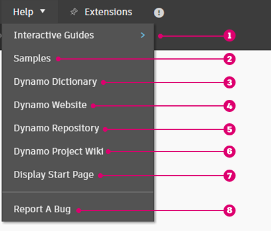

# Uživatelské rozhraní

### Přehled uživatelského rozhraní

Uživatelské rozhraní aplikace Dynamo je uspořádáno do pěti hlavních oblastí. Níže naleznete jeho stručný přehled a v následujících částech naleznete informace o pracovním prostoru a knihovně.

> 1. Nabídky
> 2. Panel nástrojů
> 3. Knihovna
> 4. Pracovní prostor
> 5. Panel spuštění

### Nabídky

.jpg)

Zde jsou nabídky pro základní funkce aplikace Dynamo. Podobně jako u většiny softwaru pro systém Windows se první dvě nabídky týkají správy souborů, operací pro výběr a úpravy obsahu. Zbývající nabídky jsou specifičtější pro aplikaci Dynamo.

#### Nabídky aplikace Dynamo

V rozevírací nabídce **Dynamo** naleznete obecné informace a přístup k nastavení.

> 1. O aplikaci – Zde naleznete informace o verzi aplikace Dynamo nainstalované v počítači.
> 2. Smlouva o shromažďování údajů o použitelnosti – Zde můžete povolit nebo zakázat sdílení uživatelských dat za účelem zlepšení aplikace Dynamo.
> 3. Předvolby – Zahrnuje nastavení, jako je definování přesnosti aplikace na určený počet desetinných míst a kvality rendrování geometrie.
> 4. Ukončit aplikaci Dynamo

#### Nápověda

Pokud máte problém, podívejte se do nabídky **Nápověda**. Prostřednictvím internetového prohlížeče můžete navštívit některou z referenčních webových stránek aplikace Dynamo.

> 1. Interaktivní průvodci – Prohlídky, které vás krok za krokem provedou různými funkcemi aplikace Dynamo.
> 2. Ukázky – Vzorové referenční soubory. K dispozici pouze v hostitelských programech včetně aplikací Revit a Civil 3D.
> 3. Slovník aplikace Dynamo – Zdroj s dokumentací o všech uzlech.
> 4. Web aplikace Dynamo – Webová stránka s informacemi o aplikaci Dynamo a odkazy na zdroje informací, jako jsou fórum, blog atd.
> 5. Úložiště aplikace Dynamo – Zobrazení projektu aplikace Dynamo v úložišti GitHub. 
> 6. Stránka Wiki k projektu aplikace Dynamo – Na stránce Wiki najdete informace o vývoji pomocí rozhraní Dynamo API, podpůrných knihoven a nástrojů.
> 7. Zobrazit úvodní stránku – Návrat na úvodní stránku aplikace Dynamo, když se nacházíte v dokumentu.
> 8. Hlášení chyby – Otevře problém v úložišti GitHub.

### Panel nástrojů

Panel nástrojů aplikace Dynamo obsahuje řadu tlačítek pro rychlý přístup k práci se soubory a také příkazy Zpět [Ctrl+Z] a Znovu [Ctrl+Y]. Zcela vpravo je další tlačítko, které umožňuje exportovat snímek pracovního prostoru, což je mimořádně užitečné pro dokumentaci a sdílení.

*  Nový – Vytvoří nový soubor .dyn.
* \ (1) (1).jpg>) Otevřít – Otevře existující soubor .dyn (pracovní prostor) nebo .dyf (vlastní uzel).
*  Uložit/uložit jako – Uloží aktivní soubor .dyn nebo .dyf.
*  Zpět – Vrátí zpět poslední akci.
*  Znovu – Znovu provede další akci.
*  Exportovat pracovní prostor jako obrázek – Exportuje viditelný pracovní prostor jako soubor PNG.

### Knihovna

Knihovna aplikace Dynamo je kolekce funkčních knihoven, z nichž každá obsahuje uzly seskupené podle kategorie. Skládá se ze základních knihoven, které jsou přidány při výchozí instalaci aplikace Dynamo. Jak budeme pokračovat v představování jejího použití, ukážeme si, jak rozšířit základní funkce pomocí vlastních uzlů a dalších balíčků. Podrobnější informace o jejím používání naleznete v části [2-library.md](2-library.md "mention").

### Pracovní prostor

Pracovní prostor je místo, kde sestavujete své vizuální programy. Můžete také měnit jeho nastavení náhledu tak, abyste si zde mohli prohlížet 3D geometrie. Další podrobnosti naleznete v části [1-workspace.md](1-workspace.md "mention").

### Panel spuštění

Zde spusťte skript aplikace Dynamo. Kliknutím na ikonu rozevíracího seznamu na tlačítku Spuštění můžete přepínat mezi různými režimy.

* Automaticky: Automaticky spustí skript. Změny se aktualizují v reálném čase.
* Ruční: Skript se spustí pouze po kliknutí na tlačítko Spustit. To je užitečné při provádění změn ve složitých a těžkých skriptech.
* Pravidelně: Ve výchozím nastavení je tato možnost zobrazena šedě. Tato možnost je dostupná pouze v případě, že je použit uzel _DateTime.Now_. Graf můžete nastavit tak, aby se spouštěl automaticky v zadaném intervalu.

