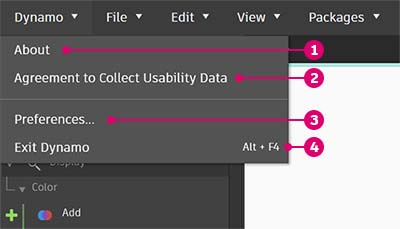

# 사용자 인터페이스

### 사용자 인터페이스 개요

Dynamo의 UI(사용자 인터페이스)는 5개의 주요 영역으로 구성되어 있습니다. 여기에서 개요를 간략하게 설명하고 다음 섹션에서 작업공간 및 라이브러리에 대해 자세히 살펴보겠습니다.

> 1. 메뉴
> 2. 도구막대
> 3. 라이브러리
> 4. 작업공간
> 5. 실행 막대

### 메뉴

.jpg)

다음은 Dynamo 응용프로그램의 기본 기능에 대한 메뉴입니다. 대부분의 Windows 소프트웨어와 마찬가지로, 처음 두 메뉴는 파일 관리, 선택 및 컨텐츠 편집을 위한 작업과 관련된 메뉴입니다. 나머지 메뉴는 좀 더 Dynamo에 해당하는 항목입니다.

#### Dynamo 메뉴

일반 정보 및 설정은 **Dynamo** 드롭다운 메뉴에서 찾을 수 있습니다.

> 1. 정보 - 컴퓨터에 설치된 Dynamo 버전을 확인할 수 있습니다.
> 2. 가용성 데이터 수집에 대한 동의 - Dynamo를 개선하기 위한 사용자 데이터 공유를 옵트인하거나 옵트아웃할 수 있습니다.
> 3. 기본 설정 - 응용프로그램의 소수점 정밀도 및 형상 렌더 품질을 정의하는 것과 같은 설정이 포함됩니다.
> 4. Dynamo를 종료합니다.

#### 도움말

문제가 있는 경우 **도움말** 메뉴를 확인합니다. 인터넷 브라우저를 통해 Dynamo 참조 웹 사이트 중 하나에 액세스할 수 있습니다.

> 1. 시작하기 - Dynamo 사용에 대한 간략한 소개입니다.
> 2. 대화식 안내서 -
> 3. 샘플 - 참조 예시 파일입니다.
> 4. Dynamo 사전 - 모든 노드에 대한 문서가 포함된 리소스입니다.
> 5. Dynamo 웹사이트 - GitHub에서 Dynamo 프로젝트를 봅니다.
> 6. Dynamo 프로젝트 Wiki - Dynamo API, 지원 라이브러리 및 도구를 사용한 개발 방법에 대해 알아보기 위해 Wiki를 방문합니다.
> 7. 시작 페이지 표시 - 문서 내에 있는 경우 Dynamo 시작 페이지로 돌아갑니다.
> 8. 버그 신고 - GitHub에서 문제를 엽니다.

### 도구막대

Dynamo의 도구막대에는 파일 작업에 빠르게 액세스할 수 있는 일련의 버튼과 실행취소[Ctrl + Z] 및 재실행[Ctrl + Y] 명령이 포함되어 있습니다. 맨 오른쪽에는 작업공간의 스냅샷을 내보내는 또 다른 버튼이 있습니다. 이 버튼은 문서화 및 공유에 매우 유용합니다.

*  새로 작성 - 새 .dyn 파일을 작성합니다.
*  (1).jpg>) 열기 - 기존 .dyn(작업공간) 또는 .dyf(사용자 노드) 파일 열기
*  저장/다른 이름으로 저장 - 활성 .dyn 또는 .dyf 파일을 저장합니다.
*  실행취소 - 마지막 작업을 실행취소합니다.
*  재실행 - 다음 작업을 재실행합니다.
*  작업공간을 이미지로 내보내기 - 표시되는 작업공간을 PNG 파일로 내보냅니다.

### 라이브러리

Dynamo 라이브러리는 기능 라이브러리의 모음으로, 각 라이브러리에는 카테고리별로 그룹화된 노드가 포함되어 있습니다. 이 라이브러리는 Dynamo의 기본 설치 중에 추가되는 기본 라이브러리로 구성되어 있습니다. 사용법을 계속 소개하면서 사용자 노드 및 추가 패키지를 사용하여 기본 기능을 확장하는 방법을 보여 드리겠습니다. [2-library.md](2-library.md "mention") 섹션에서는 이 기능을 사용하는 방법에 대한 보다 자세한 지침을 설명합니다.

### 작업공간

작업공간에서는 시각적 프로그램을 구성합니다. 여기에서 3D 형상을 보기 위한 미리보기 설정을 변경할 수도 있습니다. 자세한 내용은 [1-workspace.md](1-workspace.md "mention")을 참고하십시오.

### 실행 막대

여기에서 Dynamo 스크립트를 실행합니다. 실행 버튼의 드롭다운 아이콘을 클릭하여 다양한 모드 간에 전환합니다.

* 자동: 스크립트를 자동으로 실행합니다. 변경 사항은 실시간으로 업데이트됩니다.
* 수동: '실행' 버튼을 클릭한 경우에만 스크립트가 실행됩니다. 복잡한 '대용량 스크립트'를 변경할 때 유용합니다.
* 주기적: 이 옵션은 기본적으로 회색으로 표시됩니다. DateTime.Now 노드가 사용되는 경우에만 사용할 수 있습니다. 지정된 간격으로 자동으로 실행되도록 그래프를 설정할 수 있습니다.

