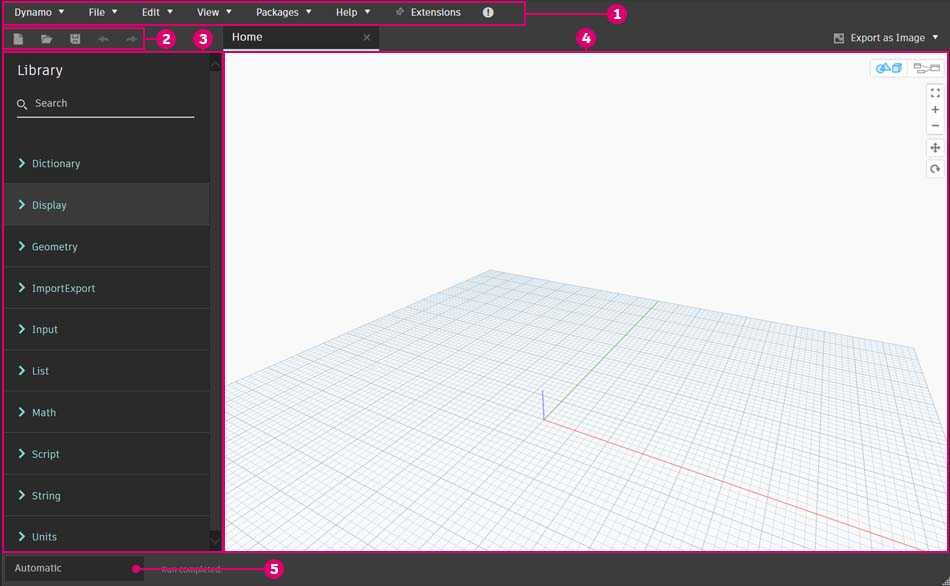

# Interfaz de usuario

### Descripción general de la interfaz de usuario

La interfaz de usuario (IU) de Dynamo se organiza en cinco regiones principales. Aquí se ofrecerá una breve descripción general; analizaremos más detalladamente el espacio de trabajo y la biblioteca en las siguientes secciones.

> 1. Menús
> 2. Barra de herramientas
> 3. Biblioteca
> 4. Espacio de trabajo
> 5. Barra de ejecución

### Menús

.jpg)

A continuación, se indican los menús de las funciones básicas de la aplicación Dynamo. Al igual que la mayoría del software de Windows, los dos primeros menús están relacionados con la administración de archivos, las operaciones de selección y la edición de contenido. El resto de los menús son más específicos de Dynamo.

#### Menús de Dynamo

La información general y la configuración se pueden encontrar en el menú desplegable **Dynamo**.

> 1. Acerca de: descubra la versión de Dynamo instalada en el equipo.
> 2. Acuerdo para recopilar datos de uso: esta opción le permite elegir compartir sus datos de usuario a fin de mejorar Dynamo.
> 3. Preferencias: incluye parámetros como, por ejemplo, la definición de la precisión del separador decimal de la aplicación y la calidad de renderización de la geometría.
> 4. Salir de Dynamo

#### Ayuda

Si no sabe cómo continuar, consulte el menú de **Ayuda**. Puede acceder a uno de los sitios web de referencia de Dynamo a través del navegador de Internet.

> 1. Para empezar: una breve introducción al uso de Dynamo.
> 2. Guías interactivas:
> 3. Muestras: archivos de ejemplo de referencia.
> 4. Diccionario de Dynamo: recurso con documentación sobre todos los nodos.
> 5. Sitio web de Dynamo: vea el proyecto de Dynamo en GitHub.
> 6. Wiki del proyecto Dynamo: visite la página wiki para obtener información sobre el desarrollo mediante la API de Dynamo con bibliotecas y herramientas.
> 7. Mostrar página de inicio: regrese a la página de inicio de Dynamo cuando se encuentre en un documento.
> 8. Informar de un error: abra una incidencia en GitHub.

### Barra de herramientas

La barra de herramientas de Dynamo contiene una serie de botones para acceder rápidamente a los archivos, así como a los comandos Deshacer (Ctrl + Z) y Rehacer (Ctrl + Y). En el extremo derecho, hay otro botón que exporta una instantánea del espacio de trabajo, lo que resulta muy útil para la documentación y el uso compartido.

* Nuevo: cree un nuevo archivo .dyn.
*  Abrir: abra un archivo .dyn (espacio de trabajo) o .dyf (nodo personalizado) existente.
*  Guardar/Guardar como: guarde el archivo .dyn o .dyf activo.
*  Deshacer: deshaga la última acción.
*  Rehacer: rehaga la siguiente acción.
*  Exportar espacio de trabajo como imagen: exporte el espacio de trabajo visible como un archivo PNG.

### Biblioteca

La biblioteca de Dynamo es una colección de bibliotecas funcionales; cada una de ellas contiene nodos agrupados por categorías. Consta de bibliotecas básicas que se añaden durante la instalación por defecto de Dynamo. A medida que sigamos describiendo su uso, mostraremos cómo ampliar la funcionalidad básica con nodos personalizados y paquetes adicionales. En la sección [2-library.md](2-library.md "mention"), se ofrecerá información más detallada sobre cómo utilizarla.

### Espacio de trabajo

El espacio de trabajo es el lugar en el que se crean los programas visuales; también puede cambiar su parámetro Vista preliminar para ver las geometrías 3D desde aquí. Para obtener más información, consulte [1-workspace.md](1-workspace.md "mention").

### Barra de ejecución

Ejecute la secuencia de comandos de Dynamo desde aquí. Haga clic en el icono desplegable del botón de ejecución para cambiar entre los distintos modos.

* Automático: ejecuta la secuencia de comandos automáticamente. Los cambios se actualizan en tiempo real.
* Manual: la secuencia de comandos solo se ejecuta cuando se hace clic en el botón "Ejecutar". Este modo es útil para realizar cambios en secuencias de comandos complejas y de gran tamaño.
* Periódica: esta opción está atenuada por defecto. Solo está disponible cuando se utiliza el nodo DateTime.Now. Puede establecer el gráfico para que se ejecute automáticamente en el intervalo especificado.

