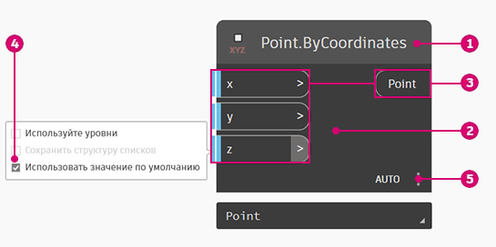
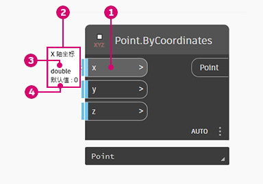
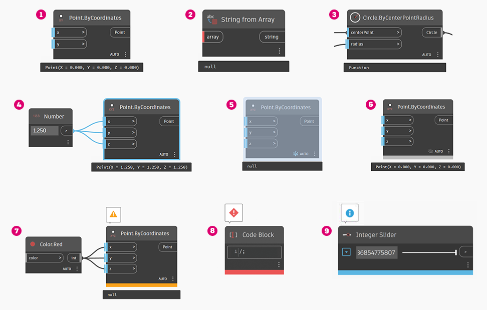
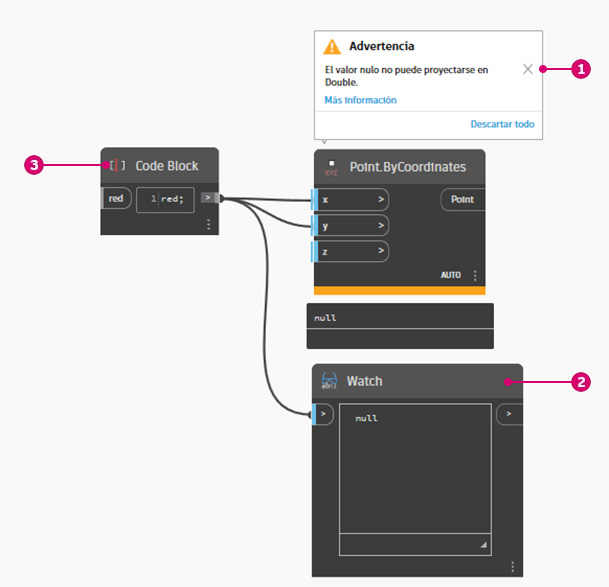
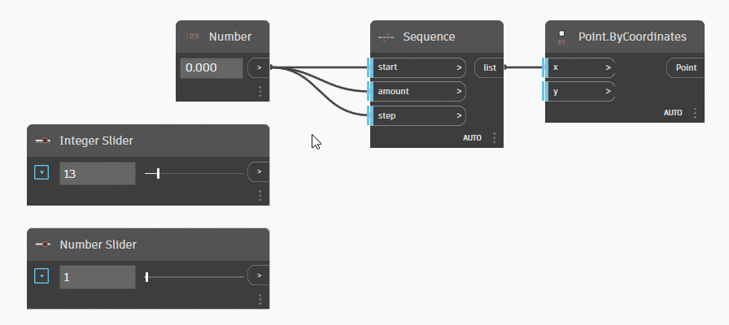
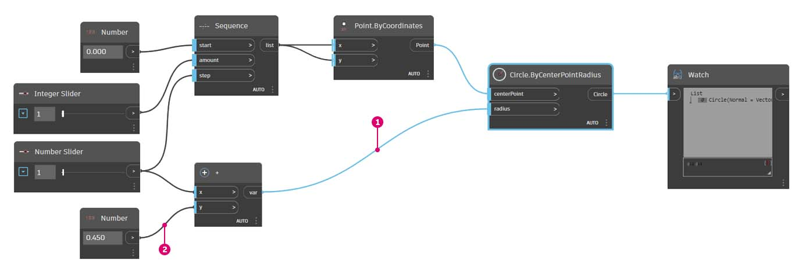
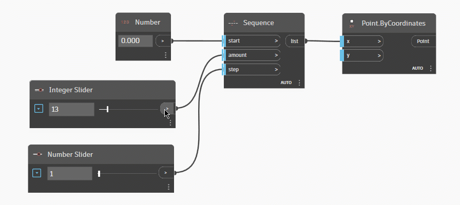

# Uzly a dráty

## Uzly

V aplikaci Dynamo jsou **uzly** objekty, jejichž propojováním vzniká vizuální program. Každý **uzel** provádí operaci – někdy může být jednoduchá, například uložení čísla, jindy může být složitá, například tvorba nebo dotazování geometrie.

### Anatomie uzlu

Většina uzlů v aplikaci Dynamo se skládá z pěti částí. Ačkoliv existují výjimky, například vstupní uzly, anatomii každého uzlu lze popsat následovně:

> 1. Název – Název uzlu. Konvence pojmenování je `Category.Name`.
> 2. Hlavní tělo – Hlavní tělo uzlu. Po kliknutí pravým tlačítkem myši se zde zobrazí možnosti na úrovni celého uzlu.
> 3. Porty (vstupní a výstupní) – Slouží jako zásuvky pro dráty, zleva dochází ke vstupu dat do uzlu, vpravo je výstup výsledků po provedení akce uzlu.
> 4. Výchozí hodnota – Klikněte pravým tlačítkem myši na vstupní port – některé uzly mají k dispozici výchozí hodnoty, které mohou nebo nemusí být použity.
> 5. Ikona vázání – Označuje [možnost vázání](../5\_essential\_nodes\_and\_concepts/5-4\_designing-with-lists/1-whats-a-list.md#lacing) zadanou pro odpovídající vstupy seznamu (více informací později).

### Vstupní/výstupní porty uzlů

Vstupům a výstupům uzlů se říká porty, které se chovají jako zásuvky pro dráty. Data vstupují do uzlu skrz porty vlevo a po jeho spuštění proudí z uzlu ven skrz porty vpravo.

Porty očekávají, že obdrží data určitého typu. Například připojením čísla _2.75_ na porty uzlu Point.ByCoordinates dojde k úspěšné tvorbě bodu, pokud však na stejný port zadáme hodnotu _Červená_, dojde k chybě.

 Přesunutím kurzoru nad port zobrazíte popisek s očekávaným datovým typem. 

> 1. Popisek portu
> 2. Popisek
> 3. Datový typ
> 4. Výchozí hodnota

### Stavy uzlů

Aplikace Dynamo naznačuje stav běhu vizuálního programu, tím že jednotlivé uzly rendruje s různými barvami podle jejich stavu. Hierarchie stavů se řídí touto posloupností: Chyba > Upozornění > Informace > Náhled.

Najetím myší nebo kliknutím pravým tlačítkem myši na název nebo porty se zobrazí další informace a možnosti.

> 1. Připojené vstupy – Uzel s modrými svislými pruhy na vstupních portech je dobře připojen a má úspěšně připojeny všechny vstupy.
> 2. Nepřipojené vstupy – Pokud má uzel na jednom nebo více vstupních portech červené svislé pruhy, je nutné tyto vstupy připojit.
> 3. Funkce – Uzel, jehož výstupem je funkce, a u jehož výstupního portu je zobrazen šedý svislý pruh, je uzel funkce.
> 4. Vybráno – Aktuálně vybrané uzly mají světle modré rámečky.
> 5. Zmrazeno –Průsvitný modrý uzel je zmrazen, čímž je pozastaveno provádění uzlu.
> 6. Náhled vypnut – Šedý stavový řádek pod uzlem a ikona oka  označuje, že náhled geometrie uzlu je vypnutý.
> 7. Upozornění – Žlutý stavový řádek pod uzlem označuje stav upozornění, což znamená, že buď chybí vstupní data, nebo jsou použity nesprávné datové typy.
> 8. Chyba – Červený stavový řádek pod uzlem označuje chybový stav uzlu.
> 9. Informace – Modrý stavový řádek pod uzlem označuje stav Informace, což znamená, že jsou k dispozici užitečné informace o uzlech. Tento stav lze spustit, pokud se blíží maximální hodnota podporovaná uzlem, jestliže je uzel používán způsobem, který má potenciální dopad na výkon atd.

#### Zpracování uzlů s chybou nebo upozorněním

Pokud jsou ve vizuálním programu upozornění nebo chyby, aplikace Dynamo zobrazí další informace o problému. Nad názvy žlutých uzlů se navíc zobrazí popisky. Přesunutím ukazatele myši nad ikonu popisku upozornění  nebo chyby  tuto ikonu rozbalíte.

 Pomocí informací uvedených v popisku můžete zjistit, kde došlo k problému (například chybný datový typ nebo datová struktura u předchozích uzlů). 

> 1. Popisek k upozornění – Hodnotu „Null“ nebo prázdná data nelze interpretovat jako typ Double, tj.číslo.
> 2. Pomocí uzlu Watch můžete prozkoumat vstupní data uzlu.
> 3. V předchozím uzlu Number je uložena hodnota „Red“ a nikoli číslo.

## Dráty

Dráty propojují uzly a vytvářejí mezi nimi vazby, které tvoří tok vizuálního programu. Lze si je představit jako elektrické dráty, které přenášejí pulzy dat od jednoho objektu k dalšímu.

### Tok programu 

Dráty propojují výstupní port jednoho uzlu se vstupním portem jiného uzlu. Tím se v daném směru vytváří **tok dat** vizuálního programu.

Vstupní porty jsou na levé straně a výstupní porty jsou umístěny na pravé straně uzlů, proto lze obecně říci, že tok programu se pohybuje zleva doprava.

### Tvorba drátů 

Vytvořte drát kliknutím levým tlačítkem myši na požadovaný port a následným kliknutím na port jiného uzlu vytvořte propojení. Při propojování uzlů se drát zobrazuje přerušovaně až do jeho propojení s jiným uzlem, pak se zobrazí plnou čarou.

Data tímto drátem budou protékat od vstupu do výstupu, na porty je však možné klikat v libovolném pořadí.

### Úprava drátů

Často je nutné upravit tok vizuálního programu tak, že se upraví propojení reprezentovaná dráty. Chcete-li upravit drát, klikněte levým tlačítkem myši na vstupní port uzlu, který je již propojen. Nyní máte dvě možnosti:

* Chcete-li změnit propojení ke vstupnímu portu, klikněte levým tlačítkem myši na jiný vstupní port.

\(1) (1) (2).gif>)

* Chcete-li drát odebrat, odsuňte jej pryč a klikněte levým tlačítkem myši na pracovní prostor.

* Stisknutím klávesy Shift a kliknutím levým tlačítkem myši můžete změnit propojení několik drátů.

* Stisknutím klávesy Ctrl a kliknutím levým tlačítkem myši můžete drát duplikovat.

#### Výchozí a zvýrazněné dráty 

Ve výchozím nastavení se dráty zobrazují šedě. Po výběru uzlu se k němu připojené dráty zvýrazní světle modrou barvou stejně jako uzel samotný.

> 1. Zvýrazněný drát
> 2. Výchozí drát

**Skrytí drátů ve výchozím nastavení**

Pokud chcete dráty v grafu skrýt, přejděte do nabídky Zobrazit > Konektory a zrušte zaškrtnutí položky Zobrazit spojky.

Při tomto nastavení se bledě modrou barvou zvýrazní pouze vybrané uzly a jejich spojovací dráty.

\ (1).gif>)

#### Skrytí pouze jednotlivých drátů

Můžete skrýt také pouze vybraný drát a to kliknutím pravým tlačítkem na výstup uzlů a výběrem položky Skrýt dráty.

