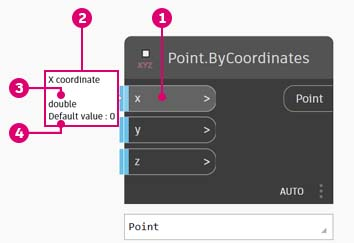
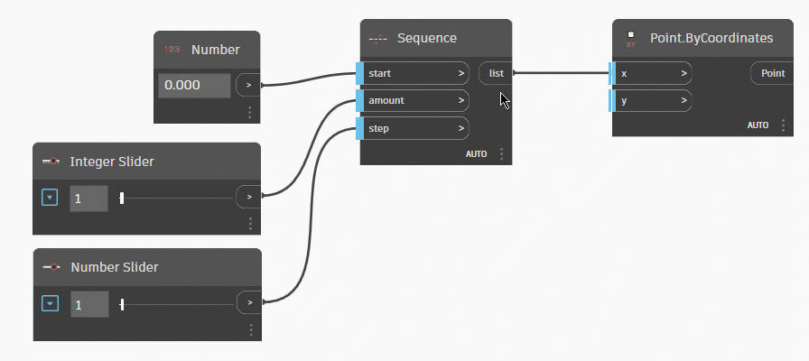
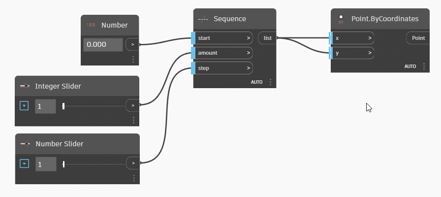

# Nodi e fili

## Nodi

In Dynamo, i **nodi** sono gli oggetti collegati per formare un programma visivo. Ogni **nodo** esegue un'operazione; talvolta può essere semplice come memorizzare un numero o può essere un'azione più complessa come creare o sottoporre a query la geometria.

### Struttura di un nodo

La maggior parte dei nodi in Dynamo è composta da cinque parti. Sebbene vi siano eccezioni, ad esempio i nodi di input, la struttura di ogni nodo può essere descritta come segue:

> 1. Nome: il nome del nodo con una convenzione di denominazione `Category.Name`.
> 2. Corpo principale: il corpo principale del nodo. Facendo clic con il pulsante destro del mouse qui vengono visualizzate le opzioni a livello dell'intero nodo.
> 3. Porte (entrata e uscita): i ricettori dei fili che forniscono i dati di input al nodo e i risultati dell'azione del nodo.
> 4. Valore di default: fare clic con il pulsante destro del mouse su una porta di input. Alcuni nodi presentano valori di default che è possibile utilizzare o meno.
> 5. Icona di collegamento: indica l'[opzione Collegamento](../5\_essential\_nodes\_and\_concepts/5-4\_designing-with-lists/1-whats-a-list.md#lacing) specificata per gli input dell'elenco corrispondenti (verranno fornite ulteriori informazioni in seguito).

### Porte di input/output dei nodi

Gli input e gli output per i nodi sono denominati porte e fungono da prese per i fili. I dati entrano nel nodo mediante le porte a sinistra e fuoriescono dal nodo dopo che è stata eseguita l'operazione a destra.

Si prevede che le porte ricevano dati di un certo tipo. Ad esempio, se si collega un numero come _2.75_ alle porte su un nodo Point.ByCoordinates, la creazione di un punto verrà eseguita correttamente. Se tuttavia si specifica _Red_ nella stessa porta, verrà generato un errore.

 Suggerimento Posizionare il cursore su una porta per visualizzare una descrizione comando contenente il tipo di dati previsto. 

> 1. Etichetta della porta
> 2. Descrizione comando
> 3. Tipo di dati
> 4. Default Value

### Stati dei nodi

In Dynamo viene fornita un'indicazione dello stato di esecuzione del programma visivo tramite il rendering dei nodi con diversi schemi di colori basati sullo stato di ogni nodo. La gerarchia degli stati segue questa sequenza: Errore > Avviso > Informazioni > Anteprima.

Se si posiziona il cursore o si fa clic con il pulsante destro del mouse sul nome o sulle porte, vengono visualizzate informazioni e opzioni aggiuntive.

> 1. Input soddisfatti: un nodo con barre verticali blu sulle relative porte di input è collegato correttamente e tutti i relativi input sono connessi correttamente.
> 2. Input non soddisfatti: è necessario che tali input siano collegati ad un nodo con una barra verticale rossa su una o più porte di input.
> 3. Funzione: un nodo che genera una funzione e presenta una barra verticale grigia su una porta di output è un nodo di funzione.
> 4. Selezionato: i nodi attualmente selezionati hanno un'evidenziazione verde acqua sul bordo.
> 5. Congelato: un nodo blu traslucido viene congelato, sospendendo l'esecuzione del nodo.
> 6. Anteprima disattivata: una barra di stato grigia sotto il nodo e un'icona a forma di occhio  indicano che l'anteprima della geometria per il nodo è disattivata.
> 7. Avviso: una barra di stato gialla sotto il nodo indica lo stato di avviso, ovvero nel nodo se risultano mancanti dati di input o se sono presenti tipi di dati errati.
> 8. Errore: una barra di stato rossa sotto il nodo indica che il nodo si trova in uno stato di errore.
> 9. Informazioni: una barra di stato blu al di sotto del nodo indica lo stato Informazioni, che contrassegna le informazioni utili sui nodi. Questo stato può essere attivato quando si avvicina ad un valore massimo supportato dal nodo, utilizzando un nodo in un modo che ha potenziali impatti sulle prestazioni e così via.

#### Gestione dei nodi di errore o di avviso

Se il programma visivo contiene avvertimenti o errori, in Dynamo verranno fornite ulteriori informazioni sul problema. Qualsiasi nodo giallo avrà anche una descrizione comando sopra il nome. Posizionare il cursore del mouse sull'icona della descrizione comando relativo all’avviso  o all’errore  per espanderla.

 Suggerimento Con queste informazioni sulla descrizione comando, esaminare i nodi a monte per verificare se la struttura di dati o il tipo di dati richiesto è errato. 

> 1. Descrizione comando di avviso: impossibile interpretare un valore "null" o i dati come Double, ossia un numero.
> 2. Utilizzare il nodo Watch per esaminare i dati di input.
> 3. A monte il nodo Number memorizza Red e non un numero.

## Fili

I fili si collegano tra i nodi per creare relazioni e stabilire il flusso del programma visivo. Si può pensare ai fili letteralmente come fili elettrici che trasmettono impulsi di dati da un oggetto a quello successivo.

### Flusso di programma 

I fili collegano la porta di output di un nodo alla porta di input di un altro nodo. Questa direzionalità definisce il **flusso di dati** nel programma visivo.

Le porte di input sono sul lato sinistro e le porte di output si trovano sul lato destro dei nodi, pertanto, è possibile generalmente affermare che il flusso del programma si sposta da sinistra a destra.

### Creazione di fili 

Creare un filo facendo clic con il pulsante sinistro del mouse su una porta, quindi facendo clic con il pulsante sinistro del mouse sulla porta di un altro nodo per creare un collegamento. Mentre è in corso il processo di creazione di un collegamento, il filo risulterà tratteggiato e verrà eseguito lo snap per diventare linee continue quando è stato collegato correttamente.

I dati fluiscono sempre attraverso questo filo dall'output all'input. È tuttavia possibile creare il filo in entrambe le direzioni in termini di una sequenza di clic sulle porte collegate.

### Modifica di fili 

Spesso è necessario regolare il flusso di programma nel programma visivo modificando i collegamenti rappresentati dai fili. Per modificare un filo, fare clic sulla porta di input del nodo già collegato. Si hanno ora a disposizione due opzioni:

* Per modificare il collegamento in una porta di input, fare clic con il pulsante sinistro del mouse su un'altra porta di input.

(1) (1) (2).gif>)

* Per rimuovere il filo, trascinarlo e fare clic con il pulsante sinistro del mouse sull'area di lavoro.

* Ricollegare più fili utilizzando MAIUSC+clic con pulsante sinistro del mouse.

* Duplicare un filo mediante CTRL+clic con il pulsante sinistro del mouse.

#### Fili di default ed evidenziati 

Per default, i fili verranno visualizzati in anteprima con un tratto di colore grigio. Quando si seleziona un nodo, verrà eseguito il rendering di qualsiasi filo collegato con la stessa evidenziazione di color azzurro del nodo.

> 1. Filo evidenziato
> 2. Filo di default

**Occultamento di fili per default**

Se si preferisce nascondere i fili nel grafico, è possibile trovare questa opzione da Vista > Connettori > deselezionare Mostra connettori.

Con questa impostazione, solo i nodi selezionati e i relativi fili di unione verranno mostrati con una leggera evidenziazione verde acqua.

 (1).gif>)

#### Occultamento solo del singolo filo

È anche possibile nascondere solo il filo selezionato facendo clic con il pulsante destro del mouse sull'output Nodi > selezionare Nascondi fili.

