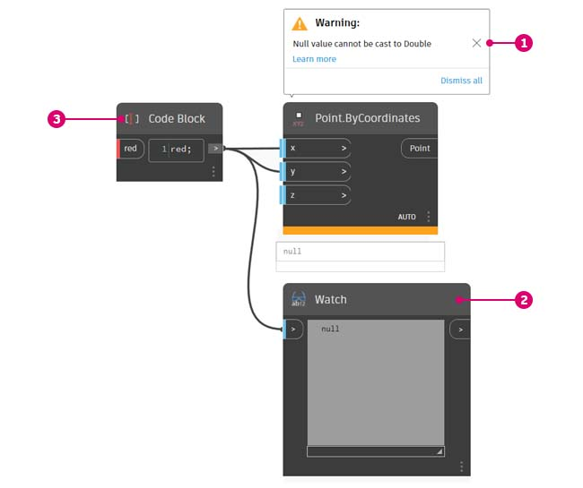
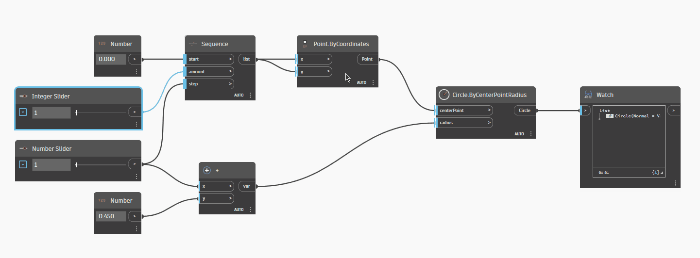
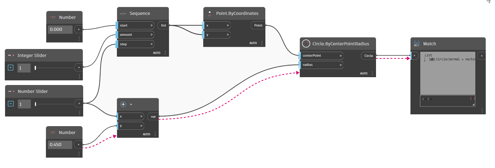
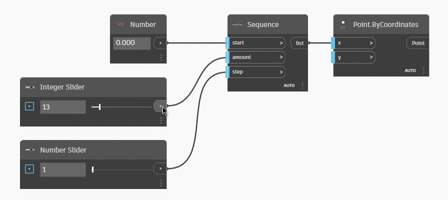

# Węzły i przewody

## Węzły

W dodatku Dynamo **węzły** są obiektami, które można połączyć w celu utworzenia programu wizualnego. Każdy **węzeł** wykonuje operację — czasami może ona być tak prosta, jak przechowywanie liczby, ale może być bardziej skomplikowana, na przykład tworzenie lub przywoływanie geometrii.

### Budowa węzła

Większość węzłów w dodatku Dynamo składa się z pięciu części. Istnieją wyjątki, takie jak węzły Input, ale budowę każdego węzła można opisać w następujący sposób:

> 1. Nazwa — nazwa węzła w konwencji nazewnictwa `Category.Name`
> 2. Część główna — treść główna węzła, kliknięcie której prawym przyciskiem myszy powoduje przedstawienie opcji na poziomie całego węzła
> 3. Porty (wejściowe i wyjściowe) — gniazda dla przewodów, które dostarczają dane wejściowe do węzła, jak również wyprowadzają wyniki działania węzła
> 4. Wartość domyślna — po kliknięciu prawym przyciskiem myszy portu wejściowego: niektóre węzły mają wartości domyślne, które mogą być używane lub nie.
> 5. Ikona skratowania — wskazuje [opcję skratowania](../5\_essential\_nodes\_and\_concepts/5-4\_designing-with-lists/1-whats-a-list.md#lacing) określoną dla wejść zgodnej listy (więcej informacji na ten temat przedstawiono w dalszej części)

### Porty wejść/wyjść węzłów

Wejścia i wyjścia węzłów są nazywane portami i działają jak gniazda dla przewodów. Dane są przekazywane do węzła przez porty po lewej stronie i wypływają z węzła po wykonaniu jego operacji po prawej stronie.

Porty oczekują, że otrzymają dane określonego typu. Na przykład podłączenie liczby, takiej jak _2,75_, do portów w węźle Point By Coordinates („punkt według współrzędnych”) spowoduje utworzenie punktu. Jednak jeśli do tego samego portu zostanie podłączony ciąg _„Czerwony”_, spowoduje to błąd.

 Wskazówka: umieść kursor na porcie, aby wyświetlić etykietę narzędzia zawierającą oczekiwany typ danych. 

> 1. Etykieta portu
> 2. Etykieta narzędzia
> 3. Typ danych
> 4. Wartość domyślna

### Stany węzłów

Dodatek Dynamo wskazuje stan wykonania programu wizualnego przez renderowanie węzłów w różnych schematach kolorów na podstawie stanów poszczególnych węzłów. Hierarchia stanów jest zgodna z następującą sekwencją: Błąd > Ostrzeżenie > Informacje > Podgląd.

Po ustawieniu wskaźnika myszy na nazwie lub portach albo kliknięciu ich prawym przyciskiem myszy wyświetlane są dodatkowe informacje i opcje.

> 1. Dostarczone dane wejściowe — węzeł z niebieskimi paskami pionowymi nad portami wejściowymi jest poprawnie połączony i wszystkie jego dane wejściowe są pomyślnie połączone.
> 2. Niedostarczone dane wejściowe — w przypadku węzła z czerwonym paskiem pionowym nad co najmniej jednym portem wejściowym należy połączyć wskazane dane wejściowe.
> 3. Funkcja — węzeł, który generuje funkcję i ma szary pasek pionowy nad portem wyjściowym, jest węzłem funkcji.
> 4. Wybrane — obecnie wybrane węzły mają błękitne wyróżnienie wokół obramowania.
> 5. Zablokowanie — półprzezroczysty węzeł niebieski jest zablokowany, co oznacza zawieszenie jego wykonywania
> 6. Podgląd wyłączony — szary pasek stanu pod węzłem oraz ikona oka  wskazują, że podgląd geometrii dla węzła jest wyłączony.
> 7. Ostrzeżenie — żółty pasek stanu pod węzłem wskazuje stan ostrzeżenia, co oznacza, że w węźle brakuje danych wejściowych lub typy danych są nieprawidłowe.
> 8. Błąd — czerwony pasek stanu poniżej węzła wskazuje, że węzeł jest w stanie błędu.
> 9. Informacja — niebieski pasek stanu pod węzłem wskazuje stan informacji; jest to oznaczenie przydatnych informacji o węzłach. Stan ten może być wyzwalany przy zbliżaniu się do maksymalnej wartości obsługiwanej przez węzeł, gdy węzeł jest używany w sposób, który może mieć wpływ na wydajność itp.

#### Obsługa węzłów z błędami lub ostrzeżeniami

Jeśli program wizualny zawiera ostrzeżenie lub błędy, dodatek Dynamo dostarczy dodatkowe informacje na temat problemu. Każdy żółty węzeł ma również etykietę narzędzia nad nazwą. Ustaw wskaźnik myszy na ikonie etykiety narzędzia ostrzeżenia  lub błędu , aby ją rozwinąć.

 Wskazówka: na podstawie informacji z etykiety narzędzia sprawdź we wcześniejszych węzłach, czy wymagane typy danych lub struktury danych nie są błędne. 

> 1. Etykieta narzędzia z ostrzeżeniem — wartość „null” lub nie można zinterpretować danych jako wartości typu Double, czyli liczby
> 2. Użyj węzła Watch, aby sprawdzić dane wejściowe
> 3. Wcześniejszy węzeł przechowuje wartość „Czerwony”, a nie liczbę

### Blokowanie węzłów

W niektórych sytuacjach może zaistnieć potrzeba zapobiegania wykonywaniu określonych węzłów w programie wizualnym. Można to zrobić przez „zablokowanie” węzła — odpowiednia opcja jest dostępna w menu kontekstowym węzła.

<figure><figcaption></figcaption></figure>

Zablokowanie węzła powoduje zablokowanie też węzłów znajdujących się po nim. Oznacza to, że wszystkie węzły zależne od wyniku zablokowanego węzła również zostaną zablokowane.

<figure><figcaption></figcaption></figure>

## Przewody

Przewody łączą węzły, aby utworzyć zależności i ustalić przepływ programu wizualnego. Możemy interpretować je jako przewody elektryczne, które przenoszą impulsy z jednego obiektu do następnego.

### Przepływ programu 

Przewód łączy port wyjściowy jednego węzła z portem wejściowym innego węzła. Ta kierunkowość określa **przepływ danych** w programie wizualnym.

Porty wejściowe znajdują się po lewej stronie węzłów, a porty wyjściowe — po ich prawej stronie, dlatego możemy ogólnie powiedzieć, że program przepływa od lewej strony do prawej.

### Tworzenie przewodów 

Utwórz przewód, klikając lewym przyciskiem myszy port, a następnie klikając lewym przyciskiem myszy port innego węzła, aby utworzyć połączenie. W trakcie tworzenia połączenia przewód będzie wyświetlany jako kreskowany, a po pomyślnym połączeniu zostanie przyciągnięty i stanie się linią ciągłą.

Dane zawsze będą przepływać przez ten przewód z wyjścia do wejścia. Można jednak utworzyć przewód w dowolnym kierunku, jeśli chodzi o sekwencję klikania połączonych portów.

### Edytowanie przewodów 

Często chcemy dostosować przepływ programu w programie wizualnym, edytując połączenia reprezentowane przez przewody. Aby edytować przewód, kliknij lewym przyciskiem myszy już połączony port wejściowy węzła. Dostępne są teraz dwie opcje:

* Zmień połączenie z portem wejściowym: kliknij lewym przyciskiem myszy inny port wejściowy

(1) (1) (1).gif>)

* Aby usunąć przewód, odciągnij przewód, a następnie kliknij lewym przyciskiem myszy obszar roboczy

* Połącz ponownie wiele przewodów, używając kombinacji Shift+lewy przycisk myszy

* Powiel przewód, używając kombinacji Ctrl+lewy przycisk myszy

#### Przewody domyślne a przewody wyróżnione 

Domyślnie podgląd wszystkich przewodów jest wyświetlany jako szare pociągnięcie. Po wybraniu węzła wszystkie łączące przewody są renderowane z tym samym wyróżnieniem w kolorze błękitnym co węzeł.

> 1. Wyróżniony przewód
> 2. Domyślny przewód

**Domyślne ukrywanie przewodów**

Jeśli wolisz ukryć przewody na wykresie, anuluj zaznaczenie opcji Widok > Złącza > Pokaż złącza.

To ustawienie sprawia, że będą wyświetlane tylko wybrane węzły i połączone z nimi przewody z delikatnym niebieskim wyróżnieniem.

.gif)

#### Ukrywanie tylko pojedynczego przewodu

Można również ukryć wybrany przewód, klikając prawym przyciskiem myszy wyjście węzła i wybierając opcję Ukryj przewody.

