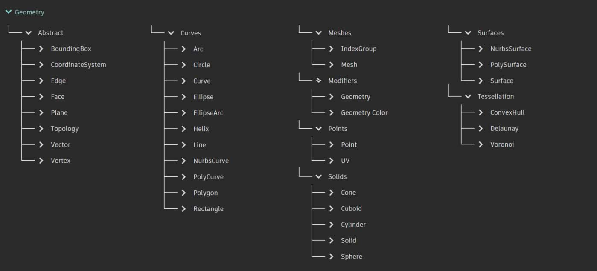
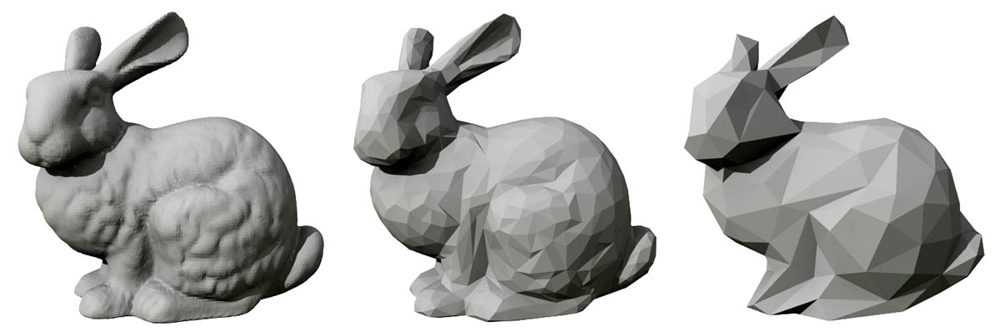
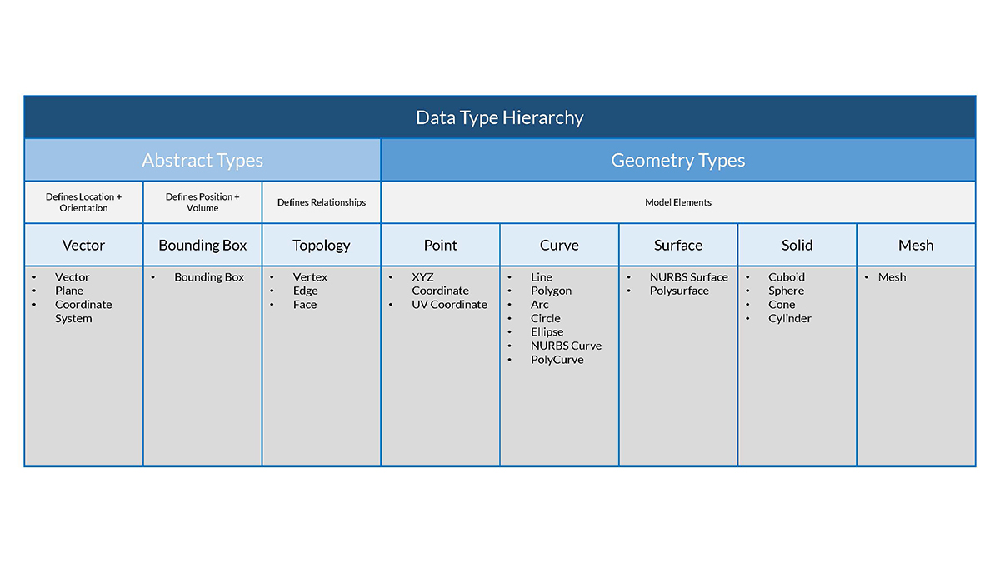

# Visão geral da geometria

## Geometria no Dynamo Sandbox

**Geometria** é a linguagem da área de design. Quando uma linguagem de programação ou ambiente tem um kernel de geometria em seu núcleo, podemos explorar as possibilidades de projetar modelos precisos e robustos, automatizando rotinas de projeto e gerando iterações de projeto com algoritmos.

A compreensão dos tipos de geometria e [como eles estão relacionados](1-geometry-overview.md#stepping-through-the-hierarchy) permitirá navegar no conjunto de **Nós de geometria** disponíveis na biblioteca. Os nós de geometria são organizados em ordem alfabética, ao contrário da hierarquia; aqui eles são exibidos de forma similar ao layout na interface do Dynamo.

Além disso, a criação de modelos no Dynamo e conexão da visualização de plano fundo ao fluxo de dados em nosso gráfico são processos que devem se tornar mais intuitivos com o passar do tempo.

> 1. Observe o sistema de coordenadas assumido renderizado pela grade e pelos eixos coloridos
> 2. Os nós selecionados irão renderizar a geometria correspondente (se o nó criar geometria) no plano de fundo, a cor de realce

> Faça o download do arquivo de exemplo clicando no link abaixo.
>
> É possível encontrar uma lista completa de arquivos de exemplo no Apêndice.



## Conceito de geometria

A geometria, tradicionalmente definida, é o estudo de forma, tamanho, posição relativa das imagens e as propriedades de espaço. Este campo tem uma história rica que remonta a milhares de anos. Com o advento e a popularização do computador, ganhamos uma poderosa ferramenta na definição, na exploração e na geração de geometria. Agora é muito fácil calcular o resultado de interações geométricas complexas, o fato de que estamos fazendo isso é quase transparente.

> Se você tem curiosidade em descobrir como a geometria pode ser diversa e complexa com o poder do computador, faça uma pesquisa rápida pelo Stanford Bunny, um modelo tradicional usado para testar algoritmos.

Compreender a geometria no contexto de algoritmos, computação e complexidade pode parecer desafiador. No entanto, há alguns princípios-chave e relativamente simples que podemos estabelecer como fundamentos para começar a construção em aplicativos mais avançados:

1. A geometria corresponde a **dados**: para o computador e o Dynamo, um modelo Bunny não é tão diferente de um número.
2. A geometria depende da **abstração**: fundamentalmente, os elementos geométricos são descritos por números, relações e fórmulas em um determinado sistema de coordenadas espaciais.
3. A geometria possui uma **hierarquia**: os pontos são reunidos para criar linhas, as linhas se unem para criar superfícies, e assim por diante.
4. A geometria descreve simultaneamente **a parte e o todo**: quando uma curva é exibida, ela tem a forma e todos os pontos possíveis ao longo dela.

Na prática, esses princípios significam que precisamos estar cientes do material com o qual estamos trabalhando (com que tipo de geometria, como ela foi criada, etc.) para que possamos compor, decompor e recompor de forma fluida diferentes geometrias à medida que desenvolvemos modelos mais complexos.

## Etapas a seguir na hierarquia

Vamos separar um momento para analisar a relação entre as descrições de geometria abstrata e hierárquica. Como esses dois conceitos estão relacionados, mas nem sempre são óbvios no início, podemos chegar rapidamente a um bloco de estradas conceitual quando começamos a desenvolver fluxos de trabalho ou modelos mais profundos. Para começar, vamos usar a cotagem como um descritor fácil do "material" que modelamos. O número de cotas necessárias para descrever uma forma nos dá uma ideia sobre como a geometria é organizada hierarquicamente.

> 1. Um **Ponto** (definido por coordenadas) não possui dimensões, apenas números que descrevem cada coordenada
> 2. Uma **Linha** (definida por dois pontos) agora tem _uma_ cota: é possível “navegar” na linha para frente (direção positiva) ou para trás (direção negativa)
> 3. Um **Plano** (definido por duas linhas) tem _duas_ dimensões: agora é possível andar mais para a esquerda ou mais para a direita
> 4. Uma **Caixa** (definida por dois planos) tem _três_ dimensões: podemos definir uma posição com relação para cima ou para baixo

A cotagem é uma forma conveniente de começar a classificar a geometria, mas não é necessariamente a melhor. Afinal, não modelamos apenas com pontos, linhas, planos e caixas; e se eu quiser algum modelo curvado? Além disso, há toda uma outra categoria de tipos de geometria que é completamente abstrata, ou seja, define propriedades como orientação, volume ou relações entre as peças. Não podemos considerar um vetor, e então como o definimos em relação ao que vemos no espaço? Uma categorização mais detalhada da hierarquia geométrica deve acomodar a diferença entre Tipos abstratos ou “Auxiliares”, cada um dos quais podemos agrupar pelo que eles ajudam a fazer e os tipos que ajudam a descrever a forma dos elementos do modelo.

## Aprofundar a geometria

A criação de modelos no Dynamo não se limita ao que podemos gerar com Nós. Aqui estão algumas maneiras importantes de levar o processo para o próximo nível com a Geometria:

1. O Dynamo permite importar arquivos: tente usar um CSV para nuvens de pontos ou SAT para trazer superfícies
2. Quando trabalhamos com o Revit, podemos referenciar os elementos do Revit para usar no Dynamo
3. O Dynamo Package Manager oferece funcionalidade adicional para tipos e operações estendidos de geometria: verifique o pacote [Kit de ferramentas de malha](https://github.com/DynamoDS/Dynamo/wiki/Dynamo-Mesh-Toolkit)
