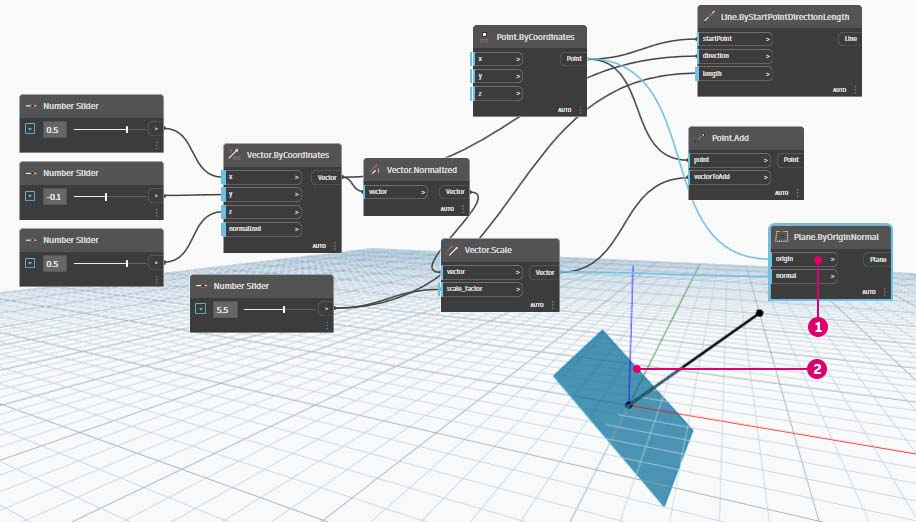
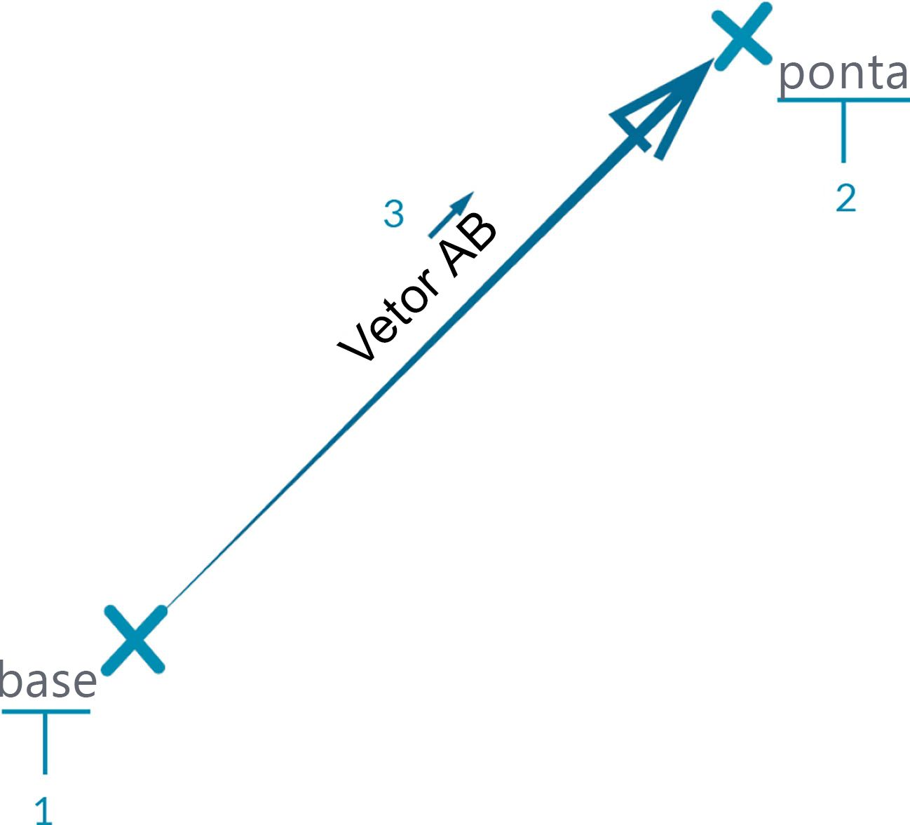

# Vetor, plano e sistema de coordenadas

## Vetor, plano e sistema de coordenadas no Dynamo

### Vetor

[Vetor ](2-vectors.md#vector-1)é uma representação de magnitude e direção. É possível visualizá-lo como uma seta que acelera em uma determinada direção em uma velocidade especificada. É um componente-chave para os nossos modelos no Dynamo. Observe que, como eles estão na categoria Abstrata de “Auxiliares”, quando criamos um vetor, não veremos nada na Visualização do plano de fundo.

> 1. Podemos usar uma linha como suporte para uma visualização de Vetor.

> Faça o download do arquivo de exemplo clicando no link abaixo.
>
> É possível encontrar uma lista completa de arquivos de exemplo no Apêndice.



### Plano

[Plano ](2-vectors.md#plane-1)é uma superfície bidimensional. É possível imaginá-lo como uma superfície plana que se estende indefinidamente. Cada plano tem uma Origem, Direção X, Direção Y e uma Direção Z (para cima).

> 1. Embora sejam abstratos, os planos têm uma posição de origem para que possam ser localizados no espaço.
> 2. No Dynamo, os planos são renderizados na Visualização de plano de fundo.

> Faça o download do arquivo de exemplo clicando no link abaixo.
>
> É possível encontrar uma lista completa de arquivos de exemplo no Apêndice.



### Sistema de coordenadas

[Sistema de coordenadas](2-vectors.md#coordinate-system-1) é um sistema para determinar a localização de pontos ou outros elementos geométricos. A imagem abaixo explica como o sistema de coordenadas é exibido no Dynamo e o que cada cor representa.

> 1. Embora sejam abstratos, os sistemas de coordenadas também têm uma posição de origem para que possamos localizá-los no espaço.
> 2. No Dynamo, os sistemas de coordenadas são renderizados na visualização do plano de fundo como um ponto (origem) e linhas que definem os eixos (X é vermelho, Y é verde e Z é azul, seguindo a convenção).

> Faça o download do arquivo de exemplo clicando no link abaixo.
>
> É possível encontrar uma lista completa de arquivos de exemplo no Apêndice.



## Análise abrangente de...

Vetores, Planos e Sistemas de coordenadas constituem o grupo principal de Tipos de geometria abstratos. Eles nos ajudam a definir a localização, a orientação e o contexto espacial para outra geometria que descreva as formas. Se eu disser que estou em Nova Iorque, na rua 42nd e Broadway (Sistema de Coordenadas), de pé no nível da rua (Plano), olhando para o norte (Vetor), acabei de usar essas "Ajudas" para definir onde estou. O mesmo vale para um produto de caso de telefone ou um arranha-céu. Precisamos desse contexto para desenvolver nosso modelo.

### Vetor

Um vetor é uma quantidade geométrica que descreve a direção e a magnitude. Os vetores são abstratos; isto é, eles representam uma quantidade, e não um elemento geométrico. Os vetores podem ser facilmente confundidos com pontos porque ambos são compostos por uma lista de valores. No entanto, há uma diferença fundamental: os pontos descrevem uma posição em um determinado sistema de coordenadas, enquanto os vetores descrevem uma diferença relativa na posição, o que é o mesmo que dizer “direção”.

Se a ideia de diferença relativa for confusa, pense no vetor AB como “Estou de pé no ponto A, olhando em direção ao ponto B”. A direção, daqui (A) até lá (B), é o nosso vetor.

Dividindo os vetores em suas partes, usando a mesma notação AB:

> 1. O **Ponto inicial** do vetor é chamado **Base**.
> 2. O *Ponto final **do vetor é chamado **Ponta** ou **Sentido**.
> 3. O vetor AB não é o mesmo que o vetor BA, que apontaria na direção oposta.

Se você precisar de uma anedota no que diz respeito aos vetores (e sua definição abstrata), veja a comédia clássica Airplane e ouça o diálogo engraçado:

> _Roger, Roger. Qual é o nosso vetor, Victor?_

### Plano

Os planos são "Ajudas" abstratas bidimensionais. Mais especificamente, os planos são conceitualmente "planos", estendendo-se infinitamente em duas direções. Normalmente, eles são renderizados como um retângulo menor perto de sua origem.

Você pode estar pensando: “Espere um segundo. Origem? Isso parece um sistema de coordenadas... como o que eu uso para modelar no meu software CAD!"

E você está correto! A maioria dos softwares de modelagem aproveita os planos de construção ou “níveis” para definir um contexto de duas dimensões locais na qual a inclinação será desenhada. XY, XZ, YZ ou Norte, Sudeste, Plano pode parecer mais familiar. Todos esses são os Planos, definindo um contexto "plano" infinito. Os planos não têm profundidade, mas eles nos ajudam a descrever a direção também -

### Sistema de coordenadas

Se estivermos confortáveis com o conceito de planos, estamos a um pequeno passo de entender os sistemas de coordenadas. Um plano tem todas as mesmas peças que um sistema de coordenadas, desde que seja um sistema de coordenadas padrão "Euclidean" ou "XYZ".

No entanto, há outros sistemas de coordenadas alternativos como Cilíndricos ou Esféricos. Como veremos em seções posteriores, os sistemas de coordenadas também podem ser aplicados a outros tipos de geometria para definir uma posição naquela geometria.

> Adicionar sistemas de coordenadas alternativos: cilíndricos, esféricos
