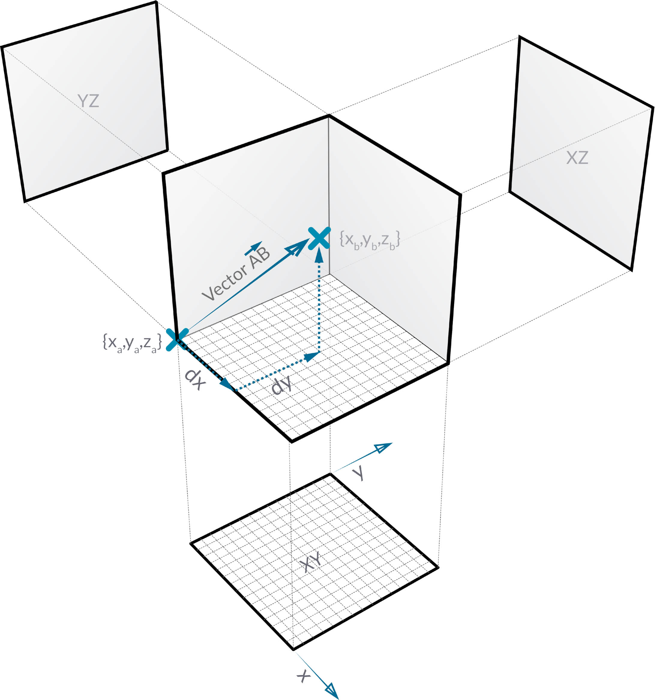

# Vektor, Ebene und Koordinatensystem

## Vektor, Ebene und Koordinatensystem in Dynamo

### Vector

Ein [Vektor](5-2\_vectors.md#vector-1) ist eine Darstellung der Größe und Richtung. Sie können sich diesen als einen Pfeil vorstellen, der mit einer bestimmten Geschwindigkeit in eine bestimmte Richtung beschleunigt. Vektoren stellen eine wichtige Komponente für Modelle in Dynamo dar. Beachten Sie, dass Sie zur abstrakten Kategorie der "Helfer" gehören. Wenn Sie also einen Vektor erstellen, wird nichts in der Hintergrundvorschau angezeigt.

> 1. Sie können eine Linie zur Darstellung einer Vektorvorschau verwenden.

> Laden Sie die Beispieldatei herunter, indem Sie auf den folgenden Link klicken.
>
> Eine vollständige Liste der Beispieldateien finden Sie im Anhang.



### Ebene

Eine [Ebene](5-2\_vectors.md#plane-1) ist eine zweidimensionale Fläche. Sie können sich diese als eine flache Oberfläche vorstellen, die sich unendlich ausdehnt. Jede Ebene verfügt über einen Ursprung, eine X-Richtung, eine Y-Richtung und eine Z-Richtung (nach oben).

> 1. Ebenen sind zwar abstrakt, verfügen aber über eine Ursprungsposition, damit sie im Raum lokalisiert werden können.
> 2. In Dynamo werden Ebenen in der Hintergrundvorschau gerendert.

> Laden Sie die Beispieldatei herunter, indem Sie auf den folgenden Link klicken.
>
> Eine vollständige Liste der Beispieldateien finden Sie im Anhang.



### Koordinatensystem

Ein [Koordinatensystem](5-2\_vectors.md#coordinate-system-1) ist ein System zur Bestimmung der Position von Punkten oder anderen geometrischen Elementen. In der folgenden Abbildung wird erläutert, wie die Darstellung in Dynamo aussieht und welche Bedeutung die einzelnen Farben haben.

> 1. Koordinatensysteme sind zwar abstrakt, verfügen aber über eine Ursprungsposition, damit sie im Raum lokalisiert werden können.
> 2. In Dynamo werden Koordinatensysteme in der Hintergrundvorschau als Punkt (Ursprung) und Linien gerendert, die die Achsen definieren (gemäß folgender Konvention: X ist rot, Y ist grün und Z ist blau).

> Laden Sie die Beispieldatei herunter, indem Sie auf den folgenden Link klicken.
>
> Eine vollständige Liste der Beispieldateien finden Sie im Anhang.



## Vertiefung...

Vektoren, Ebenen und Koordinatensysteme bilden die primäre Gruppe der abstrakten Geometrietypen. Sie helfen uns dabei, die Position und Ausrichtung sowie den räumlichen Kontext für andere Geometrien zu definieren, die Formen beschreiben. Wenn Sie sagen, dass Sie sich in New York City an der Kreuzung zwischen der 42nd Street und dem Broadway (Koordinatensystem) auf Straßenniveau (Ebene) befinden und nach Norden (Vektor) blicken, habe Sie gerade diese "Helfer" verwendet, um zu definieren, wo Sie stehen. Dasselbe gilt für das Gehäuse eines Telefons oder einen Wolkenkratzer – Sie benötigen diesen Kontext für die Entwicklung eines Modells.

### Vector

Ein Vektor ist eine geometrische Größe, die die Richtung und den Betrag beschreibt. Vektoren sind abstrakt, d. h., dass Sie eine Größe darstellen, kein geometrisches Element. Vektoren können leicht mit Punkten verwechselt werden, da beide aus Wertelisten bestehen. Es gibt jedoch einen wesentlichen Unterschied: Punkte beschreiben eine Position in einem bestimmten Koordinatensystem, während Vektoren einen relativen Positionsunterschied beschreiben, also die "Richtung".

Wenn Ihnen die Idee des relativen Unterschieds verwirrend erscheint, stellen Sie sich einen Vektor AB folgendermaßen vor: Sie stehen an Punkt A und sehen zu Punkt B. Die Richtung von A zu B entspricht Ihrem Vektor.

Aufgliedern von Vektoren in Ihre Bestandteile mit derselben AB-Notation:

> 1. Der **Startpunkt** von Vektoren wird als **Basis** bezeichnet.
> 2. Der Endpunkt von \*\*Vektoren \*\*wird als **Spitze** oder **Ausrichtung** bezeichnet.
> 3. Vektor AB entspricht nicht Vektor BA, der in die entgegengesetzte Richtung weist.

Wenn Sie in Bezug auf Vektoren (und ihrer abstrakten Definition) jemals einer komischen Entlastung bedürfen, sehen Sie sich die klassische Komödie "Die unglaubliche Reise in einem verrückten Flugzeug" an und hören auf die häufig zitierte, humorvolle Aussage:

> _Roger, Roger. Was ist unser Vektor, Viktor?_

### Ebene

Ebenen sind zweidimensionale abstrakte "Helfer". Genauer gesagt sind Ebenen konzeptuell gesehen "flach" und erstrecken sich unendlich in zwei Richtungen. In der Regel werden sie als ein kleineres Rechteck in der Nähe ihres Ursprungs gerendert.

Sie denken möglicherweise: "Stopp! Ursprung? Das klingt nach einem Koordinatensystem, das ich auch zum Modellieren in meiner CAD-Software verwende!"

Und Sie haben recht! In Modellierungssoftware werden häufig Konstruktionsebenen verwendet, um einen lokalen, zweidimensionalen Kontext zu definieren, in dem Entwürfe erstellt werden können. XY-, XZ-, YZ- bzw. Nord- oder Südostebene klingen möglicherweise vertrauter. Dies sind alles Ebenen, die einen unendlichen "flachen" Kontext definieren. Ebenen haben keine Tiefe, aber sie helfen uns auch, die Richtung zu beschreiben.

### Koordinatensystem

Sobald Sie mit Ebenen vertraut sind, ist es nur noch ein kleiner Schritt hin zu Koordinatensystemen. Eine Ebene weist dieselben Bestandteile wie ein Koordinatensystem auf, solange es sich um ein "euklidisches" oder "XYZ"-Koordinatensystem handelt.

Darüber hinaus gibt es jedoch auch alternative Koordinatensysteme wie Zylinder- oder Kugelkoordinatensysteme. Wie Sie in späteren Abschnitten sehen werden, können Koordinatensysteme auch auf andere Geometrietypen angewendet werden, um eine Position in der Geometrie zu definieren.

> Hinzufügen alternativer Koordinatensysteme – Zylinder- oder Kugelkoordinatensystem
