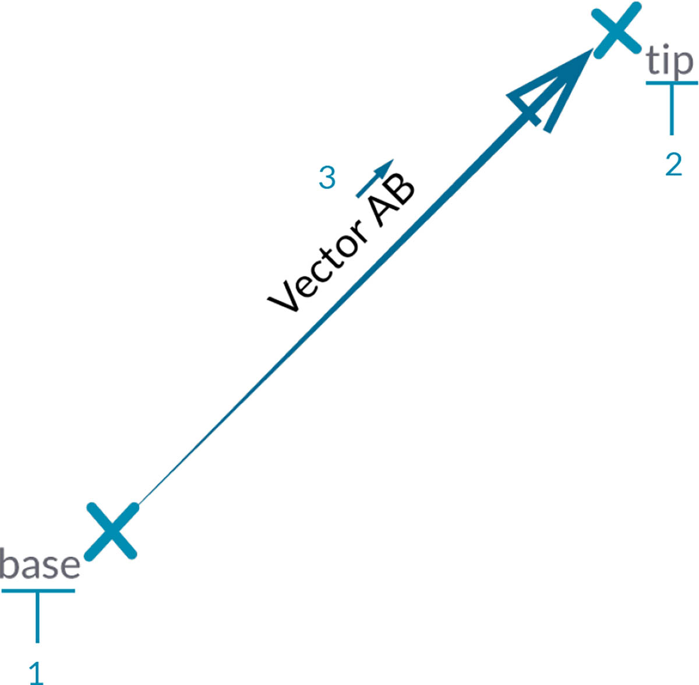

# Vettore, piano e sistema di coordinate

## Vettore, piano e sistema di coordinate in Dynamo

### Vettore

Il [vettore](5-2\_vectors.md#vector-1) è una rappresentazione dell'intensità e della direzione, che è possibile visualizzare come una freccia che accelera verso una specifica direzione ad una determinata velocità. È un componente chiave per i modelli in Dynamo. Notare che, poiché si trovano nella categoria astratta di "helper", quando si crea un vettore, non verrà visualizzato alcun elemento nell'anteprima sfondo.

> 1. È possibile utilizzare una linea come supporto in un'anteprima vettoriale.

> Scaricare il file di esempio facendo clic sul collegamento seguente.
>
> Un elenco completo di file di esempio è disponibile nell'Appendice.



### Piano

Il [piano ](5-2\_vectors.md#plane-1)è una superficie bidimensionale, che può essere visualizzata come superficie piana che si estende all'infinito. Ciascun piano ha un'origine, una direzione X, una direzione Y e una direzione Z (su).

> 1. Sebbene siano astratti, i piani hanno una posizione di origine in modo da poterli posizionare nello spazio.
> 2. In Dynamo, il rendering dei piani viene eseguito nell'anteprima sfondo.

> Scaricare il file di esempio facendo clic sul collegamento seguente.
>
> Un elenco completo di file di esempio è disponibile nell'Appendice.



### Sistema di Coordinate

Il [sistema di coordinate](5-2\_vectors.md#coordinate-system-1) è un sistema che consente di determinare la posizione di punti o altri elementi geometrici. Nell'immagine seguente è illustrato l'aspetto che ha in Dynamo e ciò che ogni colore rappresenta.

> 1. Sebbene siano astratti, anche i sistemi di coordinate hanno una posizione di origine in modo da poterli individuare nello spazio.
> 2. In Dynamo, i sistemi di coordinate vengono sottoposti a rendering nell'anteprima sfondo come punto (origine) e linee che definiscono gli assi (X è rosso, Y è verde e Z è blu in base alla seguente convenzione).

> Scaricare il file di esempio facendo clic sul collegamento seguente.
>
> Un elenco completo di file di esempio è disponibile nell'Appendice.



## Approfondimento su...

Vettori, piani e sistemi di coordinate costituiscono il gruppo principale dei tipi di geometria astratta. Aiutano a definire la posizione, l'orientamento e il contesto spaziale della geometria di cui è necessario determinare la forma. Se dico che sono a New York, tra la 42° strada e Broadway (sistema di coordinate), a livello strada (piano), guardando verso nord (vettore), ho utilizzato questi "helper" per definire dove sono. Lo stesso vale per una custodia per il cellulare o un grattacielo. Per sviluppare il modello, è necessario questo contesto.

### Vettore

Un vettore è una quantità geometrica che descrive la direzione e l'intensità. I vettori sono astratti, ossia rappresentano una quantità, non un elemento geometrico. I vettori possono essere facilmente confusi con i punti perché sono entrambi composti da un elenco di valori. Tuttavia, esiste una differenza fondamentale: i punti descrivono una posizione in un determinato sistema di coordinate, mentre i vettori descrivono una differenza relativa nella posizione, che è identica a quella indicata come "direzione".

Se l'idea della differenza relativa è confusa, pensare al vettore AB come "Sono in piedi nel punto A, guardando verso il punto B." La direzione, da qui (A) a qui (B), è il vettore.

Suddividere ulteriormente i vettori nelle loro parti utilizzando la stessa notazione AB:

> 1. Il **punto iniziale** del vettore è denominato **base**.
> 2. Il \*\*punto finale \*\*del vettore è denominato **punta** o **senso**.
> 3. Il vettore AB non è uguale al vettore BA, il quale punta nella direzione opposta.

Per una visione in chiave comica dei vettori (e della loro definizione astratta), guardare la commedia classica L'aereo più pazzo del mondo e ascoltare la frase ironica, citata spesso:

> _Roger, Roger. Qual è il nostro vettore, Victor?_

### Piano

I piani sono "helper" astratti bidimensionali. Più in particolare, i piani sono concettualmente "piatti" e si estendono all'infinito in due direzioni. In genere, viene eseguito il rendering di un rettangolo più piccolo vicino all'origine.

Si potrebbe pensare: "Aspetta! Origine? Sembra un sistema di coordinate... come quello che utilizzo per modellare nel mio software CAD!"

Ed è corretto. La maggior parte del software di modellazione sfrutta i piani di costruzione o i "livelli" per definire un contesto bidimensionale locale in cui disegnare. Il piano XY, XZ, YZ (o nord, sudest) potrebbe sembrare più familiare. Sono tutti piani, che definiscono un contesto "piatto" infinito. I piani non hanno profondità, ma ci aiutano a descrivere anche la direzione.

### Sistema di Coordinate

Se si sono ben compresi i piani, non è difficile capire i sistemi di coordinate. Un piano ha tutte le stesse parti di un sistema di coordinate, a condizione che si tratti di un sistema di coordinate "euclideo" o "XYZ" standard.

Sono presenti, tuttavia, altri sistemi di coordinate alternativi, ad esempio cilindrici o sferici. Come si vedrà nelle sezioni successive, anche i sistemi di coordinate possono essere applicati ad altri tipi di geometria per definire una posizione su tale geometria.

> Aggiunta di sistemi di coordinate alternativi - cilindrici, sferici
