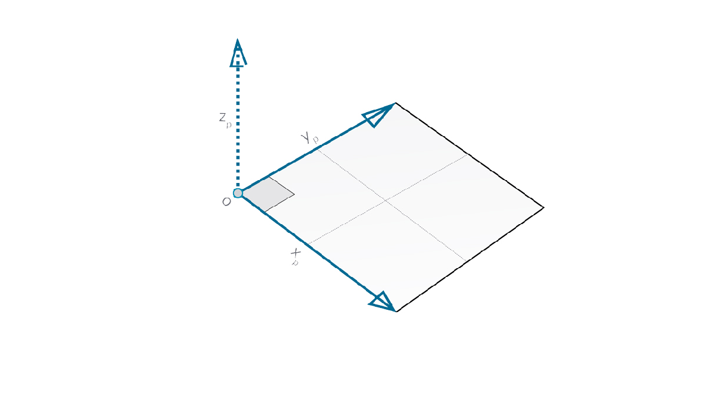

# Вектор, плоскость и система координат

## Вектор, плоскость и система координат в Dynamo

### Работа с векторами

[Вектор](5-2\_vectors.md#vector-1) — это представление величины и направления. Его можно изобразить в виде стрелки, которая движется в определенном направлении на заданной скорости. Векторы являются ключевым компонентом при разработке моделей в Dynamo. Обратите внимание, что поскольку они относятся к категории вспомогательных средств, то при создании векторы не отображаются в области фонового просмотра.

> 1. В качестве замены вектору в области предварительного просмотра можно использовать отрезок.

> Скачайте файл примера, щелкнув указанную ниже ссылку.
>
> Полный список файлов примеров можно найти в приложении.



### Плоскость

[Плоскость](5-2\_vectors.md#plane-1) — это двухмерная поверхность, которую можно представить в виде бесконечной плоской поверхности. Каждая плоскость имеет исходную точку и направления по осям X, Y и Z (вверх).

> 1. Хотя плоскости являются абстрактными, они имеют исходную точку, что позволяет определить их положение в пространстве.
> 2. В Dynamo плоскости визуализируются в области фонового просмотра.

> Скачайте файл примера, щелкнув указанную ниже ссылку.
>
> Полный список файлов примеров можно найти в приложении.



### Система координат

[Система координат](5-2\_vectors.md#coordinate-system-1) — это система для определения местоположения точек или других геометрических элементов. На изображении ниже показано, как это выглядит в Dynamo, и что представляет каждый цвет.

> 1. Хотя системы координат являются абстрактными, они имеют исходную точку, что позволяет определить их положение в пространстве.
> 2. В Dynamo системы координат визуализируются в области фонового просмотра в виде точки (начало координат) и линий, определяющих оси (согласно принятым нормам, ось X обозначается красным цветом, Y — зеленым, а Z — синим).

> Скачайте файл примера, щелкнув указанную ниже ссылку.
>
> Полный список файлов примеров можно найти в приложении.



## Углубленное изучение

Векторы, плоскости и системы координат составляют основную группу абстрактных типов геометрии. Они помогают задавать расположение, ориентацию и пространственный контекст для других геометрических объектов, определяющих формы. Представим себе человека, который находится в Нью-Йорке на пересечении 42-й улицы и Бродвея (система координат), стоит на тротуаре (плоскость) и смотрит на север (вектор). Мы только что описали местонахождение человека с помощью вспомогательных абстрактных средств. Таким же образом можно задать местонахождение любого объекта, от чехла телефона до небоскреба. Это контекст, необходимый для разработки любой модели.

### Работа с векторами

Вектор — это геометрическая величина, описывающая направление и величину. Векторы являются абстрактными, т. е. они представляют собой некоторую величину, а не геометрический элемент. Векторы легко спутать с точками, поскольку они также состоят из списка значений. Однако существует одно важное отличие: точки описывают положение в заданной системе координат, а векторы описывают относительную разницу в положении, что аналогично понятию направления.

Если идея относительной разницы не вполне ясна, представьте, что вектор AB означает следующее: вы стоите в точке A и смотрите в точку B. Направление от одной точки (A) до другой (B) и будет вектором.

Рассмотрим подробнее структуру векторов на примере вектора AB.

> 1. **Начальная точка** вектора называется его **началом**.
> 2. **Конечная точка** вектора называется его **концом** или **направлением**.
> 3. Вектор AB и вектор BA — это два разных вектора, поскольку они указывают в противоположных направлениях.

Чтобы отдохнуть от слишком формальных и абстрактных определений вектора и посмеяться, посмотрите классическую комедию «Аэроплан!» (Airplane!), где есть следующая знаменитая цитата:

> _Roger, Roger. What's our vector, Victor? (Роджер, Роджер. Каков наш вектор, Виктор?)_

### Плоскость

Плоскости являются двумерной абстрактной вспомогательной геометрией. Плоскости по определению являются «плоскими» и бесконечно расширяются в двух направлениях. Обычно они визуализируются в виде небольшого прямоугольника в начале координат.

Но постойте, скажете вы. Начало координат? Как в системе координат, которая используется для моделирования в САПР?

Совершенно верно. В большинстве программ моделирования используются плоскости построения, или «уровни», с помощью которых определяется локальный двумерный контекст для создания черновиков чертежей. XY, XZ, YZ или, возможно, более знакомые вам «север», «юго-восток», «план» — все это плоскости, определяющие бесконечный «плоский» контекст. Плоскости не имеют глубины, но они помогают описать направление.

### Система координат

Если мы с вами освоили плоскости, то разобраться с системами координат нам не составит труда. Плоскость состоит из тех же компонентов, что и система координат, при условии что это стандартная евклидова система координат или система координат XYZ.

Однако имеются и другие альтернативные системы координат, например цилиндрические или сферические. Как будет показано в следующих разделах, системы координат можно также применять к другим типам геометрии для указания положения в пределах этой геометрии.

> Можно добавить альтернативные системы координат — цилиндрические и сферические.
