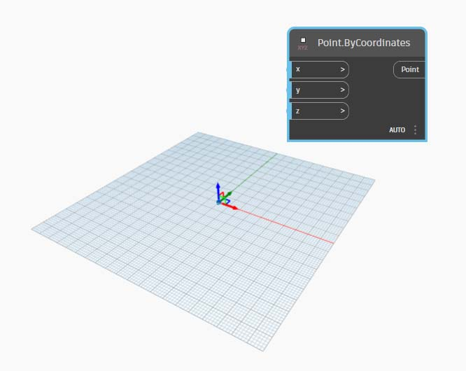
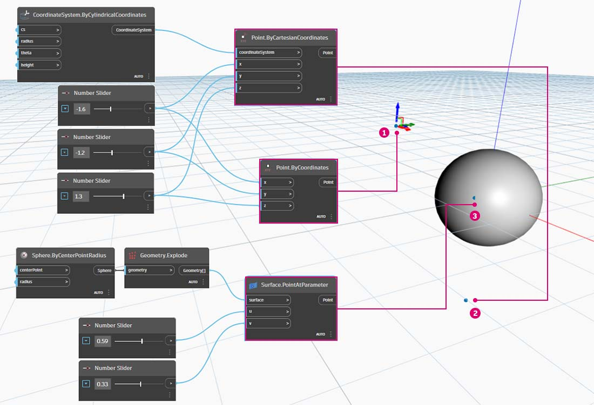

# Точки

## Точки в Dynamo

### Что такое точка?

[Точка](5-3\_points.md#point-as-coordinates) определяется одним или несколькими значениями, которые называются координатами. Количество значений координат, необходимых для определения точки, зависит от системы координат или контекста, в котором она находится.

### 2D- и 3D-точка

Самый распространенный тип точки в Dynamo существует в трехмерной мировой системе координат и имеет три координаты: [X,Y,Z] (3D-точка в Dynamo).

2D-точка в Dynamo имеет две координаты — [X,Y].

### Точка на кривых и поверхностях

Параметры кривых и поверхностей являются непрерывными и выходят за пределы заданной геометрии. Поскольку формы, определяющие параметрическое пространство, находятся в трехмерной мировой системе координат, параметрическую координату можно всегда легко преобразовать в «мировую». Например, точка [0.2, 0.5] на поверхности соответствует точке [1.8, 2.0, 4.1] в системе мировых координат.

> 1. Точка в предполагаемой системе мировых координат XYZ.
> 2. Точка, представленная относительно заданной системы координат (цилиндрической).
> 3. Точка, представленная координатами UV на поверхности.

> Скачайте файл примера, щелкнув указанную ниже ссылку.
>
> Полный список файлов примеров можно найти в приложении.



## Углубленное изучение

Если геометрия — это язык модели, то точки — ее алфавит. Точки являются основой для создания всех прочих объектов геометрии. Для создания кривой требуется не менее двух точек, для создания полигона или грани сети — не менее трех и т. д. Определение положения, порядка и связей между точками (например, с помощью функции синуса) позволяет работать с геометрией более высокого порядка, в том числе с такими элементами, как окружности или кривые.

> 1. Окружность, построенная с помощью функций `x=r*cos(t)` и `y=r*sin(t)`.
> 2. Синусоидальная кривая, построенная с помощью функций `x=(t)` и `y=r*sin(t)`.

### Точка в системе координат

Точки также могут существовать в двумерной системе координат. В зависимости от типа рабочего пространства, могут использоваться различные буквенные обозначения — [X,Y] на плоскости или [U,V] на поверхности.

> 1. Точка в евклидовой системе координат: [X,Y,Z]
> 2. Точка в системе координат параметров кривой: [t]
> 3. Точка в системе координат параметров поверхности: [U,V]
