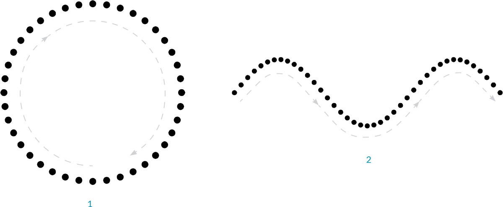
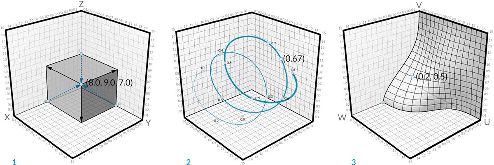

# Punti

## Punti in Dynamo

### Che cos'è un punto?

Un [punto](3-points.md#deep-dive-into...) è definito da niente di più che uno o più valori denominati coordinate. Il numero di valori delle coordinate necessari per definire il punto dipende dal sistema di coordinate o dal contesto in cui si trova.

### Punto 2D e 3D

Il tipo di punto più comune in Dynamo è presente nel sistema di coordinate globali tridimensionale e dispone di tre coordinate [X,Y,Z] (punto 3D in Dynamo).

\

Un punto 2D in Dynamo ha due coordinate [X,Y].

\

### Punto su curve e superfici

I parametri per le curve e le superfici sono continui e si estendono oltre il bordo della geometria specificata. Poiché le forme che definiscono lo spazio del parametro risiedono in un sistema di coordinate globali tridimensionale, è sempre possibile convertire una coordinata parametrica in una coordinata "globale". Il punto [0.2, 0.5] sulla superficie, ad esempio, è uguale al punto [1.8, 2.0, 4.1] nelle coordinate globali.

\

> 1. Punto nelle coordinate XYZ globali supposte
> 2. Punto rispetto ad un determinato sistema di coordinate (cilindrico)
> 3. Punto come coordinata UV su una superficie

> Scaricare il file di esempio facendo clic sul collegamento seguente.
>
> Un elenco completo di file di esempio è disponibile nell'Appendice.



## Approfondimento su...

Se la geometria è il linguaggio di un modello, i punti sono l'alfabeto. I punti sono la base su cui vengono create tutte le altre geometrie: sono necessari almeno due punti per creare una curva, almeno tre punti per creare un poligono o una faccia della mesh e così via. La definizione della posizione, dell'ordine e della relazione tra i punti (provare una funzione seno) consente di definire una geometria di ordine più alto, ad esempio oggetti riconosciuti come cerchi o curve.

> 1. Un cerchio che utilizza le funzioni `x=r*cos(t)` e `y=r*sin(t)`
> 2. Una curva seno che utilizza le funzioni `x=(t)` e `y=r*sin(t)`

### Punto come coordinate

I punti possono esistere anche in un sistema di coordinate bidimensionale. La convenzione ha una notazione di lettere diversa a seconda del tipo di spazio impiegato. È possibile che si stia utilizzando [X,Y] su un piano o [U,V] se si è su una superficie.

> 1. Un punto nel sistema di coordinate euclideo: [X,Y,Z]
> 2. Un punto in un sistema di coordinate di parametri delle curve: [t]
> 3. Un punto in un sistema di coordinate di parametri delle superfici: [U,V]
