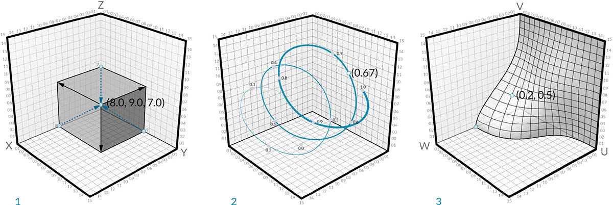

# Punkty

## Punkty w dodatku Dynamo

### Co to jest punkt?

[Punkt](3-points.md#deep-dive-into...) jest zdefiniowany przez tylko jedną wartość lub tylko kilka wartości nazywanych współrzędnymi. Liczba wartości współrzędnych potrzebnych do zdefiniowania punktu zależy od układu współrzędnych lub kontekstu, w którym się on znajduje.

### Punkt 2D/3D

Najczęściej używany typ punktu w dodatku Dynamo istnieje w trójwymiarowym globalnym układzie współrzędnych i ma trzy współrzędne [X,Y,Z] (w dodatku Dynamo jest to punkt 3D).

Punkt 2D w dodatku Dynamo ma dwie współrzędne [X,Y].

### Punkt na krzywych i powierzchniach

Parametry dla krzywych i powierzchni są ciągłe i rozciągają się poza krawędź danej geometrii. Ponieważ kształty definiujące przestrzeń parametryczną znajdują się w trójwymiarowym globalnym układzie współrzędnych, zawsze można przekształcić współrzędną parametryczną we współrzędną „globalną”. Na przykład punkt [0,2, 0,5] na powierzchni jest taki sam jak punkt [1,8, 2,0, 4,1] we współrzędnych globalnych.

> 1. Punkt w zakładanych współrzędnych globalnych XYZ
> 2. Punkt względem danego układu współrzędnych (walcowego)
> 3. Punkt jako współrzędne UV na powierzchni

> Pobierz plik przykładowy, klikając poniższe łącze.
>
> Pełna lista plików przykładowych znajduje się w załączniku.



## Bliższe spojrzenie na...

Jeśli geometria jest językiem modelu, punkty są alfabetem. Punkty są podstawą tworzenia całej geometrii — do utworzenia krzywej potrzebne są co najmniej dwa punkty, do utworzenia wieloboku lub powierzchni siatki potrzebne są co najmniej trzy punkty itd. Zdefiniowanie położenia, kolejności i relacji między punktami (np. funkcji sinus) umożliwia zdefiniowanie geometrii wyższego rzędu, takich jak elementy rozpoznawane przez użytkownika jako okręgi lub krzywe.

> 1. Okrąg na podstawie funkcji `x=r*cos(t)` i `y=r*sin(t)`
> 2. Krzywa sinusoidalna na podstawie funkcji `x=(t)` i `y=r*sin(t)`

### Punkt jako współrzędne

Punkty mogą również występować w dwuwymiarowym układzie współrzędnych. Konwencja wskazuje różne notacje literowe w zależności od tego, z którym typem przestrzeni pracujemy — możemy używać [X,Y] na płaszczyźnie lub [U,V] na powierzchni.

> 1. Punkt w euklidesowym układzie współrzędnych: [X,Y,Z]
> 2. Punkt w układzie współrzędnych z parametrem krzywej: [t]
> 3. Punkt w układzie współrzędnych z parametrami powierzchni: [U,V]
