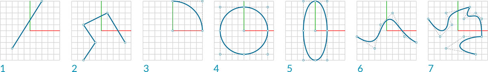
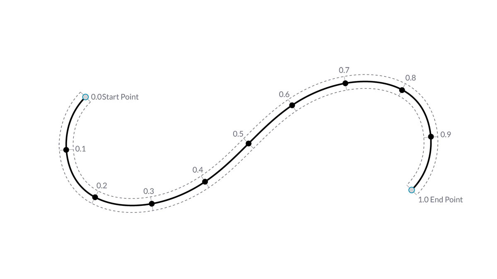

# 曲線

## Dynamo 中的曲線

### 什麼是曲線？

[曲線](4-curves.md#deep-dive-into...)是我們討論的第一種幾何資料類型，具有我們更熟悉的一組形狀描述性質 - 多彎或多直？多長或多短？請記住，點仍然是我們的基礎材料，用於定義從直線到雲形線的所有項目，以及所有曲線類型。

> 1. 直線
> 2. 聚合線
> 3. 弧
> 4. 圓
> 5. 橢圓
> 6. NURBS 曲線
> 7. Polycurve

### 直線

[直線](4-curves.md#lines)由一組點組成，每條直線至少有 2 個點。在 Dynamo 中建立直線最常使用的其中一個方法是使用 `Line.ByStartPointEndPoint` 。

\.jpg>)

### NURBS 曲線

[NURBS](4-curves.md#nurbs-+-polycurves) 是一個用於精確表示曲線和曲面的模型。Dynamo 中的正弦曲線使用兩種不同方法建立 NURBS 曲線以比較結果。

> 1. _NurbsCurve.ByControlPoints_ 使用點清單做為控制點
> 2. _NurbsCurve.ByPoints_ 繪製一條通過點清單的曲線

> 按一下下方的連結下載範例檔案。
>
> 附錄中提供完整的範例檔案清單。



## 深入探索...

### 曲線

**曲線**一詞通常是所有不同彎曲 (甚至筆直) 造型的統稱。曲線是所有這些造型類型 (直線、圓、雲形線等) 的父系分類。若以更具技術性的語言來表述，一條曲線描述在一系列函數 (這些函數包含從諸如 `x = -1.26*t, y = t` 的簡單函數到涉及微積分的複雜函數) 中輸入「t」即可找到的每個可能點。不論使用何種類型的曲線，這個稱為「t」的**參數**是我們可以演算的性質。此外，不論造型外觀為何，所有曲線都有起點與終點，兩者分別對應於建立曲線所使用的最小 t 值與最大 t 值。這也有助於我們瞭解其方向性。

> 請務必注意，Dynamo 假設曲線「t」值的範圍是 0.0 到 1.0。

所有曲線還具有許多性質或特性，可用於對其進行描述或分析。若起點與終點之間的距離是零，則曲線是「封閉」曲線。此外，每條曲線都有許多控制點，若所有這些點都位於同一平面上，則該曲線是「平面」曲線。有些性質會套用至曲線的整體，而其他性質只會套用至曲線上的特定點。例如，平面性是曲線的整體性質，而指定 t 值處的切線向量是局部性質。

### 直線

**直線**是形式最簡單的曲線。直線看上去可能並不彎曲，但實際上屬於曲線，只是沒有曲率而已。有幾種不同方式可以建立直線，最直觀的方式是從點 A 到點 B 畫線。直線 AB 的造型包含兩點之間的點，但在數學上，該直線在兩個方向無限延伸。

將兩條直線連接在一起，就產生**聚合線**。我們有一個簡單的方法可以表示什麼是控制點。編輯其中任何點的位置都將變更聚合線的造型。若聚合線是封閉的，則會產生多邊形。若多邊形所有邊長都相等，稱為正多邊形。

### 弧、圓、橢圓弧與橢圓

正如我們對定義造型的參數式函數提高複雜度一樣，我們可以在直線的基礎上更進一步，透過描述一或兩個半徑來建立**弧**、**圓**、**橢圓弧**或**橢圓**。弧與對應的圓或橢圓之間的差異只在於造型是否封閉。

### NURBS + Polycurve

**NURBS** (非均勻有理 B 雲形線) 是數學表述，可以對從簡單的二維直線、圓、弧或矩形到最複雜的三維自由形式基本曲線的任何造型進行準確塑型。由於具備靈活性 (控制點相對較少，但根據次數設定可以平滑內插) 與精確度 (受強大數學功能約束)，因此 NURBS 模型可用於從插圖與動畫到製造的任何程序。

**次數**：曲線的次數決定控制點對曲線的影響範圍，次數越高，範圍越大。次數是正整數。該數通常是 1、2、3 或 5，但可以是任意正整數。NURBS 直線與聚合線通常是 1 次，而多數自由曲線是 3 或 5 次。

**控制點**：控制點是至少包含 (次數+1) 個點的清單變更 NURBS 曲線造型最簡單的方式之一，是移動控制點。

**權重**：控制點有一個稱為「權重」的關聯數字。權重通常是正數。若曲線控制點具有相同的權值 (通常為 1)，則曲線稱為不合理曲線，否則稱為合理曲線。多數 NURBS 曲線都是非有理曲線。

**節點**：節點是 (次數+N-1) 個數字的清單，其中 N 是控制點的數量。節點與權重搭配使用，可控制控制點對結果曲線的影響。節點的一項用途是在曲線的特定點處建立扭折。

> 1. 次數 = 1
> 2. 次數 = 2
> 3. 次數 = 3

 請注意，次數值越高，內插產生的曲線所用的控制點就越多。 
