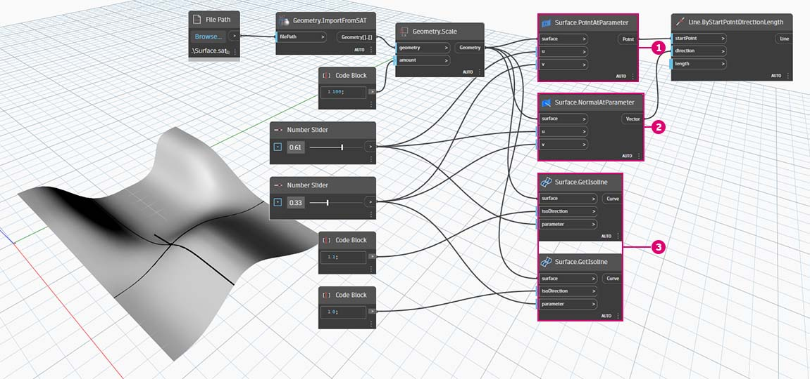
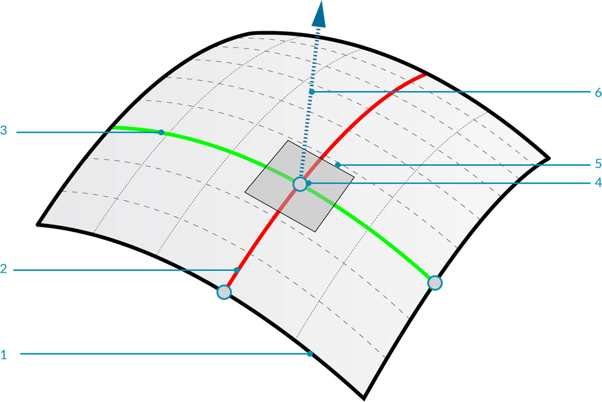
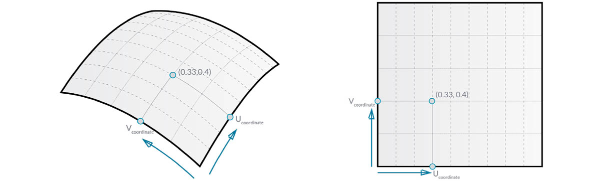
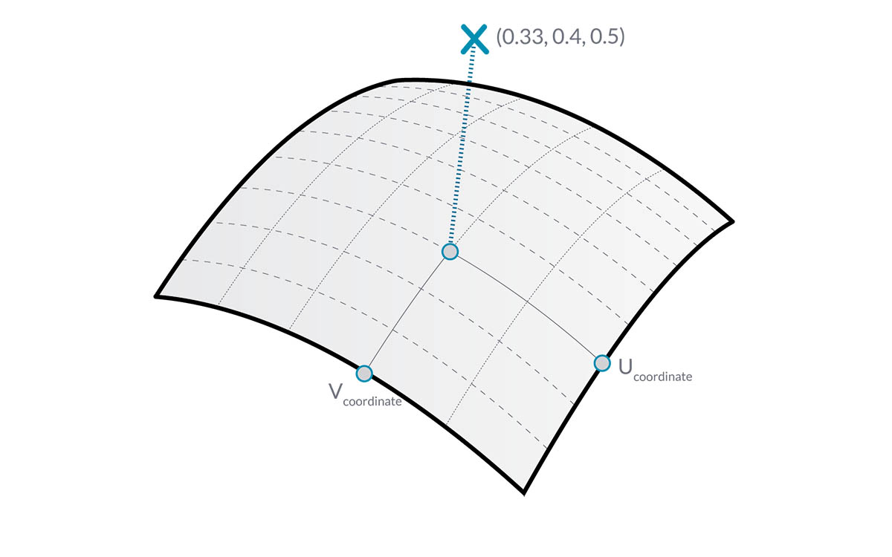
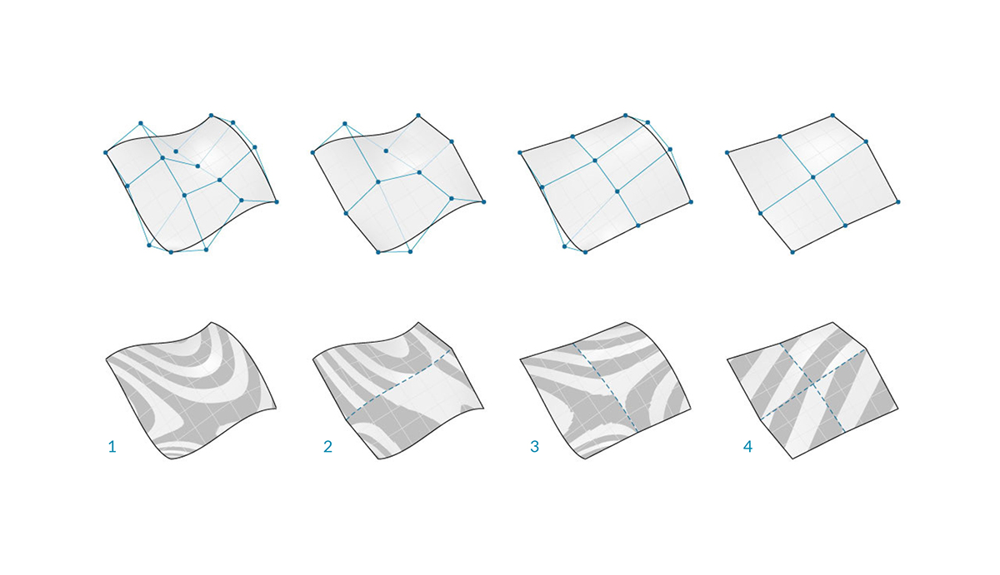

# Powierzchnie

## Powierzchnie w dodatku Dynamo

### Co to jest powierzchnia

[Powierzchni](5-surfaces.md#surface) używa się w modelu do reprezentowania obiektów, które widzimy w trójwymiarowym świecie. Chociaż krzywe nie zawsze są płaskie, mogą być na przykład trójwymiarowe, definiowana przez nie przestrzeń jest zawsze związana z jednym wymiarem. Powierzchnie dają nam kolejny wymiar oraz zbiór dodatkowych właściwości, które możemy wykorzystać w ramach innych operacji modelowania.

### Powierzchnia przy danym parametrze

Zaimportuj i oszacuj powierzchnię przy danym parametrze w dodatku Dynamo, aby zobaczyć, jakie informacje możemy wyodrębnić.

> 1. _Surface.PointAtParameter_ — zwraca punkt przy danej współrzędnej UV
> 2. _Surface.NormalAtParameter_ — zwraca wektor normalny przy danej współrzędnej UV
> 3. _Surface.GetIsoline_ — zwraca krzywą izoparametryczną przy danej współrzędnej U lub V (zwróć uwagę na wejście isoDirection).

> Pobierz pliki przykładowe, klikając poniższe łącze.
>
> Pełna lista plików przykładowych znajduje się w załączniku.



## Bliższe spojrzenie na...

### Powierzchnia

Powierzchnia stanowi kształt matematyczny zdefiniowany przez funkcję i dwa parametry. Zamiast `t` używanego w przypadku krzywych używa się `U` i `V`, aby opisać odpowiednią przestrzeń parametrów. Oznacza to, że mamy więcej danych geometrycznych, z których można korzystać podczas pracy z tym typem geometrii. Na przykład krzywe mają wektory styczne i płaszczyzny normalne (które mogą obracać się lub skręcać wzdłuż długości krzywej), natomiast powierzchnie mają wektory normalne i płaszczyzny styczne, które są spójne z ich orientacją.

> 1. Powierzchnia
> 2. Krzywa izometryczna U
> 3. Krzywa izometryczna V
> 4. Współrzędna UV
> 5. Płaszczyzna prostopadła
> 6. Wektor normalny

**Domena powierzchni**: domena powierzchni jest zdefiniowana jako zakres parametrów (U,V), które dają w wyniku punkt trójwymiarowy na tej powierzchni. Domena w każdym wymiarze (U lub V) jest zazwyczaj określana jako dwie liczby (od min. U do maks. U) i (od min. V do maks. V).

Mimo że kształt powierzchni może nie wyglądać „prostokątnie” i może ona mieć lokalnie ściślejszy lub luźniejszy zestaw krzywych izometrycznych, „przestrzeń”definiowana przez jej domenę zawsze jest dwuwymiarowa. W dodatku Dynamo zawsze zakłada się, że powierzchnie mają domeny zdefiniowane przez minimum o wartości 0,0 i maksimum o wartości 1,0 w obu kierunkach U i V. Powierzchnie płaskie lub przycięte mogą mieć inne domeny.

**Krzywa izometryczna** (lub krzywa izoparametryczna): krzywa zdefiniowana przez stałą wartość U lub V na powierzchni i domenę wartości dla odpowiedniego kierunku U lub V.

**Współrzędna UV**: punkt w przestrzeni parametrów UV zdefiniowany przez U, V, a czasem W.

**Płaszczyzna prostopadła**: płaszczyzna, która jest prostopadła do obu krzywych izometrycznych U i V przy danej współrzędnej UV.

**Wektor normalny**: wektor definiujący kierunek „w górę” względem płaszczyzny prostopadłej.

### Powierzchnie NURBS

**Powierzchnie NURBS** są bardzo podobne do krzywych NURBS. Powierzchnie NURBS można traktować jako siatkę krzywych NURBS, które biegną w dwóch kierunkach. Kształt powierzchni NURBS jest definiowany przez wiele punktów kontrolnych i stopień tej powierzchni w kierunkach U i V. Te same algorytmy służą do obliczania kształtu, normalnych, stycznych, krzywizn i innych właściwości za pomocą punktów kontrolnych, wag i stopnia.

W przypadku powierzchni NURBS istnieją dwa kierunki oznaczone geometrią, ponieważ powierzchnie NURBS są (niezależnie od kształtu, jaki widzimy) prostokątnymi siatkami punktów kontrolnych. Mimo że te kierunki są często arbitralne względem globalnego układu współrzędnych, często używa się ich do analizy modeli lub generowania innej geometrii na podstawie danej powierzchni.

> 1. Stopień (U,V) = (3, 3)
> 2. Stopień (U,V) = (3, 1)
> 3. Stopień (U,V) = (1, 2)
> 4. Stopień (U,V) = (1, 1)

### Polipowierzchnie

**Polipowierzchnie** (PolySurface) składają się z powierzchni połączonych wzdłuż krawędzi. Polipowierzchnie zapewniają więcej możliwości niż dwuwymiarowa definicja UV, ponieważ teraz można poruszać się po połączonych kształtach za pomocą ich topologii.

Chociaż „topologia” zazwyczaj opisuje to, w jaki sposób części są połączone i/lub powiązane, topologia w dodatku Dynamo jest także typem geometrii. Konkretnie jest to kategoria nadrzędna dla powierzchni, polipowierzchni i brył.

Łączenie powierzchni w ten sposób (czasem jest to nazywane płatami) pozwala tworzyć bardziej złożone kształty, jak również definiować szczegóły wzdłuż spoiny. W ten sposób można zastosować zaokrąglenie lub fazowanie do krawędzi polipowierzchni.
