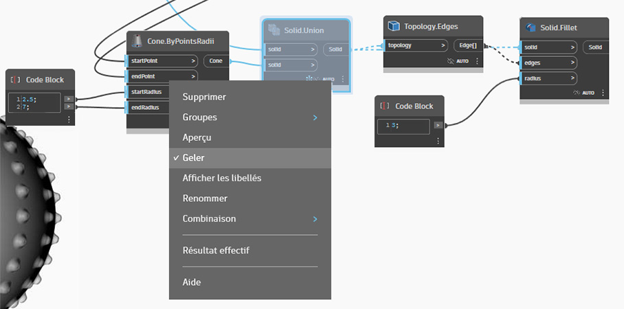
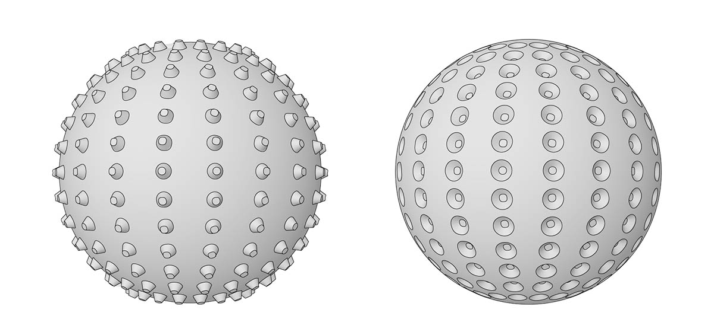

# Тела

## Твердые тела в Dynamo

### Что такое твердое тело?

Для создания сложных моделей, которые невозможно получить из одной поверхности, или определения явного объема необходимо научиться работе с [телами](6-solids.md#solids) (и полиповерхностями). Даже для самого простого куба требуется целых шесть поверхностей, по одной на каждую грань. Тела позволяют получить доступ к двум ключевым концепциям, не доступным при работе с поверхностями, а именно к уточненным топологическим описаниям (граням, кромкам, вершинам) и логическим операциям.

### Логическая операция для создания шара с шипами

Для изменения тел применяются [логические операции](6-solids.md#boolean-operations). Попробуйте использовать несколько логических операций для создания шара с шипами.

> 1. **Sphere.ByCenterPointRadius**: создание базового объекта тела Solid.
> 2. **Topology.Faces**, **Face.SurfaceGeometry**: запрос граней тела и преобразование в геометрию поверхности (в данном случае сфера имеет только одну грань).
> 3. **Cone.ByPointsRadii**: построение конусов, используя точки на поверхности.
> 4. **Solid.UnionAll**: объединение конусов со сферой.
> 5. **Topology.Edges**: запрос кромок нового объекта Solid.
> 6. **Solid.Fillet**: сглаживание кромок шара с шипами.

> Скачайте файл примера, щелкнув указанную ниже ссылку.
>
> Полный список файлов примеров можно найти в приложении.



### Замораживание

Логические операции сложны, и их вычисление может занимать много времени. Замораживание можно использовать, чтобы приостановить выполнение операций в выбранных узлах, а также следующих за ними узлах.

> 1\. Используйте контекстное меню, чтобы «заморозить» операцию объединения тел.
>
> 2\. Выбранный узел и все следующие за ним узлы отображаются светло-серым полупрозрачным цветом, а все затронутые провода отображаются в виде прерывистых линий. Предварительный просмотр соответствующей геометрии также будет полупрозрачным. Теперь можно изменить значения в узлах, предшествующих выбранному, не перегружая приложение расчетом логической операции объединения.
>
> 3\. Чтобы разморозить узлы, щелкните правой кнопкой мыши и снимите флажок «Заморозить».
>
> 4\. Все затронутые узлы и изображения предварительного просмотра связанных геометрических объектов обновляются и возвращаются к стандартному виду.


 Подробные сведения о замораживании узлов см. в разделе [4_nodes_and_wires](../../4\_nodes\_and\_wires/ "mention"). 


## Углубленное изучение

### Тела

Тела состоят из одной или нескольких поверхностей, внутри которых заключен объем, определенный замкнутым контуром, который отделяет то, что внутри тела, от того, что снаружи. Независимо от количества используемых поверхностей, для того чтобы объект считался телом, содержащийся в нем объем должен быть полностью замкнутым. Тела можно создавать путем объединения поверхностей или полиповерхностей либо с помощью таких операций, как лофтинг, сдвиг и вращение. Такие примитивы, как сфера, куб, конус и цилиндр, также являются телами. Объект Cube, у которого отсутствует хотя бы одна грань, считается полиповерхностью, которая уже не является телом, хотя и обладает многими аналогичными свойствами.

> 1. Плоскость состоит из одной поверхности и не является телом.
> 2. Сфера состоит из одной поверхности и _является_ телом.
> 3. Конус состоит из двух соединенных поверхностей и является телом.
> 4. Цилиндр состоит из трех соединенных поверхностей и является телом.
> 5. Куб состоит из шести соединенных поверхностей и является телом.

### Топология

Элементы, из которых состоят тела, делятся на три типа: вершины, кромки и грани. Грани — это поверхности, образующие тело. Кромки — это кривые, обозначающие области соединения смежных граней, а вершины — это начальные и конечные точки этих кривых. Эти элементы можно запросить с помощью узлов Topology.

> 1. Грани
> 2. Кромки
> 3. Вершины

### Операции

Тела можно изменять путем применения скруглений и фасок к кромкам, чтобы тем самым сгладить острые углы. Операция фаски создает поверхность соединения между двумя гранями, а операция сопряжения сглаживает переход между гранями для сохранения касательности.

> 1. Твердотельный куб
> 2. Куб с фасками
> 3. Скругленный куб

### Логические операции

Логические операции для тел — это методы, позволяющие объединить несколько тел в одно. Каждая логическая операция включает в себя четыре операции:

1. **Пересечение** двух или более объектов.
2. **Разделение** их в местах пересечения.
3. **Удаление** ненужных частей геометрии.
4. **Объединение** оставшихся частей.

Благодаря этому использование логических операций для тел позволяет значительно сэкономить время. Существует три логические операции для тел, позволяющие определить, как части геометрии должны сохраняться. 

> 1. **Объединение:** несколько тел объединяются в одно с удалением перекрывающихся частей.
> 2. **Разность:** одно тело вычитается из другого. Тело, которое вычитается, называется инструментом. Обратите внимание, что для сохранения обратного объема вычитаемое и подвергающееся вычитанию тела можно поменять местами.
> 3. **Пересечение:** при пересечении сохраняются только перекрывающиеся части двух тел.

В дополнение к этим трем операциям в Dynamo доступны узлы **Solid.DifferenceAll** и **Solid.UnionAll** для выполнения операций разности и объединения с несколькими телами. 

> 1. **UnionAll:** операция объединения для сферы и повернутых наружу конусов.
> 2. **DifferenceAll:** операция разности для сферы и повернутых внутрь конусов.

##
