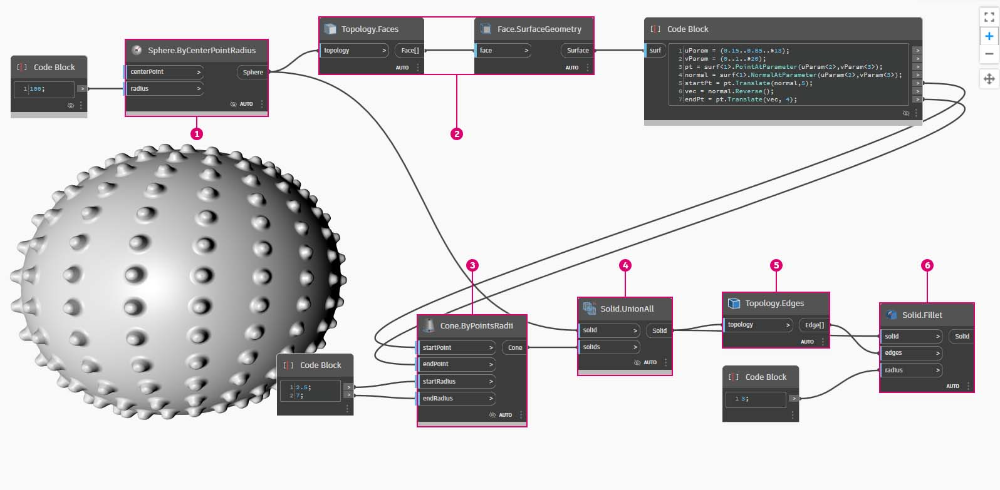

# 實體

## Dynamo 中的實體

### 什麼是實體？

如果我們要建構無法從單個平面建立的更複雜模型，或如果我們要定義明確的體積，我們現在必須瞭解[實體](6-solids.md#solids) (和 Polysurface) 領域。即使一個簡單的立方塊就夠複雜了，需要六個平面，每一面一個平面。實體提供了兩個平面不提供的關鍵概念 - 更細化的拓樸說明 (面、邊、頂點) 和布林作業。

### 建立尖刺球實體的布林運算

您可以使用[布林運算](6-solids.md#boolean-operations)來修改實體。讓我們使用幾個布林運算建立一個尖刺球。

> 1. **Sphere.ByCenterPointRadius**：建立基礎實體。
> 2. **Topology.Faces**、**Face.SurfaceGeometry**：查詢實體的面並將其轉換為曲面幾何圖形 - 在此情況下，圓球只有一個面。
> 3. **Cone.ByPointsRadii**：使用曲面上的點建構圓錐。
> 4. **Solid.UnionAll**：將「圓錐」和「球」做聯集。
> 5. **Topology.Edges**：查詢新實體的邊
> 6. **Solid.Fillet**：對尖刺球的邊執行「圓角」作業

> 按一下下方的連結下載範例檔案。
>
> 附錄中提供完整的範例檔案清單。



### 凍結

布林運算很複雜，可能會減慢計算速度。您可以使用「凍結」功能暫停執行選取的節點和受影響的下游節點。

> 1\. 使用右鍵關聯式功能表來凍結「實體聯集」作業
>
> 2\.選取的節點和所有下游節點將以淺灰色重影模式預覽，受影響的線路將以虛線顯示。受影響的幾何圖像預覽也將被重像。現在，您可以變更上游值，而不計算布林聯集。
>
> 3\.若要解凍節點，請按一下右鍵，然後取消勾選「凍結」。
>
> 4\.所有受影響的節點和關聯的幾何圖像預覽將更新並回復至標準預覽模式。

 您可以在[4_nodes_and_wires](../../4\_nodes\_and\_wires/ "mention")一節閱讀有關凍結節點的更多資訊。

## 深入探索...

### 實體

實體由一個或多個曲面組成，以定義「內」或「外」的封閉邊界表示其體積。無論有多少平面，它們必須形成一個「無縫」體積才會被視為實體。可透過連結平面或多面體來建立實體圖像，或透過使用作業 (例如，斷面混成、掃掠和迴轉) 來建立。圓球、立方體、圓錐與圓柱基本型也是實體。將立方塊至少一個面移除所得的圖像為 Polysurface，它有實體的某些相似性質，但不是實體。

> 1. 平面是由單一曲面組成，不是實體。
> 2. 圓球是由一個曲面組成，但 _是_ 實體。
> 3. 圓錐是由兩個曲面接合在一起而建立的實體。
> 4. 圓柱是由三個表面接合在一起而建立的實體。
> 5. 立方塊是由六個平面接合在一起而建立的實體。

### 拓樸

實體由三種類型的元素組成：頂點、邊和面。面是構成實體的平面。邊是定義相鄰面之間連結的曲線，頂點是這些曲線的起點和終點。這些元素可以使用拓樸節點進行查詢。

> 1. 面
> 2. 邊
> 3. 頂點

### 作業

可透過對邊執行圓角或倒角作業來消除急轉角和角，從而對實體進行修改。「倒角」作業會在兩個面之間建立符合規則的曲面，而「圓角」作業會混合兩個面使其保持相切。

> 1. 實體立方塊
> 2. 倒角的立方塊
> 3. 圓角的立方塊

### 布林作業

實體布林作業是結合兩個或多個實體的方式。單一布林作業實際意味著執行四個作業：

1. 讓兩個或多個物件**交集**。
2. 讓它們在交集處**分離**。
3. **刪除**不需要的幾何圖形部分。
4. 將所有物件重新**接合**在一起。

這樣可使實體布林運算成為功能強大且節省時間的流程。有三種實體布林運算，可區分要保留幾何圖形的哪些部分。

> 1. **聯集：** 移除實體的重疊部分並將它們接合為單一實體。
> 2. **差集：** 從一個實體減去另一個。要被減去的實體稱為工具。請注意，您可以切換作為工具的實體，以保留相反的部分。
> 3. **交集：** 僅保留兩個實體的交集部分。

除了這三個作業，Dynamo 有 **Solid.DifferenceAll** 和 **Solid.UnionAll** 節點用於對多個實體執行「差集」和「聯集」作業。

> 1. **UnionAll：** 對球和向外圓錐進行「聯集」作業
> 2. **DifferenceAll：** 對球和向內圓錐進行「差集」作業

##
