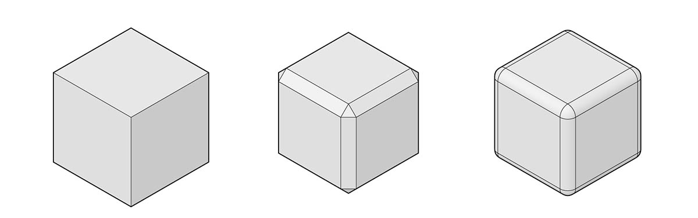
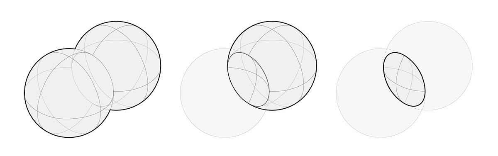

# Tělesa

## Tělesa v aplikaci Dynamo

### Co je těleso?

Pokud chcete vytvářet složitější modely, které nelze vytvořit z jedné plochy, nebo pokud chcete explicitně definovat objem, je nutné využít tělesa  (a polyplochy). I obyčejná krychle je dost složitá na to, aby potřebovala šest ploch (pro každou stěnu jednu). Tělesa na rozdíl od ploch nabízejí dva klíčové koncepty – přesnější topologický popis (stěny, hrany, vrcholy) a booleovské operace.

### Booleovská operace k vytvoření ostnatého kulového tělesa

K úpravě těles můžete použít [booleovské operace](5-6\_solids.md#boolean-operations). Pojďme vytvořit ostnatou kouli pomocí několika booleovských operací.

> 1. **Sphere.ByCenterPointRadius**: Vytvořte základní těleso.
> 2. **Topology.Faces**, **Face.SurfaceGeometry**: Vytvořte dotaz na stěny tělesa a převeďte je na geometrie ploch – v tomto případě pracujeme s koulí, která má pouze jednu stěnu.
> 3. **Cone.ByPointsRadii**: Pomocí bodů na ploše vytvořte kužely.
> 4. **Solid.UnionAll**: Sjednoťte kužely a kouli.
> 5. **Topology.Edges**: Vytvořte dotaz na hrany nového tělesa
> 6. **Solid.Fillet**: Zaoblete hrany ostnaté koule

> Kliknutím na odkaz níže si stáhněte vzorový soubor.
>
> Úplný seznam vzorových souborů najdete v dodatku.



### Zmrazení

Booleovské operace jsou složité a jejich výpočet může být pomalý. Pomocí funkce zmrazení je možné vypnout výpočet vybraných uzlů a všech následných uzlů.

> 1\. Zmrazte operaci sjednocení těles tím, že kliknete pravým tlačítkem myši a vyberete možnost Zmrazit
>
> 2\. Vybraný uzel a všechny následné uzly se zobrazí světle šedou průhlednou barvou a související dráty budou zobrazeny přerušovaně. Náhled ovlivněné geometrie bude také zobrazen světle šedou průhlednou barvou. Nyní můžete měnit předcházející hodnoty, aniž by došlo k výpočtu booleovského sjednocení.
>
> 3\. Chcete-li zmrazení zrušit, klikněte pravým tlačítkem a zrušte výběr možnosti Zmrazit.
>
> 4\. Všechny ovlivněné uzly a geometrie se aktualizují a zobrazí se běžným způsobem.

## Podrobné informace...

### Tělesa

Tělesa se skládají z jedné nebo více ploch, které tvoří objem tím, že definují hranici, která rozděluje prostor na vnitřní a vnější. Aby byl objem považován za těleso, musí být neprodyšně uzavřen, nezávisle na počtu ploch. Tělesa lze vytvářet spojováním ploch nebo polyploch nebo pomocí operací, například spojením profilů, tažením nebo rotací. Koule, krychle, kužel a válec jsou také tělesy. Krychle s odebranou stěnou se považuje za polyplochu s podobnými vlastnostmi, ale nejedná se přímo o těleso.

> 1. Rovina se skládá z jedné plochy a nejedná se o těleso.
> 2. Koule je tvořena jednou plochou a _je_ tělesem.
> 3. Kužel je tvořen dvěma spojenými plochami utvářejícími těleso.
> 4. Válec je tvořen třemi spojenými plochami utvářejícími těleso.
> 5. Krychle je tvořena šesti spojenými plochami utvářejícími těleso.

### Topologie

Tělesa se skládají z prvků třech typů: vrcholů, hran a stěn. Stěny jsou plochy, které těleso tvoří. Hrany jsou křivky, které definují propojení sousedních hran a vrcholy jsou počáteční a koncové body těchto křivek. Tyto prvky je možné dotazovat prostřednictvím uzlů topologie.

> 1. Stěny
> 2. Hrany
> 3. Vrcholy

### Operace

Tělesa lze upravit zaoblením nebo zkosením jejich hran, aby se odstranily ostré rohy a úhly. Operace zkosení vytvoří šikmou plochu mezi dvěma stěnami, zatímco zaoblení mezi nimi vytvoří plynulý přechod se zachováním tečnosti.

> 1. Krychlové těleso
> 2. Zkosená krychle
> 3. Zaoblená krychle

### Booleovské operace

Booleovské operace s tělesy kombinují dvě nebo více těles. Jedna booleovská operace ve skutečnosti provádí čtyři operace:

1. **Průnik** dvou nebo více objektů.
2. **Rozdělení** těchto objektů v průsečících.
3. **Odstranění** nežádoucích částí geometrie.
4. **Spojení** celé geometrie dohromady.

Díky tomu booleovské operace šetří velké množství času. Existují tři booleovské operace pro tělesa, které určují, která část geometrie zůstane zachována. 

> 1. **Union:** Odebere překrývající se části těles a spojí je do jednoho tělesa.
> 2. **Difference:** Odečte jedno těleso od druhého. Odečítané těleso se nazývá nástroj. Je možné určit, které těleso bude použito jako nástroj.
> 3. **Intersection:** Zachová pouze společný objem obou těles.

Aplikace Dynamo kromě těchto tří operací obsahuje také uzly**Solid.DifferenceAll** a **Solid.UnionAll**, které provádějí rozdíl a sjednocení s více tělesy. 

> 1. **UnionAll:** operace sjednocení s koulí a kužely směřujícími ven
> 2. **DifferenceAll:** operace rozdílu s koulí a kužely směřujícími dovnitř

##
